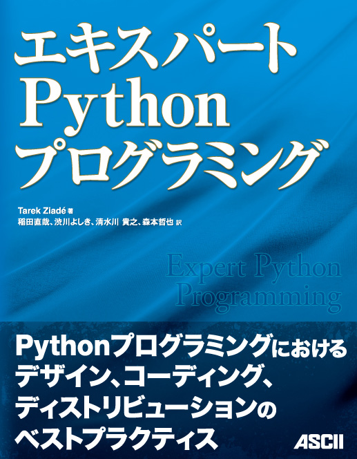

:タイトル: `エキスパートPythonプログラミング <http://ascii.asciimw.jp/books/books/detail/978-4-04-868629-7.shtml>`_
:出版社: `アスキー・メディアワークス <http://ascii.asciimw.jp/>`_
:著者: Tarek Ziade
:翻訳: 稲田直哉, 渋川よしき, 清水川貴之, 森本哲也
:定価: 3,780円 (本体3,600円)
:発売日: 2010年5月31日
:形態: B5変 (416ページ)
:ISBN: 978-4-04-868629-7

.. ########################
   Documenting Your Project
   ########################

#################################### 
10章: プロジェクトのドキュメント作成
#################################### 

.. Documentation is work that is often neglected by developers and sometimes by managers. This is often due to a lack of time towards the end of development cycles, and the fact that people think they are bad at writing. Some of them are bad, but the majority of them are able to produce fine documentation. 

ドキュメント作成は、開発者、ときにはマネージャもさぼってしまいがちな作業です。開発サイクルの終了に向かうにつれて時間が無くなったり、自分は文章を書くのが苦手だと考えている人がいたりするのが、さぼってしまう原因です。確かに文章を書くのが苦手な人もいますが、大多数の開発者とマネージャはすばらしいドキュメントを書くことができます。

.. In any case, the result is a disorganized documentation made of documents that are written in a rush. Developers hate doing this kind of work most of the time. Things get even worse when existing documents need to be updated. Many projects out there are just providing poor, out-of-date documentation because the manager does not know how to deal with it. 

急いで書かれた文書が集めれた結果、内容が整理されていないドキュメントが作られてしまうこともあります。開発者はたいてい、この手の仕事をするのが好きではありません。既存のドキュメントをアップデートしなければならない場合には、さらに事態は悪化します。マネージャがそのような事態にどう対処すればいいのか分からない場合、多くのプロジェクトでは貧相で、内容の古いドキュメントしか提供できないということになります。

.. But setting up a documentation process at the beginning of the project and treating documents as if they were modules of code makes documenting easier. Writing can even be fun when a few rules are followed. 

しかし、プロジェクトの開始時にドキュメント作成プロセスを整備し、ドキュメントをソフトウェアのコードのモジュールと同じように扱うようにすると、ドキュメントを書くのがもっと簡単になります。いくつかのルールに従うと、書くのが楽しくなる場合すらあります。

.. This chapter provides a few tips to start documenting your project through: 

本章では次のような内容を通じて、プロジェクトのドキュメントを書き始めるためのTipsを紹介していきます:

.. * The seven rules of technical writing that summarize the best practices 
   * A reStructuredText primer, which is a plain text markup syntax used 
     in most Python projects 
   * A guide for building good project documentation 

* 技術的な文章を書くためのベストプラクティスをまとめた、７つのルール
* ほとんどのPythonプロジェクトで使用されている、reStructuredTextというプレーンテキストのテキストマークアップ文法の入門
* 良いドキュメントを構築するためのガイド

-----------------------------------

.. toctree::
   :maxdepth: 2

   tips_for_technical_writing
   restructuredtext
   building_documentation
   make_your_portfolio
   summary

