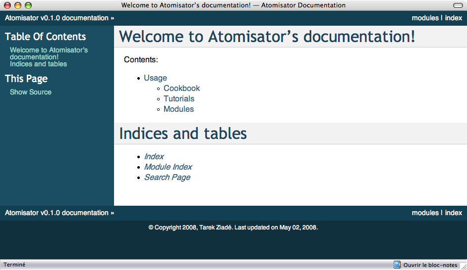
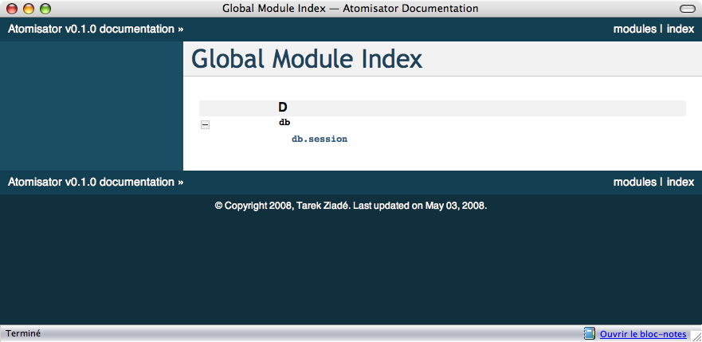

.. =======================
   Make Your Own Portfolio 
   =======================

==================================
自分自身のポートフォリオを構築する
==================================

.. The templates that we discussed earlier are just a basis that you can use to document your software. From there, as explained in the chapter dedicated to Paster, you can tune it and add other templates to build your own document portfolio. 

これまでの説明で紹介してきたテンプレートは、あなたのソフトウェアのドキュメント作成に使用することができる基盤となります。ここからは、Pasterを使用して、自分自身のドキュメントのポートフォリオを構築するために、それ以外のテンプレートを追加するための方法を紹介していきます。

.. Keep in mind the light but sufficient approach for project documentation: Each document added should have a clearly defined target readership and should fill a real need. Documents that don't add a real value should not be written. 

プロジェクト中に作成するドキュメントの量に関しては、必要最低限で、十分というのを心がけてください。追加されるそれぞれのドキュメントについても、対象となる読者を明確に定義し、実際のニーズを満たすようにします。実際に価値の増加に寄与しないドキュメントは書くべきではありません。

.. Building the Landscape 
   ======================

ドキュメントのランドスケープの構築
==================================

.. The document portfolio built in the previous section provides a structure at document level, but does not provide a way to group and organize it to build the documentation the readers will have. This is what Andreas Ruping calls a document landscape, referring to the mental map the readers use when they browse documentation. He came up with the conclusion that the best way to organize documents is to build a logical tree. 

.. Tarek:
    when you are in the country and you look far away you can see trees, fields, houses the whole point of view is a "landscape"
    so a document landscape is like all the types of documentation for a given documentation.
    the types are a recipe, a tutorial, etc. recipe = one type of document, recipe + tutorial + ..  = document landscape.
    -- quote start
    The document portfolio built in the previous section provides a structure at document level, but does not provide a way
    to group and organize it to build. the documentation the readers will have. This is what Andreas Rüping calls document  landscape,
    referring to the mental map the readers use when they browse documentation. 
    -- quote end
    the landscape is how you organize all your documentation like the index page, you see ?
    there's one landscape for readers == front documentation and one for writers
    it like a table content, but it can be different than a table of content. it can be an image, where you can click on elements
    but yeah, like a table of content

前節で説明をしてきたドキュメントポートフォリオによって、複数の種類のドキュメントが提供されますが、読者の手に渡った後でそのドキュメントを再グループ化したり、再構成したりする方法は提供されません。読者がドキュメントにざっと目を通すときに、心の中でドキュメントのインデックスページのようなものを作成してそれを参照します。Andreas Rupingは、これをドキュメントランドスケープと呼んでいます。彼は、ドキュメントを組織化するための最適な手法は、ロジカルツリーを構築する方法であるという結論づけています。

.. note::
   (Tarekによる補足)田舎に行って景色を見ると木々や平地、家々などを見ることができますが、このようなさまざまな要素が含まれる景色をランドスケープと呼びます。ドキュメントランドスケープもこれと同じく、レシピ、チュートリアルなどの多くのドキュメントからなります。ランドスケープは目次、イメージマップなどのさまざまな形式で表現することもできます。読者や作成者ごとのランドスケープを用意することもできます。

.. 
    判りにくい･･･けど原文も判りにくい。
    morimoto: 意訳してみました、これでどうかなぁ
    渋川: 森本さんがしてくれたと思われる質問を訳して挿入しました。省略されている意味が
    補足されて分かりやすくなったと思います。

.. In other words, the different kinds of documents composing the portfolio need to find a place to live within a tree of directories. This place must be obvious to the writers when they create the document and to the readers when they are looking  for it. 

言い換えると、ポートフォリオを構成するドキュメントごとに、ディレクトリツリー内に配置するべき場所を見つける必要があるということです。この場所というのは、ドキュメント作成者が作成するとき、もしくはドキュメントの読者がそれを探すときの、どちらの場合においてもわかりやすい必要があります。

.. A great helper in browsing documentation is index pages at each level that can drive writers and readers. 

ドキュメントを探索する上で手助けとなるのは、作成者と読者の両方が読むことができるように、それぞれのレベルで目次のページを作ることです。

.. Building a document landscape is done in two steps: 

ドキュメントのランドスケープの構築は、次の２つのステップで行うことができます。

.. * Building a tree for the producers (the writers) 
   * Building a tree for the consumers (the readers), on the top of the  
     producers' one 

* 制作者向けのツリーの構築
* 顧客のためのツリーを構築し、制作者向けのツリーの上位の配置する

.. This distinction between producers and consumers is important since they access the documents in different places and different formats. 

制作者と顧客は異なった場所で、異なった形式のドキュメントにアクセスするので、制作者と顧客を明確に区別することが大切です。

.. Producer's Layout 
   -----------------

制作者のレイアウト
------------------

.. From a producer's point of view, each document is processed exactly like a Python module. It should be stored in the version control system and worked like code. 

制作者の視点から見た場合、それぞれのドキュメントは、Pythonモジュールと同じように処理されます。ドキュメントはバージョン管理システムに格納され、コードと同じように扱われます。

.. Writers do not care about the final appearance of their prose and where it is available. They just want to make sure that they are writing a document, so it is the single source of truth on the topic covered. 

作成者は、自分が作成している文章が最終的にどのような外見になるのか、ということを気にしません。彼らが確実に行いたいのは、適切な場所に目的のドキュメントを書くことです。

.. reStructuredText files stored in a folder tree are available in the version control system together with the software code, and are a convenient solution to build the documentation landscape for producers. 

フォルダのツリーに保存されたreStructuredTextのファイルは、バージョン管理システムを使用して、ソフトウェアのコードと一緒に管理することができます。この方法は、制作者向けのドキュメントのランドスケープを構築するための便利な方法です。

.. If we look back at the folder structure presented in Chapter 6 for Atomisator, the docs folder can be used as the root of this tree. 

6章で説明したのAtomisatorの中で紹介したフォルダ構造を振り返ってみると、このツリーのルートにある//tt{docs//tt}フォルダを使用することができることがわかります。

.. The simplest way to organize the tree is to group documents by nature: 

このツリーを組織化するためのもっともシンプルな方法は、特性に従ってドキュメントをグループにすることです。

.. code-block:: bash

   $ cd atomisator 
   $ find docs 
   docs 
   docs/source 
   docs/source/design 
   docs/source/operations 
   docs/source/usage 
   docs/source/usage/cookbook 
   docs/source/usage/modules 
   docs/source/usage/tutorial 

.. Notice that the tree is located in a source folder because the docs folder will be used as a root folder to set up a special tool in the next section. 

このdocsフォルダでは、次節で使用するツールで利用出来るようにするため、ドキュメントをsourceフォルダの下に格納している点に注意してください。

.. (コメントアウトしたtodo) Sphinxだと思うけど、今はフラットにも配置できる。

.. From there, an index.txt file can be added at each level (besides the root), explaining what kind of documents the folder contains, or summarizing what  each sub-folder contains. These index files can define a listing of the documents  they contain. For instance, the operation folder can contain a list of operations documents available: 

ルート以外のそれぞれのレベルには、index.txtというファイルを追加することができます。これは、どのような種類のドキュメントがそのフォルダに含まれているのかというのを説明したり、それぞれのサブフォルダに何が含まれているのかというサマリーを書くことができます。例えば、運用フォルダの場合には、読むことができる運用ドキュメントのリストを含めます。

.. code-block:: rst 

   ========== 
   Operations 
   ========== 

   This section contains operations documents: 

   - How to install and run Atomisator 
   - How to install and manage a PostgreSQL database 
   for Atomisator 

.. code-block:: rst

   ====
   運用
   ====

   このセクションには運用に関するドキュメントが含まれます:

   - Atomisatorのインストールと実行方法
   - Atomisatorで使用する、PostgreSQLのデータベースのインストールと管理

.. So that people do not forget to update them, we can have lists generated 
   automatically. 

作成した人が更新するのを忘れないように、自動生成したリストを使用する方法もあるでしょう。

.. Consumer's Layout 
   -----------------

顧客のレイアウト
----------------

.. From a consumer's point of view, it is important to work out the index files and to present the whole documentation in a format that is easy to read and looks good. 

顧客の視点から考えると、目次を見て概要を掴んだり、ドキュメント全体がきちんとフォーマットされていて、読みやすく、なおかつ見た目が良いということが重要になります。

.. Web pages are the best pick and are easy to generate from reStructuredText files. 

フォーマットとしては、ウェブページがベストな選択肢です。reStructuredTextのファイルから生成するのも簡単です。

.. Sphinx (http://sphinx.pocoo.org) is a set of scripts and docutils extensions that can be used to generate an HTML structure from our text tree. This tool is used (for instance) to build the Python documentation, and many projects are now using it for their documentation. Among its built-in features, it produces a really nice browsing system, together with a light but sufficient client-side JavaScript search engine. It  also uses pygments for rendering code examples, which produces really nice syntax highlights. 

Sphinx (http://sphinx.pocoo.org) を使用すると、テキストのツリーから、構造化されたHTMLを生成することができます。Sphinxはいくつかのスクリプトと、docutils拡張で作られています。このツールはPython本体のドキュメントも含め、多くのプロジェクトのドキュメント作成のツールとして使用されています。組み込みの機能にはさまざまなものがあり、本当にすばらしいナビゲーションや、JavaScriptで実装されクライアントサイドで動作する、軽量だが十分な機能を持つ検索エンジンと一緒にコンテンツを生成します。また、コードのサンプルをレンダリングするにはPygmentsを使用しているため、見た目のすばらしいシンタックスハイライトも行われます。

.. Sphinx can be easily configured to stick with the document landscape defined in the earlier section. 

本節の前半で定義したドキュメントのランドスケープの設定も、Sphinxを使うと容易に行えます。

.. To install it, just call easy_install: 

Sphinxのインストールには、easy_installを使用します:

.. code-block:: bash

   $ sudo easy_install Sphinx 
   Searching for Sphinx 
   Reading http://cheeseshop.python.org/pypi/Sphinx/ 
   ... 
   Finished processing dependencies for Sphinx 

.. This installs a few scripts such as sphinx-quickstart. This script will generate a script together with a Makefile, which can be used to generate the web documentation every time it is needed. Let's run this script in the docs folder and answer its questions: 

インストールを行うと、 ``sphinx-quickstart`` などのいくつかのスクリプトがインストールされます。このスクリプトを実行すると、Webのドキュメントを生成するために使用するスクリプトや、Makefileを生成します。docsフォルダの中でこのスクリプトを実行して、次のように質問に答えていきます。

.. code-block:: bash

   $ sphinx-quickstart 
   Welcome to the Sphinx quickstart utility. 

   Enter the root path for documentation. 
   > Root path for the documentation [.]: 
   > Separate source and build directories (y/n) [n]: y 
   > Name prefix for templates and static dir [.]: 
   > Project name: Atomisator 
   > Author name(s): Tarek Ziade 
   > Project version: 0.1.0 
   > Project release [0.1.0]: 
   > Source file suffix [.rst]: .txt 
   > Name of your master document (without suffix) [index]: 
   > Create Makefile? (y/n) [y]: y 

   Finished: An initial directory structure has been created. 

   You should now populate your master file ./source/index.txt and create 
   other documentation 
   source files. Use the sphinx-build.py script to build the docs, like so: 

      make <builder> 

.. This adds a conf.py file in the source folder that contains the configuration defined through the answers, and an index.txt file at the root, together with a Makefile in docs. 

このスクリプトを実行すると、conf.pyというファイルがsourceフォルダの中に追加されます。このファイルには、質問に回答して定義された設定が含まれます。それ以外には、スクリプトを実行したフォルダのルートにindex.txtと、Makefileも生成されます。

.. Running make html will then generate a tree in build: 

``make html`` を実行すると、 ``build`` ディレクトリの中にツリーを生成されます。

.. code-block:: bash

   $ make html 
   mkdir -p build/html build/doctrees 
   sphinx-build.py -b html -d build/doctrees -D latex_paper_size=  source 
   build/html 
   Sphinx v0.1.61611, building html 
   trying to load pickled env... done 
   building [html]: targets for 0 source files that are out of date 
   updating environment: 0 added, 0 changed, 0 removed 
   creating index... 
   writing output... index 
   finishing... 
   writing additional files... 
   copying static files... 
   dumping search index... 
   build succeeded. 
   Build finished. The HTML pages are in build/html. 

.. The documentation will then be available in build/html, starting at index.html. 

``build/html`` ディレクトリの中にドキュメントが生成されます。 ``index.html`` をブラウザで開いて読むことができます。

.. Besides the HTML versions of the documents, the tool also builds automatic pages such as a module list and an index. Sphinx provides a few docutils extensions to drive these features. The main ones are: 

ソースコードから生成されたHTML版のドキュメント以外にも、モジュールリストや索引などのページが自動的に生成されます。Sphinxでは、これらの機能のためにdocutilsを拡張しています。主に次の項目が、拡張された箇所です。

.. * A directive that builds a table of contents 
   * A marker that can be used to register a document as a module helper 
   * A marker to add an element in the index 

* 目次を構築するためのディレクティブ
* ドキュメントをモジュールヘルパーとして登録するためのマーカー
* 索引に項目を追加するためのマーカー

.. Working on the Index Pages 
   ;;;;;;;;;;;;;;;;;;;;;;;;;;

インデックスのページでの作業
;;;;;;;;;;;;;;;;;;;;;;;;;;;;;

.. Sphinx provides a toctree directive that can be used to inject a table of contents in a document, with links to other documents. Each line must be a file with its relative path, starting from the current document. Glob-style names can also be provided to add several files that match the expression. 

Sphinxでは ``toctree`` ディレクティブが用意されています。これは、ドキュメント内に目次を挿入して、他のドキュメントへのリンクを張るために使用します。ディレクティブ内のそれぞれの行は、現在のドキュメントからの相対パスで書かれたファイル名でなければなりません。globスタイルの名前を使用して、式にマッチする複数ファイルをまとめて登録する機能も提供されています。

.. For example, the index file in the cookbook folder, which we have previously defined in the producer's landscape, can look like this: 

例えば、制作者のランドスケープで定義した、cookbookフォルダのindexファイルは次のような内容になるでしょう。

.. 
   code-block rst

   ======== 
   Cookbook 
   ======== 

   Welcome to the CookBook. 

   Available recipes: 

   .. toctree:: 
     :glob: 

     * 

.. code-block:: rst

   ============
   クックブック
   ============

   クックブックへようこそ！

   現在利用可能なレシピ:

   .. toctree:: 
     :glob: 

     * 

.. With this syntax, the HTML page will display a list of all reStructuredText documents available in the cookbook folder. This directive can be used in all index files to build a browseable documentation. 

このような文法に従ってソースに書いてビルドすると、 ``cookbook`` フォルダ内にある、利用可能なすべてのreStructuredTextのリストが表示されるようになります。このディレクティブは、ブラウズ可能なドキュメントにビルドされるすべてのindexファイル内で利用することができます。

.. Registering Module Helpers 
   ;;;;;;;;;;;;;;;;;;;;;;;;;;

モジュールヘルパーの登録
;;;;;;;;;;;;;;;;;;;;;;;;

.. For module helpers, a marker can be added so that it is automatically listed and available in the module's index page: 

モジュールヘルパーのドキュメントで使用できる機能として、モジュールのマーカーを追加することができます。これを書くと、モジュールの索引ページから参照することができるようになります。

.. 
   code-block: rst

   ======= 
   session 
   ======= 

   .. module:: db.session 

   The module session... 

.. code-block:: rst

   ======= 
   session 
   ======= 

   .. module:: db.session 

   このsessionモジュールでは...

.. Notice that the db prefix here can be used to avoid module collision. Sphinx will use it as a module category and will group all modules that start with db. in  this category. 

モジュール名の衝突を防ぐために使用される、 ``db`` という名前空間がここで設定されていることに注意してください。Sphinxはこれをモジュールのカテゴリとして使用します。図では1つしかありませんが、 ``db.`` という名前で始まるすべてのモジュールがグループにまとめられて表示されます。

.. For Atomisator db, feed, main, and parser can be used in order to group the entries, as shown in the figure: 

Atomisatorのの場合にはdb, feed, main, parserというパッケージが、モジュールのグループ化に利用されるでしょう。

.. In your documentation, you can use this feature when you have a lot of modules. 

あなたのドキュメントでも、多くのモジュールが含まれる場合に、この機能を使用することができます。

.. note

   Notice that the module helper template that we created earlier  
   (pbp_module_doc) can be changed to add the module directive  
   by default. 

.. note::

   最初の方で作成したモジュールヘルパーのテンプレート(pbp_module_doc)を変更して、デフォルトで、この ``module`` ディレクティブを追加するようにできます。

.. Adding Index Markers 
   ;;;;;;;;;;;;;;;;;;;;

索引のマーカーの追加
;;;;;;;;;;;;;;;;;;;;;

.. Another option can be used to fill the index page by linking the document to an entry: 

モジュール以外にも、索引ページに、ドキュメント内の要素へのリンクを追加するためのオプションを使用することができます。

.. code-block-rst

   .. index:: 
      Database Access 
      Session 

   ======= 
   session 
   ======= 

   .. module:: db.session 

   The module session... 

.. code-block:: rst

   .. index:: 
      single: データベースアクセス
      single: セッション

   ======= 
   session 
   ======= 

   .. module:: db.session 

   このsessionモジュールでは...

.. 
   (todo削除)
   indexディレクティブの書き方を最新に合わせました。

.. Two new entries, Database Access and Session will be added in the index page.

"データベースアクセス"と"セッション"の、2つの新しい項目が索引ページに追加されます。

.. Cross-references 
   ;;;;;;;;;;;;;;;;

クロス・リファレンス
;;;;;;;;;;;;;;;;;;;;

.. Finally, Sphinx provides an inline markup to set cross-references. For instance, a link to a module can be done like this: 

最後になりますが、Sphinxではクロス・リファレンスの設定を行うためのインラインマークアップも提供されています。例えば、次のように書くと、指定されたモジュールへのリンクを作成することができます。

.. code-block:: rest

   :mod:`db.session` 

.. Where :mod: is the module marker's prefix and `db.session` is the name of the module to be linked to (as registered previously), keep in mind that :mod: as well  as the previous elements are the specific directives introduced in reSTructuredText by Sphinx. 

``:mod:`` というのは、モジュールを表すマーカーです。 ``db.session`` というのはリンクを張ろうと思っているモジュールの名前になります。このリンク先のドキュメントは、どこかで登録しておく必要があります。 ``:mod:`` もそうですが、これまで説明してきた項目はSphinxによってreStructuredTextに追加された、特別なディレクティブです。

.. note:

   Sphinx provides a lot more features that you can discover in its website. 
   For instance, the autodoc feature is a great option to automatically 
   extract your doctests to build the documentation. 
   See http://sphinx.pocoo.org. 

.. note::

   Sphinxはもっと多くの機能を提供しています。それらの情報はウェブサイトで見ることができます。たとえば、 ``autodoc`` 機能は、ドキュメントを構築する際にdoctestを自動収集することができる、すばらしいオプションになります。詳しくは http://sphinx.pocoo.org を参照してください。 [#]_

.. rubric:: 脚注
.. [#] 日本語訳は http://sphinx-users.jp/doc.html を参照してください。

