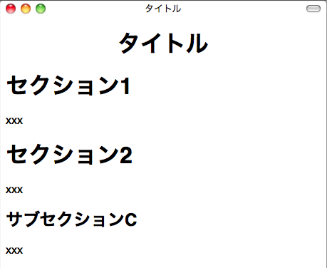

.. =========================
   A reStructuredText Primer
   =========================

====================
reStructuredText入門
====================

.. reStructuredText is also called reST (see http://docutils.sourceforge.net/rst.html).  It is a plain text markup language widely used in the Python community to document packages. The great thing about reST is that the text is still readable since the markup syntax does not obfuscate the text like LaTeX would. 

reStructuredTextはreSTとも呼ばれます。 (http://docutils.sourceforge.net/rst.html (英語) を参照してください。) reSTは、プレーンテキストを使ったマークアップ言語で、パッケージのドキュメントを作成する際に、Pythonのコミュニティ内で広く使用されています。reSTの優れている点は、ソースのテキストの状態でもそのまま読むことができるという点です。LaTeXのように、マークアップの文法のせいで読みにくくなるということはありません。

.. Here's a sample of such a document:

以下のテキストは、reST形式のドキュメントのサンプルです。

.. ===== 
   Title 
   ===== 

   Section 1 
   ========= 

   This *word* has emphasis. 

   Section 2 
   ========= 

   Subsection 
   :::::::::: 

   Text.  

.. code-block:: rst

   ========
   タイトル
   ========

   セクション 1
   ============

   この **単語** は強調されます。

   セクション 2
   ============

   サブセクション
   ::::::::::::::

   テキスト。

.. reST comes in docutils, a package that provides a suite of scripts to transform a reST file to various formats, such as HTML, LaTeX, XML, or even S5, Eric Meyer's slide show system (see http://meyerweb.com/eric/tools/s5). 

reSTはdocutilsパッケージに含まれています。docutilsには、reSTのファイルをHTML, LaTeX, XMLなどの様々なフォーマットに変換するスクリプトが含まれます。S5という、Eric Meyerのスライドショーのシステム (http://meyerweb.com/eric/tools/s5/ を参照)のためのフォーマットにも変換することができます。

.. Writers can focus on the content and then decide how to render it, depending on the needs. For instance, Python itself is documented into reST, which is then rendered in HTML to build http://docs.python.org, and in various other formats.

ドキュメント作成者は内容にフォーカスし、必要に応じて、その後にどのようにレンダリングされるのかを決めることができます。Python自身のドキュメントもreSTで書かれています。このファイルは後でHTMLに変換され http://docs.python.org のウェブサイトが構築されています。PDFなどの他のフォーマットにも変換されています。

.. The minimum elements one should know to start writing reST are: 

reSTのテキストを書き始めるにあたって、まず知るべき最小の項目は次の通りです:

.. * Section structure 
   * Lists 
   * Inline markup 
   * Literal block 
   * Links 

* セクション構造
* リスト
* インラインマークアップ
* リテラルブロック
* リンク

.. This section is a really fast overview of the syntax. A quick reference is available for more information at: http://docutils.sourceforge.net/docs/user/rst/quickref.html, which is a good place to start working with reST. 

このセクションでは文法を駆け足で説明しています。http://docutils.sourceforge.net/docs/user/rst/quickref.html にあるクリックリファレンスを見ると、より多くの情報を得ることができます。このウェブサイトは、reSTを仕事で使い始める際にはとても参考になるでしょう。

.. (掲載許可間に合わず)瀬戸山春輝さんによる邦訳: http://www.planewave.org/translations/rst/quickref.html

.. To install reStructuredText, install docutils:

reStructuredTextをインストールするために、docutilsをインストールします。

.. code-block:: bash

  $ easy_install docutils 

.. You will get a set of scripts starting with rst2, to be able to render reST in  various formats. 

インストールが完了すると、rst2から始まるスクリプトがインストールされます。これらのスクリプトを使用すると、reSTをさまざまな形式にレンダリングすることができます。

.. For instance, the rst2html script will produce HTML output given an reST file:

例えば、rst2htmlスクリプトを使うと、与えられたreSTファイルからHTMLファイルを出力することができます:

.. $ more text.txt 
   Title 
   ===== 

   content. 

   $ rst2html.py text.txt > text.html 
   $ more text.html 
   <?xml version="1.0" encoding="utf-8" ?> 
   ... 
   <html ...> 
   <head> 
   ... 
   </head> 
   <body> 
   
 
   <h1 class="title">Title</h1> 
   
content.
 
   
 
   </body> 
   </html> 

.. code-block:: bash

   $ more text.txt
   タイトル
   ========

   内容。

   $ rst2html.py text.txt > text.html 
   $ more text.html 
   <?xml version="1.0" encoding="utf-8" ?> 
   ... 
   <html ...> 
   <head> 
   ... 
   </head> 
   <body> 
   
 
   <h1 class="title">タイトル</h1> 
   
内容。
 
   
 
   </body> 
   </html> 

.. Section Structure
   =================

セクション構造
==============

.. The document's title and its sections are underlined using non-alphanumeric characters. They can be overlined and underlined, and a common practice is to use this double markup for the title, and keep a simple underline for sections. 

ドキュメントのタイトルと、セクションは、アルファベットでも数字でもない文字を使ってアンダーラインにすることで表現されます。オーバーラインとアンダーラインの両方を使用することもできます。タイトルを表現する時には上下に付け、セクション名に対してはアンダーラインのみ、というのが一般的に使用されるプラクティスです。

.. The most used characters to underline a section title are in the following order of precedence: =, -, _, :, #, +, ^. 

セクションタイトルのアンダーラインに使用される記号として頻繁に使用されるのは、=, -, _, :, #, +, ^, があります。

.. When a character is used for a section, it is associated with its level and it has to be used consistently throughout the document. 

セクションタイトルに使用する記号の種類を変えていくことで、セクションの深さのレベルが変わっていきます。使用する記号の種類はドキュメント内で一貫している必要があります。

.. For example:

サンプル: 

.. ===== 
   Title 
   =====  

   Section 1 
   ========= 
 
   xxx 

   Subsection A 
   ------------ 

   xxx 

   Subsection B 
   ------------ 

   xxx 

   Section 2 
   ========= 

   xxx 

   Subsection C 
   ------------ 

   xxx

.. code-block:: rst

   ========
   タイトル
   ========

   セクション 1
   ============

   xxx

   セクション 2
   ============

   xxx

   サブセクション C
   ----------------

   xxx

 
.. The HTML output of this file will look like the illustration shown above. 

このファイルをHTML出力すると、上記の図で示したような見た目になります。

.. Lists 
   =====

リスト
======

.. reST provides bullet, and enumerated and definition lists with auto-enumeration features:

reSTでは、箇条書き、列挙型、定義リストを使用することができます。自動採番機能も使用できます:

.. Bullet list: 

   - one 
   - two 
   - three 

   Enumerated list: 

   1. one 
   2. two 
   #. auto-enumerated 

   Definition list: 

   one 
     one is a number. 
   two 
     two is also a number. 

.. code-block:: rst

   箇条書きリスト:

   - 一番
   - 二番
   - 三番

   列挙型リスト
   
   1. 一番
   2. 二番
   #. #を前に付けると、自動で番号が割り振られます

   定義リスト

   一
     一は数字です。
   二
     二も数字です。

.. Inline Markup 
   =============

インラインマークアップ
======================

.. Text can be styled using an inline markup:

次のようなインラインマークアップを使用すると、テキストのスタイルを変えることができます:

.. *emphasis*: Italics 
   **strong emphasis**: Boldface 
   ``inline literal``: Inline preformatted text 
   `a text with a link`_: This will be replaced by a hyperlink as long as 
   it is provided in the document (see in the Links section). 

.. code-block:: rst

   *強調*: イタリック
   **強い強調**: 太字
   ``インラインリテラル``: インラインフォーマット済みテキスト
   `リンク付きのテキスト`_: 同じ名前のものがドキュメント内にあれば、
   ハイパーリンクに置き換えられます(詳しくはリンクのセクションで説明します).

.. Literal Block 
   =============

リテラルブロック
=================

.. When you need to present some code examples, a literal block can be used. Two colons are used to mark the block, which is an indented paragraph:

コードサンプルを表現したい場合には、リテラルブロックを使用することができます。コロンを2つ( ``::`` )書くとブロックをあらわす記号になります。インデントされたパラグラフがブロックとして扱われます:

.. This is a code example 
  
   :: 

     >>> 1 + 1 
     2 

   Let's continue our text 

.. code-block:: rst

   コードサンプルです

   ::

      >>> 1 + 1
      2

   ここからテキストに戻ります。

..
  .. note::
     Don't forget to add a blank line after :: and after the block, 
     otherwise it will not be rendered. 

.. note::

   ``::`` 記号の後と、ブロックの後には空行を入れるのを忘れないようにしてください。
   入れ忘れるとレンダリングされなくなります。

.. Notice that the colon characters can be put in a text line. In that case, they will be replaced by a single colon in the various rendering formats:

``'::'`` はテキスト行にも書くことが可能です。テキスト行の末尾に書くことで、「：」１つがレンダリングされます。

.. This is a code example:: 

      >>> 1 + 1 
      2 

   Let's continue our text 

.. code-block:: rst

   コードのサンプル::

      >>> 1 + 1
      2

   テキストの続き。

.. If you don't want to keep a single colon, you can insert a space between example and ::. In that case, :: will be interpreted and totally removed. 

もしもコロンをレンダリングしたくない場合には、行末の"サンプル"の文字と、 ``::`` の記号の間にスペースを入れると、 ``::`` はブロックの始まりとして解釈されますが、レンダリングされません。

.. Links
   =====

リンク
======

.. A text can be changed into an external link with a special line starting with two dots, as long as it is provided in the document:

もしも、ソースのテキスト内にドット二つから始まる特殊な外部参照リンク情報の行があると、インラインマークアップのリンク付きのテキストは、外部参照リンクに置き換えられます。

.. 
   Try `Plone CMS`_, it is great ! It is based on Zope_. 
   .. _`Plone CMS`: http://plone.org 
   .. _Zope: http://zope.org 

.. code-block:: rst

   `Plone CMS`_ を試してみてください。これはすばらしいですよ！ Zope_ 上に作られています。

   .. _`Plone CMS`: http://plone.org
   .. _Zope: http://zope.org

.. A usual practice is to group the external links at the end of the document. When the text to be linked contains spaces, it has to be surrounded with \` characters. 

一般的には、外部参照リンクのグループはドキュメントの末尾にまとめて置かれます。リンクされるテキストにスペースが含まれる場合や、日本語などを使用する場合には、 \` (バッククオート)
文字で囲むようにしてください。

.. Internal links can also be used by adding a marker in the text:

内部リンクは、テキストの中にマーカーを追加することでも実現することができます: 

.. This is a code example 
   .. _example: 

   :: 

      >>> 1 + 1 
      2 

   Let's continue our text, or maybe go back to the example_.

.. code-block:: rst

   これはコード例です。

   .. _example:

   ::

      >>> 1 + 1
      2

   テキストの続き。コード例に戻る場合はこちら example_ 

.. Sections are also targets that can be used:

セクションはターゲットとして使用することもできます。日本語やスペースを含む場合にはシングルクオートでくくります。
 
.. ===== 
   Title 
   ===== 

   Section 1 
   ========= 

   xxx 

   Subsection A
   ------------ 

   xxx 

   Subsection B 
   ------------ 

   -> go back to `Subsection A`_ 

   Section 2 
   ========= 

   xxx 

.. code-block:: rst

   ========
   タイトル
   ========

   セクション 1
   ============

   xxx

   サブセクション A
   -----------------

   xxx

   サブセクション B
   -----------------

   -> `サブセクション A`_ に戻る

   セクション 2
   ============
