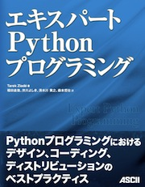

====================
ドキュメント資料集
====================

ここでは、技術ドキュメントの書き方、キュメントの活用法などについてのドキュメントについて紹介します。

.. contents:: 資料集内索引
   :depth: 2

プロジェクトのドキュメント作成
=========================================================

本ドキュメントは、アスキー・メディアワークスから5月31日に発売予定のエキスパートPythonプログラミングの10章のサンプルです。原著でも10章がサンプルとして公開されていますが、翻訳書でも10章を公開できる運びとなりました。

テクニカルドキュメントの書き方から、ドキュメントの種類など、ソフトウェア開発におけるドキュメンテーションについて、幅広く説明されています。最後にSphinxについても説明されています。

* `PDF版サンプル <http://www.shibu.jp/dcnt/dcnt.cgi?n=1>`_ : 出版されるレイアウトです。
* `ePub版(iPad用)サンプル <http://www.shibu.jp/dcnt/dcnt.cgi?n=2>`_ : Sphinxで生成しました。

.. toctree::
   :maxdepth: 2

   expertpython/index

.. note::
   Sphinx-Users.jpに関わっている、清水川、渋川が翻訳に参加しました。

Python Enhancement Proposal: 1
==============================

`PEP <http://www.python.org/dev/peps/>`_ というのはPythonの機能拡張、要望、リリース計画などを記述するのに使用される公式なドキュメントの記述方法です。オープンソースの中でも屈指のドキュメントの充実ぶりを見せるPythonのコアとなる部分で、「開発コミュニティを動かすドキュメント」です。PEP 1は、その中でも、PEPのワークフローを定めたメタなPEPです。

最近ではErlangもPythonに習って、 `EEP <http://www.erlang.org/eeps/>`_ として取り入れています。

:翻訳者: 渋川よしき(2010/05/01)
:原文: http://www.python.org/dev/peps/pep-0001/

.. toctree::
   :maxdepth: 2 

   pep1

Python Enhancement Proposal: 3120
==================================

このPEPはデフォルトソースエンコーディングをASCIIからUTF-8へ変更することを提案します。代替となるソースエンコーディング、つまり明示的なエンコーディング定義をデフォルトよりも優先することは継続的にサポートします。

:翻訳者: 森本哲也(2010/07/25)
:原文: http://www.python.org/dev/peps/pep-3120/

.. toctree::
   :maxdepth: 2

   pep3120

