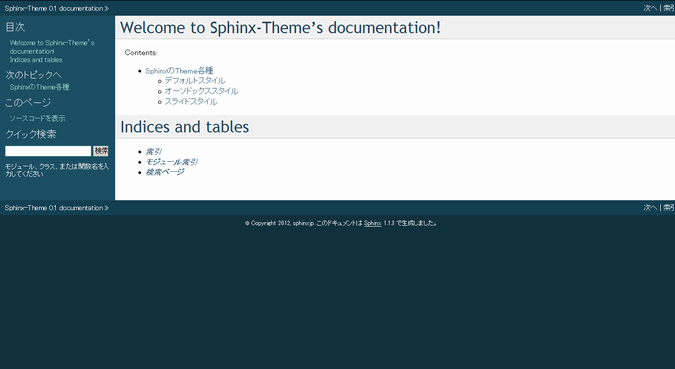
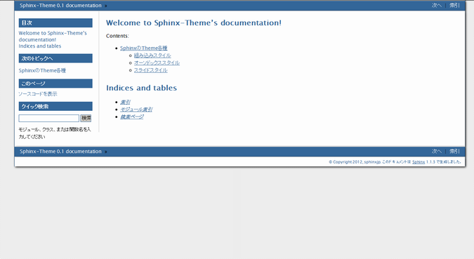

=======================================================================
テーマの変更
=======================================================================

.. contents:: 目次
   :depth: 3

概要
=======================================================================
Sphinxには、標準で9つのテーマ [#f1]_ が用意されています。まずは、標準のテーマを他のテーマへ変更する方法を確認しましょう。
詳細については `公式ドキュメント <http://sphinx-users.jp/doc11/theming.html>`_ を参照して下さい。

手順
=======================================================================
テーマを変更するには、\ ``conf.py``\ の以下の部分を編集します。

.. code-block:: python

   # -- Options for HTML output ---------------------------------------------------

   # The theme to use for HTML and HTML Help pages.  See the documentation for
   # a list of builtin themes.
   #html_theme = 'default'
   html_theme = 'default'

   # Theme options are theme-specific and customize the look and feel of a theme
   # further.  For a list of options available for each theme, see the
   # documentation.
   #html_theme_options = {}

   # Add any paths that contain custom themes here, relative to this directory.
   #html_theme_path = []

標準では、\ ``html_theme``\ には\ ``default``\ が指定され、テーマのパスを指定する項目\ ``html_theme_path``\ はコメントアウトされています。

\ ``conf.py``\ の\ ``html_theme``\ の値を、組込みテーマから選択して指定すれば、指定したテーマに変更する事が出来ます。以下の例では、sphinxdocテーマを指定しています。

.. code-block:: python

   # The theme to use for HTML and HTML Help pages.  Major themes that come with
   # Sphinx are currently 'default' and 'sphinxdoc'.
   html_theme = 'sphinxdoc'

\ ``conf.py``\ を書き換えた後、\ :command:`make html`\ を実行すれば指定したテーマのhtmlが出力されます。

.. _default_theme:

組み込みテーマの紹介
=======================================================================

default
-----------------------------------------------------------------------
下記が\ **default**\ テーマです。
\ ``default``\ テーマは\ ``sphinx-quickstart``\ を行った後に使用されるテーマです。

他にもSphinxでは、以下のテーマが組込まれています。

basic
-----------------------------------------------------------------------
.. image:: img/basic.png

* conf.pyの書き換え::

    html_theme = 'basic'

sphinxdoc
-----------------------------------------------------------------------
.. image:: img/sphinxdoc.png

* conf.pyの書き換え::

    html_theme = 'sphinxdoc'

scrolls
-----------------------------------------------------------------------
.. image:: img/scrolls.png

* conf.pyの書き換え::

    html_theme = 'scrolls'

agogo
-----------------------------------------------------------------------
.. image:: img/agogo.png

* conf.pyの書き換え::

    html_theme = 'agogo'

nature
-----------------------------------------------------------------------
.. image:: img/nature.png

* conf.pyの書き換え::

    html_theme = 'nature'

pyramid
-----------------------------------------------------------------------
.. image:: img/pyramid.png

* conf.pyの書き換え::

    html_theme = 'pyramid'

haiku
-----------------------------------------------------------------------

* conf.pyの書き換え::

    html_theme = 'haiku'

traditional
-----------------------------------------------------------------------
.. image:: img/traditional.png

* conf.pyの書き換え::

    html_theme = 'traditional'

epub
-----------------------------------------------------------------------

* conf.pyの書き換え::

    html_theme = 'epub'

サードパーティ製テーマの紹介
=======================================================================
* Pythonのパッケージ管理ツール\ :command:`easy_install`\ や\ :command:`pip`\ でSphinxの拡張テーマをインストールし利用する事が可能です。
* 組み込みスタイルと違い、\ ``conf.py``\ の書き換える箇所が複数になる場合があるので注意して下さい。

sphinxjp.themes.bizstyle
-----------------------------------------------------------------------
http://pypi.python.org/pypi/sphinxjp.themes.bizstyle/

* インストール方法例::

    easy_install sphinxjp.themes.bizstyle

* conf.pyの書き換え::

    html_theme = 'bizstyle'
    extensions = ['sphinxjp.themecore']

    # 下記オプションでバックグラウンドの色を変更する事が可能です。※必須ではありません
    html_theme_options = {'maincolor' : "#696969"}

sphinxjp.themes.dotted
-----------------------------------------------------------------------
http://pypi.python.org/pypi/sphinxjp.themes.dotted/

.. image:: img/dotted.png

* インストール方法例::

   easy_install sphinxjp.themes.dotted

* conf.pyの書き換え::

   extensions = ['sphinxjp.themecore']
   html_theme = 'dotted'

sphinxjp.themes.sphinxjp
-----------------------------------------------------------------------
http://pypi.python.org/pypi/sphinxjp.themes.sphinxjp/

.. image:: img/sphinxjp.png

* インストール方法例::

   easy_install sphinxjp.themes.sphinxjp

* conf.pyの書き換え::

   extensions = ['sphinxjp.themecore']
   html_theme = 'sphinxjp'

sphinxjp.themes.trstyle
-----------------------------------------------------------------------
http://pypi.python.org/pypi/sphinxjp.themes.trstyle/

.. image:: img/trstyle.png

* インストール方法例::

    easy_install sphinxjp.themes.trstyle

* conf.pyの書き換え::

    extensions = ['sphinxjp.themecore']
    html_theme = 'trstyle'

.. rubric:: 脚注

.. [#f1] バージョン1.1.3現在。
