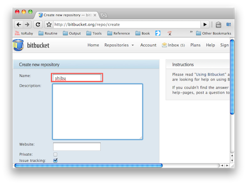
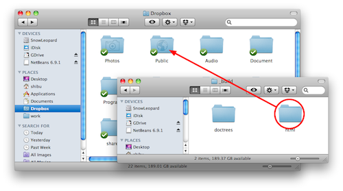
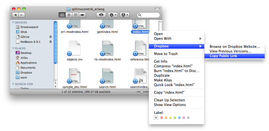

========================================
Sphinxで作ったドキュメントのホスティング
========================================

:日時: 2010/09/05
:作者: 渋川よしき、山口能迪

Sphinxでドキュメントを作ったら公開したいですよね？自分のホームページ作成のように、FTPを使って、プロバイダーなどで提供されている所に置くというのも当然できますが、ここではいくつか別の方法を紹介します。

.. contents::

Bitbucket.orgを使ってドキュメントを公開
============================================

Bitbukcet上に、 ``http://ユーザ名.bitbucket.org`` という名前でドキュメントを公開できます。

必要なもの
----------

* Bitbucketのアカウント
* Mercurial

公開手順
--------

1. ``ユーザ名.bitbucket.org`` という名前のリポジトリを作ります。

2. リポジトリを作った後のOverviewのページに表示されているコマンド(hg clone)を実行します
3. SphinxでビルドしたHTML群を登録します。
4. コミットして、Bitbucketに変更をPushします。
5. ``http://ユーザ名.bitbucket.org`` にアクセスすると、作成したファイルが見られます。

参考: `Free Hosting at BitBucket <http://hgtip.com/tips/beginner/2009-10-13-free-hosting-at-bitbucket/>`_

Dropboxを使ってドキュメントを公開
========================================

Dropboxのドキュメント公開昨日を使ってドキュメントを公開します。ローカルの作業だけで公開ができます。

必要なもの
----------

* Dropboxのユーザ登録とインストール

公開手順
--------

1. ビルドしたHTMLのフォルダを、DropboxのPublicフォルダ以下にコピーします。

2. HTMLのフォルダの名前をhtmlから、適切な名前にリネームします。

3. Dropboxにコピーしたフォルダの :file:`index.html` を右クリックして「公開パスの取得」を選択して、公開URLを取得します。

4. Dropboxのアップロードが完了したら完了です。

Google App Engineを使ってドキュメントを公開
===========================================

Google App Engine上で静的ファイルを公開する方法を使ってホスティングします。

必要なもの
----------

* Google App Engineのアカウントと `開発環境 <http://code.google.com/intl/ja/appengine/docs/python/gettingstarted/devenvironment.html>`_

公開手順
--------

#. Google App Engine （以下GAE）のアプリケーションを作成します。
   詳細は `公式サイト <http://code.google.com/intl/ja/appengine/docs/java/gettingstarted/uploading.html>`_ を参照してください。
   ここでは ``hoge`` というアプリケーションを作成します。

#. GAEプロジェクトディレクトリをローカルに作成し、Sphinxドキュメントのビルドディレクトリにシンボリックリンクを張ります。

   .. code-block:: bash

      $ mkdir hoge
      $ cd hoge
      $ ln -s /home/sphinxuser/docs/hoge/_build/html hoge_document
 

#. プロジェクトディレクトリ直下に ``app.yaml`` を作成します。

   .. code-block:: yaml

      application: hoge
      version: 1
      runtime: python
      api_version: 1
      
      handlers:
      - url: /hoge_document
        static_dir: hoge_document

   この時点でディレクトリは下記のようになっているはずです。

   .. code-block:: none

      hoge
      ├── app.yaml
      └── hoge -> /home/sphinxuser/docs/hoge/_build/html
      
#. appcfg.pyを使ってGAEへデプロイします。この時appcfg.pyに渡すのはディレクトリ名であることに注意してください。

   .. code-block:: bash

      $ appcfg.py update hoge
      Application: hoge; version: 1.
      Server: appengine.google.com.
      Scanning files on local disk.
      Scanned 500 files.
      Initiating update.
      Could not guess mimetype for hoge_document/objects.inv.  Using application/octet-stream.
      Cloning 35 static files.
      Cloning 403 application files.
      Cloned 100 files.
      Cloned 200 files.
      Cloned 300 files.
      Cloned 400 files.
      Uploading 403 files and blobs.
      Uploaded 403 files and blobs.
      Deploying new version.
      Checking if new version is ready to serve.
      Will check again in 1 seconds.
      Checking if new version is ready to serve.
      Will check again in 2 seconds.
      Checking if new version is ready to serve.
      Will check again in 4 seconds.
      Checking if new version is ready to serve.
      Closing update: new version is ready to start serving.
      Uploading index definitions.
      

#. （おまけ）デプロイの自動化をするには下記のようなスクリプトを作成してcrontabに登録しておくとよいでしょう。パスワードはappcfg.pyに渡せないので、スクリプト化するには `expect` を使う必要があります。

   .. code-block:: bash

      #!/bin/bash
      
      DOCS_HOME=${HOME}/src/docs
      GAE_SDK_HOME=${HOME}/tool/google_appengine
      GAE_APP_HOME=${HOME}/gae/
      GAE_APP_NAME=hoge
      GAE_USER=<user mail address>
      GAE_PASS=<password>
      
      PASSWD_MSG="Password for "${GAE_USER}
      
      make html
      sleep 60
      
      cd ${GAE_APP_HOME}
      
      expect -c "
      spawn $GAE_SDK_HOME/appcfg.py update --email=$GAE_USER --passin $GAE_APP_NAME
      set timeout -1
      expect $PASSWD_MSG
      send $GAE_PASS
      interact
      "   
