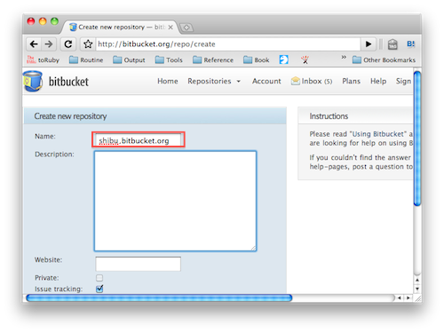

Sphinxで作ったドキュメントのホスティング
========================================

:日時: 2010/09/05
:作者: 渋川よしき

Sphinxでドキュメントを作ったら公開したいですよね？自分のホームページ作成のように、FTPを使って、プロバイダーなどで提供されている所に置くというのも当然できますが、ここではいくつか別の方法を紹介します。

.. contents::

Bitbucket.orgにホスティング
---------------------------

Bitbukcet上に、``http://ユーザ名.bitbucket.org`` という名前でドキュメントを公開できます。

必要なもの
----------

* Bitbucketのアカウント
* Mercurial

1. アカウント名と同じ名前のリポジトリを作ります。

2. リポジトリを作った後のOverviewのページに表示されているコマンド(hg clone)を実行します
3. SphinxでビルドしたHTML群を登録します。
4. コミットして、Bitbucketに変更をPushします。
5. ``http://ユーザ名.bitbucket.org`` にアクセスすると、作成したファイルが見られます。

参考: `Free Hosting at BitBucket <http://hgtip.com/tips/beginner/2009-10-13-free-hosting-at-bitbucket/>`_
