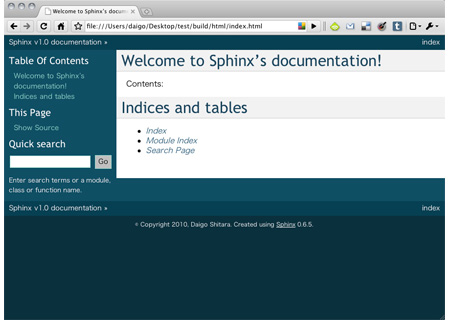
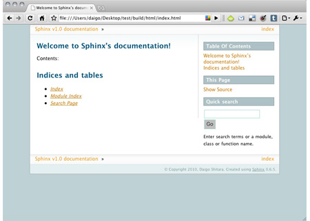
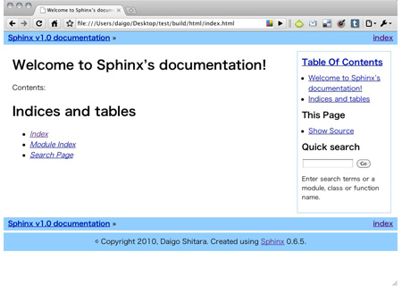

テーマの変更
=============
Sphinxには、デフォルトで3つのテーマ [#f1]_ が用意されています。まずは、デフォルトのテーマを他のテーマへ変更する方法を確認しましょう。

テーマを変更するには、\ ``conf.py``\ の以下の部分を編集します。

.. code-block:: python

   # The theme to use for HTML and HTML Help pages.  Major themes that come with
   # Sphinx are currently 'default' and 'sphinxdoc'.
   html_theme = 'default'

   # Add any paths that contain custom themes here, relative to this directory.
   #html_theme_path = []

デフォルトでは、\ ``html_theme``\ には\ ``default``\ が指定され、テーマのパスを指定する項目\ ``html_theme_path``\ はコメントアウトされています。

\ ``default``\ テーマは\ ``sphinx-quickstart``\ を行った後に使用されるテーマです。

**default**

他にもSphinxでは、以下のテーマが組込まれています。

**sphinxdoc**

**traditional**

\ ``conf.py``\ の\ ``html_theme``\ の値を、組込みテーマから選択して指定すれば、指定したテーマに変更する事が出来ます。以下の例では、sphinxdocテーマを指定しています。

.. code-block:: python

   # The theme to use for HTML and HTML Help pages.  Major themes that come with
   # Sphinx are currently 'default' and 'sphinxdoc'.
   html_theme = 'sphinxdoc'

\ ``html_theme_path``\ は、テーマが任意の場所にある場合に、その場所のパス(\ ``conf.py``\ からの相対パス)を指定します。使用したいテーマが\ ``conf.py``\ と同ディレクトリにある場合には、以下の様に指定します。組込みテーマを使用する場合には、テーマファイルはSphinxのインストールディレクトリ内にあるので、\ ``html_theme_path``\ で指定する必要はありません。

.. code-block:: python

   # Add any paths that contain custom themes here, relative to this directory.
   html_theme_path = ['.']

テーマの変更方法を確認したら、\ :doc:`prepare`\ に進んでください。

.. rubric:: 脚注

.. [#f1] バージョン0.6.5現在。バージョン1.1.3現在については :ref:`こちら <default_style113>`
