=======================================================================
テーマの紹介
=======================================================================

.. _default_style113:

組み込みスタイル
=======================================================================
| Sphinxには、デフォルトで9つのHTMLテーマが用意されています。
| 詳細については `公式ドキュメント <http://sphinx-users.jp/doc11/theming.html>`_ を参照して下さい。

  conf.py の 下記行を書き換える事により変更できます。

  ::

     html_theme = 'default'

basic
-----------------------------------------------------------------------
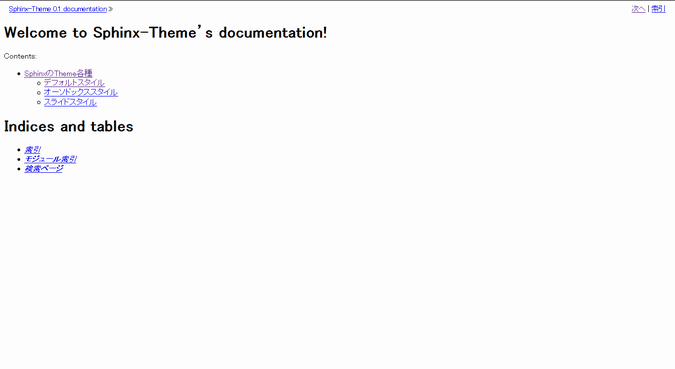

* conf.pyの書き換え::

    html_theme = 'basic'

default
-----------------------------------------------------------------------
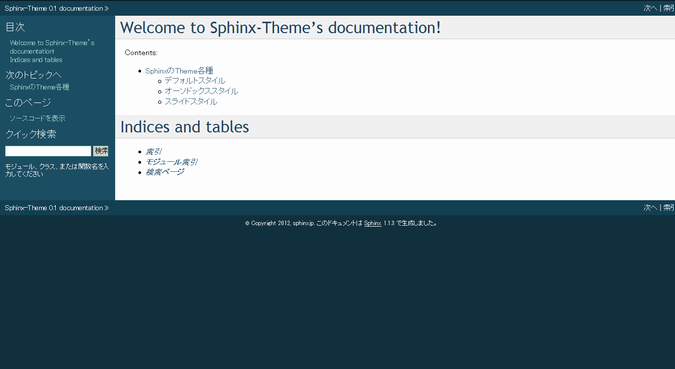

* conf.pyの書き換え::

    html_theme = 'default'

sphinxdoc
-----------------------------------------------------------------------
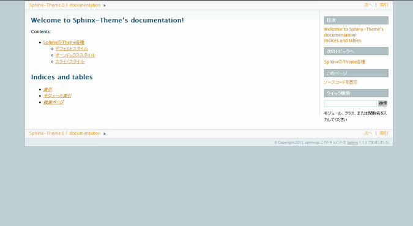

* conf.pyの書き換え::

    html_theme = 'sphinxdoc'

scrolls
-----------------------------------------------------------------------
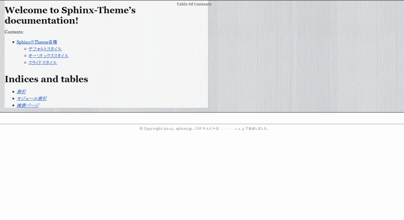

* conf.pyの書き換え::

    html_theme = 'scrolls'

agogo
-----------------------------------------------------------------------
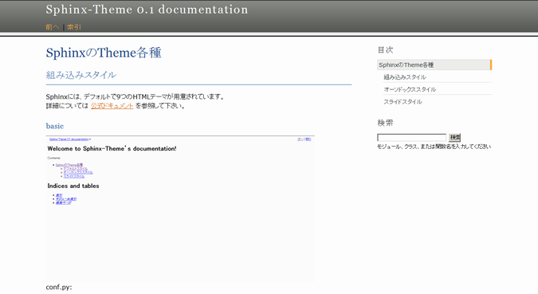

* conf.pyの書き換え::

    html_theme = 'agogo'

nature
-----------------------------------------------------------------------
.. image:: file/nature.png

* conf.pyの書き換え::

    html_theme = 'nature'

pyramid
-----------------------------------------------------------------------
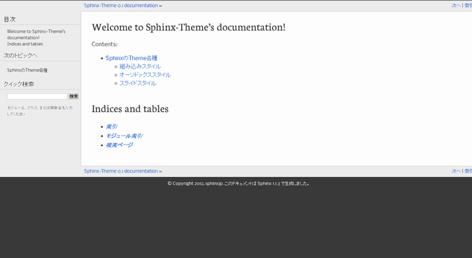

* conf.pyの書き換え::

    html_theme = 'pyramid'

haiku
-----------------------------------------------------------------------
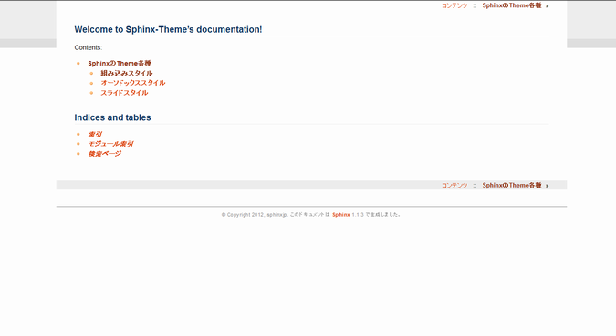

* conf.pyの書き換え::

    html_theme = 'haiku'

traditional
-----------------------------------------------------------------------
.. image:: file/traditional.png

* conf.pyの書き換え::

    html_theme = 'traditional'

epub
-----------------------------------------------------------------------
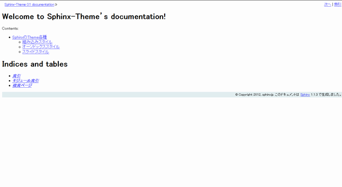

* conf.pyの書き換え::

    html_theme = 'epub'

サードパーティ製のオーソドックススタイル
=======================================================================
* Pythonのパッケージ管理ツール **easy_install** や **pip** でSphinxの拡張テーマをインストールし利用する事が可能です。
* 組み込みスタイルと違い、conf.pyの書き換えが複数の場合が多いので注意して下さい。

sphinxjp.themes.bizstyle
-----------------------------------------------------------------------
http://pypi.python.org/pypi/sphinxjp.themes.bizstyle/

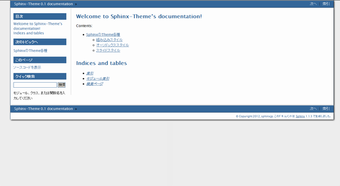

* インストール方法例::

    easy_install sphinxjp.themes.bizstyle

* conf.pyの書き換え::

    html_theme = 'bizstyle'
    extensions = ['sphinxjp.themecore']

    # 下記オプションでバックグラウンドの色を変更する事が可能です。※必須ではありません
    html_theme_options = {'maincolor' : "#696969"}

sphinxjp.themes.dotted
-----------------------------------------------------------------------
http://pypi.python.org/pypi/sphinxjp.themes.dotted/

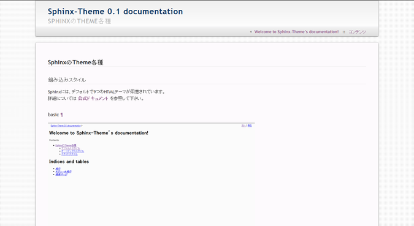

* インストール方法例::

   easy_install sphinxjp.themes.dotted

* conf.pyの書き換え::

   extensions = ['sphinxjp.themecore']
   html_theme = 'dotted'

sphinxjp.themes.sphinxjp
-----------------------------------------------------------------------
http://pypi.python.org/pypi/sphinxjp.themes.sphinxjp/

.. image:: file/sphinxjp.png

* インストール方法例::

   easy_install sphinxjp.themes.sphinxjp

* conf.pyの書き換え::

   extensions = ['sphinxjp.themecore']
   html_theme = 'sphinxjp'

sphinxjp.themes.trstyle
-----------------------------------------------------------------------
http://pypi.python.org/pypi/sphinxjp.themes.trstyle/

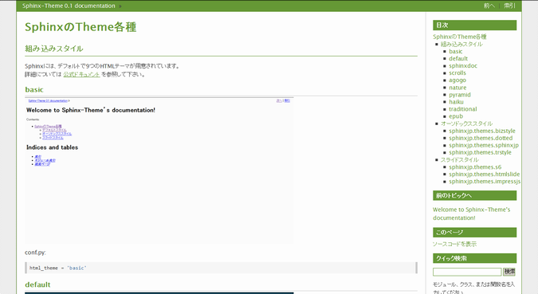

* インストール方法例::

    easy_install sphinxjp.themes.trstyle

* conf.pyの書き換え::

    extensions = ['sphinxjp.themecore']
    html_theme = 'trstyle'

サードパーティ製のスライドスタイル
=======================================================================

sphinxjp.themes.s6
-----------------------------------------------------------------------
http://pypi.python.org/pypi/sphinxjp.themes.s6/

  ※デモについてはURL先参照

* インストール方法例::

   easy_install sphinxjp.themes.s6

* conf.pyの書き換え::

   extensions = ['sphinxjp.themecore']
   html_theme = 's6'

sphinxjp.themes.htmlslide
-----------------------------------------------------------------------
http://pypi.python.org/pypi/sphinxjp.themes.htmlslide

  ※デモについてはURL先参照

* インストール方法例::

   easy_install sphinxjp.themes.htmlslide

* conf.pyの書き換え::

   extensions = ['sphinxjp.themecore']
   html_theme = 'htmlslide'
   pygments_style = 'monokai'

sphinxjp.themes.impressjs
-----------------------------------------------------------------------
http://pypi.python.org/pypi/sphinxjp.themes.impressjs/

  ※デモについてはURL先参照

* インストール方法例::

   easy_install sphinxjp.themes.impressjs

* conf.pyの書き換え::

   extensions = ['sphinxjp.themecore']
   html_theme = 'impressjs'
   html_use_index = False

