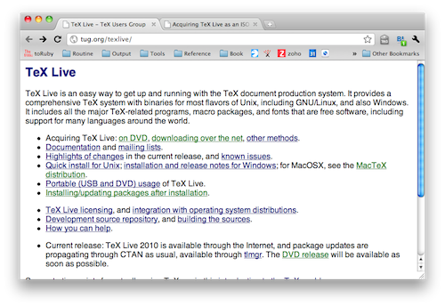
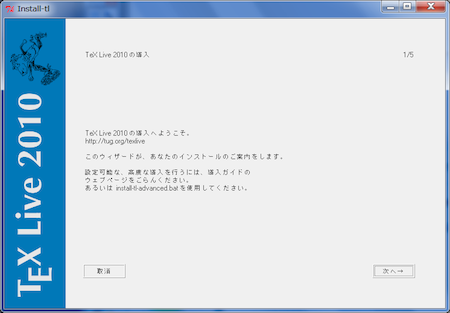

====================
LaTeX経由でのPDF作成
====================

:日時: 2010/10/10
:作者: 渋川よしき
:最終更新: 2010/10/10

Sphinxの標準機能に、LaTeXを経由したPDF出力が入っています。英語のPDFであれば簡単に成功するのですが、日本語ではスムーズに行かないところもあります。

ここでは、日本語ならではの情報を集約していこうと思います。

.. note::

   この説明手順は、Windows 7(32bit)、MacOSX 10.6(64bit)、Ubuntu Linux 10.04(32bit)で検証しています。

.. warning::
   日本語環境ではまだ、警告が出たり、100%これでOKというところまでは行っていません。現時点で分かっている所までの情報になります。追加情報や、協力してくれる方がいたら、 yoshiki@shibu.jp までご連絡ください。

   また、Sphinxの生成するスタイルファイルとpLaTeXの相性が良くないため、まだセクションタイトル周りのスタイルがおかしかったり、toctreeが出力されないという問題があることが分かっています。

TeXLive2010のインストール
=========================

TeX系の処理系には色々あります(pLaTeX、tetex、xetex、pdflatexなど)が、現在活発に開発されていているのが、 `TeXLive <http://tug.org/texlive/>`_ というディストリビューションになります。Windows、MacOSX、Linux、FreeBSDなどに対応しており、環境の作りやすさを考慮して、これを使って説明をしていきます。

TeXの処理系の中には、アスキー・メディアワークスが開発を行っていて、日本語の扱いに長けたpTeX/pLaTeXがあります。TeXLive2010からは、このpLaTeXも内蔵されたため、簡単に品質の高い日本語のドキュメントが作れるようになりました。

なお、Mac用にはMacTeXというディストリビューションもありますが、この説明はTeXLiveの方でのみ確認をしています。

.. warning::

   LinuxのパッケージやMacPortsでインストールできるTeXLiveは、今のところ2009までです。この説明で使うplatexが追加されたのは2010からなので、もし、2009で同じように実行したい場合には、 `pTeXLive <http://tutimura.ath.cx/ptexlive/>`_ を追加でインストールしてください。

インストーラのダウンロード
--------------------------

開発元が推奨しているのは、ネットワークインストールです。下記のページから、install-tl.zip (Windows用)か、install-tl-unix.tar.gzをダウンロードして、展開してください。

* `TeXLive 2010のネットワークインストーラ <http://www.tug.org/texlive/acquire-netinstall.html>`_

DVDイメージ(2GBある)もあります。社内から外にアクセスしにくいなどの環境でインストールする場合はこちらが良いでしょう。bittorrentを使ってダウンロードすることもできます。ダウンロードしたら、DVDに焼いたり、イメージファイルをマウントしてください。

* `DVDイメージダウンロード <http://www.tug.org/texlive/acquire-iso.html>`_

インストール
------------

プログラムを実行してインストールしてください。WindowsではGUIのインストーラが、それ以外ではコンソールのインストーラが起動しますが、使い勝手に差はありません。

基本的にはデフォルトの設定のままで大丈夫です。もしインストール先を換えたい場合などは、インストーラの最初の設定画面で設定できます。

Sphinxの設定ファイルの修正
==========================

標準で生成した ``conf.py`` にも、TeXの設定は入っていますが、次の設定を行います。

.. code-block:: python

   latex_docclass = {"manual":"jarticle"}

   latex_elements = {
     "papersize": "a4paper",
     "pointsize": "12pt",
   }

Sphinxのビルドの実行
====================

``make latex`` と実行すれば、ファイルが生成されます。

.. code-block:: bash

   MacBook:docjp shibu$ Make latex
   python2.6 ../sphinx-build.py -b latex -d _build/doctrees  -P  . _build/latex
   Running Sphinx v1.0
   loading pickled environment... done
   building [latex]: all documents
   updating environment: 0 added, 0 changed, 0 removed
   looking for now-outdated files... none found
   processing sphinx.tex... contents intro tutorial invocation rest...(略)
   resolving references...
   writing... /Users/shibu/work/sphinx/sphinx-domains-docjp/docjp/rest.rst:: WARNING: unusable reference target found: substitution-definitions
   done
   copying images... themes/default.png themes/haiku.png...(略
   copying TeX support files... done
   build succeeded, 1 warning.

   Build finished; the LaTeX files are in _build/latex.
   Run `make all-pdf' or `make all-ps' in that directory to run these through (pdf)latex.
   MacBook:docjp shibu$

これで、ビルドディレクトリの中にPDFの作成に必要なファイル群が作られました。ただし、PDFの場合には、これでおしまいではありません。

指示通り、ビルドフォルダの中のlatexに移動してください。

PDF作成
=======

標準のMakefileでは、pdflatexという処理系を使って処理をしています。ですが、ここではplatexを使いますので、様々な所を手で操作する必要があります。

なお、一度Sphinxのmake latexを実行すると、Makefileやsphinx.styの修正が上書きされてしまうため、注意してください。

バウンダリーファイルの作成
--------------------------

ビットマップ系の画像ファイルの場合、解像度などの情報は持っていません。正確に画像を貼り付けるために、バウンダリーボックスのファイル(.bb)を作ります。これは１行でおしまいです。

.. code-block:: bash

   MacBook:latex shibu$ ebb *.png

これで各ファイルごとに、 ``.bb`` ファイルが作られます。

sphinx.styの編集
------------------

下記のような、 ``graphincx`` パッケージを読み込んでいる所をエディタで開き、上段の ``usepackage`` のところに ``[dvipdfm]`` を追加してください。

.. code-block:: tex

   % For graphicx, check if we are compiling under latex or pdflatex.
   \ifx\pdftexversion\undefined
     \usepackage[dvipdfm]{graphicx}
   \else
     \usepackage[pdftex]{graphicx}
   \fi

Makefileの編集
--------------

``platex`` を使うので、Makefileを開いて、dviルールの所を ``latex`` から ``platex`` に書き換えてください。

.. code-block:: makefile

   %.dvi: %.tex
           platex $(LATEXOPTS) '$<'
           Platex $(LATEXOPTS) '$<'
           platex $(LATEXOPTS) '$<'
           -makeindex -s python.ist '$(basename $<).idx'
           platex $(LATEXOPTS) '$<'
           platex $(LATEXOPTS) '$<'

Windowsの場合には、次のようにしてください。

.. code-block:: makefile

   %.dvi: %.tex
           platex -kanji=utf8 $(LATEXOPTS) '$<'
           platex -kanji=utf8 $(LATEXOPTS) '$<'
           platex -kanji=utf8 $(LATEXOPTS) '$<'
           -makeindex -s python.ist '$(basename $<).idx'
           platex -kanji=utf8 $(LATEXOPTS) '$<'
           platex -kanji=utf8 $(LATEXOPTS) '$<'

pLaTeXとdvipdfmxの実行
----------------------

以上の準備ができたら、まずはDVIファイルを作ります。警告が大量にでますが、Enter連打でなんとかなります。Windwosでスタックがなくなったというエラーて進まなくなった時は、上記のMakefileに ``-kanji=utf8`` を設定するのを割れないでください。

.. code-block:: bash

    MacBook:latex shibu$ make all-dvi

仕上げに、dvipdfmxを使ってPDFファイルを作ります。拡張子なしのdviファイル名(つまりは、ソースファイル(.tex)の拡張子無しと一緒)を渡します。

.. code-block:: bash

    MacBook:latex shibu$ dvipdfmx shpinx

お疲れ様でした！これでPDFファイルができました。下記の場所にSphinx 1.0のプロジェクトからこの方法で生成したPDFを置きました。

* `Sphinx 1.0ドキュメントのPDF <http://sphinx-users.jp/doc10/sphinx.pdf>`_

.. note::

   このPDFはフォント埋め込みタイプではありませんので、Kindleなどに入れると文字が出ません。フォント埋め込みはdvipdfmxの設定で行えるようになるはずです。検証したらまた追記します。

変更履歴
========

:2010/10/10: 初版(渋川)
