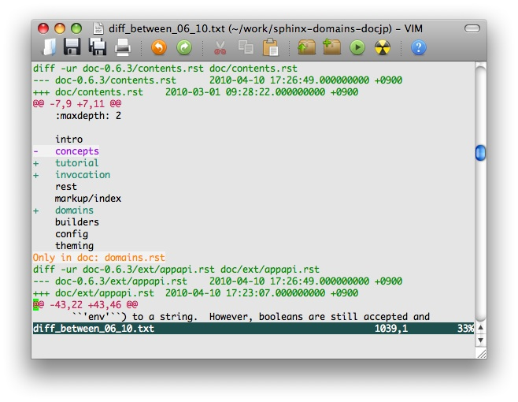

================================
ドキュメントの翻訳にSphinxを使う
================================

:author: 渋川
:date: 2010/04/18

オープンソースのソフトウェアのドキュメントの翻訳や、ブログなどの翻訳をやったことがあるのであれば、日本語と英語をどのように管理していくのか、というのは、地味に面倒な問題です。 `dokuwiki <http://www.dokuwiki.org/ja:dokuwiki>`_ のように、切り替え機能を内蔵したシステムもありますが、見比べながら訳すのがやりにくかったり、テキストファイルでないので、管理が自由にできないという問題もあります。

Sphinxが使っているreStructuredTextにはコメントアウト機能があるので、気軽に翻訳が行えます。ただし、dokuwikiのように、日本語、英語、中国語、ドイツ語・・・など複数言語を一度に扱うのは難しいです。

基本的なやり方
==============

``..`` で始まる行はコメントになります。次に同じインデントに戻るまでのブロックがまとめてコメントアウトされます。これを使うと次のように書くことができます。 

.. code-block:: rest

   .. Inline markup
      =============

   インラインマークアップ
   ======================

   .. Sphinx uses interpreted text roles to 
      insert semantic markup into documents. 
      They are written as ``:rolename:`content```.

   Sphinxは解釈済みのテキストのロールというものを
   使用して、用語の意味を記述して、リンクを張ったり
   することができます。これを記述する時は 
   ``:ロール名:`内容``` というフォーマットで記述します。

``make html`` してレンダリングすると、日本語だけのドキュメントができあがります。

`Tornadoドキュメントの翻訳 <http://tornado.shibu.jp/>`_ のソースコードを見てもらえれば、このように翻訳をしていることがわかります。以前、大きめのドキュメントの翻訳をやったときは、英語部分を落とすスクリプトを自作して使っていましたが、Sphinxを使えば標準機能でそのまま行けます。コードハイライトなども充実しているので、特にソフトウェアのドキュメントの翻訳で力を発揮し、原文以上の翻訳ドキュメントが得られるかもしれません。


書籍を翻訳するためのTips
========================

現在、Sphinxを使って、とある書籍をまるごと翻訳しています。本1冊分みたいに、量が膨大になっても問題なく作業できます。

pdf2txtや `xdoc2txt <http://www31.ocn.ne.jp/~h_ishida/xdoc2txt.html>`_ などを使ってテキスト化したら、章ごとにファイルに分けて、拡張を ``.rst`` にして翻訳を開始します。

最初にまず、セクションタイトルの構造をきちんとreST化して、そこの翻訳だけでもやっておくと、全体の雰囲気が伝わります。 `Expert Python Programmingの目次の翻訳 <http://dl.dropbox.com/u/284189/epp/index.html>`_ に、それに近い実例があります。その際、未訳のセクションタイトルは ``(, )`` で括っておくと、進捗が分かりやすくなります::

   * 異なるアプローチ

      * ウォーターフォール開発モデル
      * スパイラル開発モデル
      * (漸進型開発モデル)

   * ライフサイクルの定義

      * プランニング
      * (開発)
      * (総合デバッグ)
      * リリース

また、ページ数の表記は残しておくことをお勧めします。書籍と往復しながらチェックしたり、原文のErrataを反映するときなど、ページ数があった方が見つけやすくなります。コメントアウトして入れておきましょう。::

  .. [ 215 ]

原文のバージョンアップに備える
==============================

オープンソースのドキュメントの場合には、原文もバージョンアップしていきます。うまくシステム化できればいいのですが、最低限、迷子にならずに翻訳できる方法を紹介します。

簡易方法
--------

翻訳をしたときのバージョンの原文を保持しておきます。そして、最新に更新して、翻訳を再開するバージョンを決めたら、それぞれのディレクトリの差分を取り、それを見ながら翻訳した箇所を確認していきます。

* 新規ファイルがあれば、新しいバージョンからファイルをコピーして新規翻訳する
* 無くなったファイルがあれば、紛らわしくないように削除する
* 差分を確認しながらちょくちょく修正を加えていく。

なお、翻訳している日本語のファイルもきちんとバージョン管理をするのが望ましいのですが、している場合もそうでない場合も、いちど差分をすべて目を通しておきましょう。一見「削除された」と書いてあっても、ただ単に場所を移動しただけの場合も多々あります。



バージョン管理を利用する
------------------------

上記のバージョンのレベルアップ版です。原文は大抵、ソフトウェアを開発しているリポジトリの中などに入っていることが多いと思います。翻訳をしていたバージョン情報の番号だけ覚えておけば、それと翻訳をしているバージョンの差分なども出すことができます。

実際の操作はそれぞれが使用しているバージョン管理システムによって異なります。

Sphinx日本語ドキュメント翻訳のワークフロー
==========================================

それでは、サンプルとして、Sphinxの日本語ドキュメントの翻訳をサンプルにして具体的な翻訳の流れについて紹介します。

まずは翻訳元のSphinxをフォークする
----------------------------------

翻訳元となっているSphinxは、 `Bitbucket <http://bitbucket.org>`_ という共有リポジトリサービス上で開発が行われています。まずはBitbucket上で、自分のユーザを作成します。Bitbucketは無料でも1GBまで使える上に、プライベートリポジトリが1つ使えます。ただし、バックエンドがAmazon S3で、そちらの影響からかたまに動作が重くなっていたりすることはあります。

フォークするには、フォークしたいプロジェクトのページ(今回はSphinx)を見て、その中のアイコンが並んでいる中から、forkというリンクをクリックします。

あたらしく自分のリポジトリができます。Sphinxの日本語訳は http://bitbucket.org/sphinxjp/doc11 というリポジトリで行っています。リポジトリができたら、そこに書いてある説明を見て、ローカルにリポジトリのクローンを作成します。なお、BitbucketのリポジトリはMercurialなので、Mercurialのインストールが必要となります。

.. code-block:: bash

   $ hg clone https://shibu@bitbucket.org/shibu/sphinx-domains-docjp

この中にdocというフォルダがあるので、docjpという名前でコピーを作り、その中で作業を行うことにします。

.. code-block:: bash

   $ cd sphinx-domains-docjp
   $ cp -r doc docjp

後は、docjpのフォルダ内でどんどん訳していきます。

.. note::

   元のプロジェクトがgithubを使っていたら、Bitbucketをgithub, Mercurialをgitに適宜読み替えてもらえば、基本的な作業の流れは同じはずです。

原文がバージョンアップした
--------------------------

まずは、翻訳した元のリビジョン番号を特定します。次のように実行すると、作業ログ一覧が表示されます。最新の方は日本語訳の作業履歴が残っているはずですが(コミットをきちんとしていれば)、それの一番若い数値(元開発者が最後にコミットした番号の次)を覚えておきます。

.. code-block:: bash

   $ hg log | head -n 30
   チェンジセット:   2285:831f0b135d9d
   タグ:             tip
   親:               2251:02058b6f3673
   親:               2284:2964c2788d22
   ユーザ:           shibu
   日付:             Tue Jun 01 00:45:15 2010 +0900
   要約:             update base version

   チェンジセット:   2284:2964c2788d22
   ユーザ:           mitsuhiko
   日付:             Sun May 30 22:18:16 2010 +0200
   要約:             Nicer solution for the C++ fix

ここでは、2285というのが覚えておくべき数字になります。

次に最新のリポジトリとマージします。元にしたプロジェクトを見ると、cloneするときの書き方が書かれていますが、現在翻訳作業をしているページに入り、"clone"の代わりに"pull"にして実行します。

.. code-block:: bash

   $ cd sphinx-domains-docjp
   $ hg pull https://shibu@bitbucket.org/birkenfeld/sphinx
   https://shibu@bitbucket.org/birkenfeld/sphinx から取り込み中
   変更点を探索中
   チェンジセットを追加中
   マニフェストを追加中
   ファイルの変更を追加中
   25 のチェンジセット(43 の変更を 22 ファイルに適用)を追加（+1個のヘッド）
   (ヘッド一覧表示は 'hg heads'、マージ実施は 'hg merge')

   $ hg heads
   チェンジセット:   2310:04464ddd8808
   タグ:             tip
   ユーザ:           Georg Brandl
   日付:             Sat Jun 05 18:49:39 2010 +0200
   要約:             merge with 0.6

   チェンジセット:   2285:831f0b135d9d
   ユーザ:           shibu
   日付:             Tue Jun 01 00:45:15 2010 +0900
   要約:             update base version

開発元のリビジョンが2310まで上がっていることが分かります。2284から2310までの変更点を取り込むのが、やるべき作業となります。

.. code-block:: bash

   $ hg merge 2310

   ファイル状態: 更新数 21、マージ数 0、削除数 0、衝突未解決数 0
   (マージ結果の commit を忘れずに)

マージされました。commit前にdiffを取れば、2284から2310に至る変更点をファイルに落とせます。

.. code-block:: bash

   $ hg diff > 2310.diff

コミットした後も、番号を覚えていれば簡単に差分を再度取り出せます。

.. code-block:: bash

   $ hg diff -r 2285 > 2310.diff

変更があった文章を翻訳しなおす
------------------------------

後はこの差分を落としたファイルを見ながら作業をすればOKです。diffを見ると、今回はdoc/config.rstとdoc/domains.rstが更新されていますので、それに合わせて直します。今回はdocjpとディレクトリを分けて作業していますので、変更があったら、docjp内も変更を加えます。

ここは手作業でのマージになると思いますが、英語と日本語が併記してある形式にしないと、作業がしにくいため、ちょっと大変ですが修正します。ここにかんしてもし良いやり方があれば教えてください。

docjp内の原文を直し、日本語訳も修正が完了したら作業はおしまいです。

.. code-block:: bash

   $ hg commit
   $ hg push

あとはビルドして公開しましょう。


 
