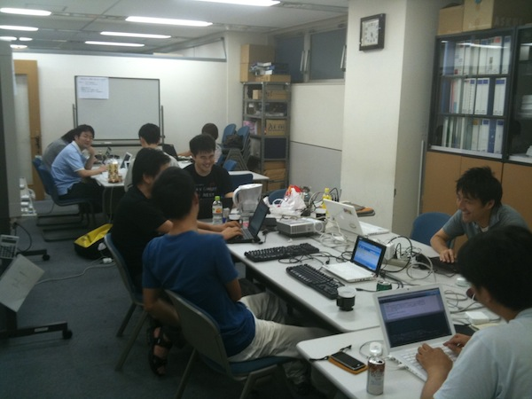

Sphinx翻訳ハッカソン(2010/08/01)
================================

:日時: 2010/08/01 11:00～19:00
:場所: タイムインターメディア(曙橋)

ソフトウェアのドキュメントに興味のある人が集まって、みんなで翻訳しよう、というイベントです。

なお、翻訳するものは問いませんし、Sphinxを使わなくてもOKです。また、一人でやっても、グループでやってもOK。一人では辛くてすぐ飽きちゃう活動も、みんなと一緒ならがんばれる！というのが目的です。また、翻訳とは関係なく、Sphinxを使ってみたい、という人でも歓迎です。

参加申込みはこちら -> `Sphinx + 翻訳 Hack-a-thon 2010.08 : ATND <http://atnd.org/events/6754>`_ (終了しました)

------------------------------------

イベントは無事開催されました。 @atusi さんによる、Wave講座があったり、Bitbucketを使ってドキュメントを無料でホスティングするテクニック紹介があったり、単なる翻訳に限らず、幅広く情報交換が行われました。今後も月に1回ぐらいのペースで開催していきたいと思います。

成果報告
--------

* @shibukawa: 

  * 翻訳した。 http://python-history-jp.blogspot.com/2010/08/mro.html
  * 写真を追加 http://sphinx-users.jp/event/20100724_release_party.html
  * The Art of Communityの翻訳を進めた。頭が爆発しそう。

* @atusi 
  
  http://a2c.bitbucket.org/flask/

* @nishio 

  http://pepja.googlecode.com/hg/build/html/index.html

  * 抜粋翻訳 PEP3104: Access to Names in Outer Scopes: http://d.hatena.ne.jp/nishiohirokazu/20100801/1280651063
  * 抜粋翻訳 PEP 342: Coroutines via Enhanced Generators: http://d.hatena.ne.jp/nishiohirokazu/20100801/1280656890
    抽象的な最初の説明をどう訳すかしばらく考えてから、まず訳すべきなのは実装例だろうという結論になった。どう使うかわからないものの説明を聞いてもわからない。

* @kshigeru 

  http://skitazaki.appspot.com/translation/twisted-intro-ja/index.html  (Sphinx 化できてないけど)

* @aohta 

  形態素解析して、stdoutするのはできた。jinja2で、reSTに整形とかやろうとしているところ。
  単語とファイルパスをうまく持てば簡易日本語検索いけるかも
  あと、仕事用ツールを作った。

* @takabow 

  なぜかVBAのマクロ直す羽目になってます。。。

* @shimizukawa 

  Pythonヒッチハイカーガイド for パッケージング http://shimizukawa.bitbucket.org/python-distribute-ja/index.html

* @tk0miya 

  Sphinx を使ってみた & 1.0.1 オレオレ Debian パッケージを使って epub & pdf 出してみた
  自分の debian repository に置きました： http://www.monochrome.jp/~katsuwo/debian/

* @t2y 

  PyMOTW の SimpleXMLRPCServer http://bit.ly/9bQMtN を翻訳した
  1週間以内には Web サイト http://bit.ly/blirHT にアップされると思う 

* @aroma_blackさん 

  noseの翻訳