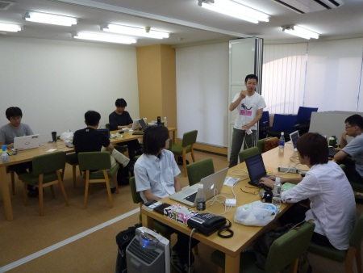

Sphinx翻訳ハッカソン(2010/09/05)
================================

:日時: 2010/09/05 11:00～19:00
:場所: `アクセンス・テクノロジー(神楽坂)`__

.. __: http://accense.com/company/access.html

ソフトウェアのドキュメントに興味のある人が集まって、みんなで翻訳しよう、というイベントです。

なお、翻訳するものは問いませんし、Sphinxを使わなくてもOKです。また、一人でやっても、グループでやってもOK。一人では辛くてすぐ飽きちゃう活動も、みんなと一緒ならがんばれる！というのが目的です。また、翻訳とは関係なく、Sphinxを使ってみたい、という人でも歓迎です。

参加申込みはこちら -> `Sphinx + 翻訳 Hack-a-thon 2010.09 : ATND <http://atnd.org/events/7475>`_ (終了しました)

------------------------------------

今回もイベントは無事開催されました。前回は `LL Tiger <http://ll.jus.or.jp/2010/>`_, 今回は `XP祭り2010 <http://kokucheese.com/event/index/2167/>`_ の翌日、と、なにか大きなイベントの翌日を狙って開催している気がしますね。さて、今回は比較的黙々と翻訳やSphinx関連の作業をしている感じでした。

成果報告
--------

* @shibukawa: 

  * The Art of Communityの7章を1割くらい翻訳進めた。

* @tokibito:

  * Django-Skype-Hub のドキュメントを書きました。
    http://tokibito.bitbucket.org/django-skypehub/

* @shimizukawa

  * buildoutでGAE環境を作る設定をアップデートしてました。
    http://www.freia.jp/taka/docs/pyhack4/buildout/gae.html

  * あとは金曜までにやったんですが、自分のサイトをPloneとSphinxnのハイブリッドにしました。
    デザイン適用はxdvでやっています。
    http://www.freia.jp/taka/docs/xdv/

* @aohta 

  * zope.interfaceの勉強をしてbuildbotのプラグインを書こうとしていました。
    プラグイン書くところで難航中。

* @takabow 

  * 仕事の内部資料（英語）を翻訳してました。あとでSphinxにする予定です。

* @tk0miya 

  * rst2pdfにバグ報告を2件しました。
  * あとはrst2pdfのスタイルの書き方を調べています。

* @t2y 

  * PyMOTW の multiprocessingの翻訳7割進みました。
    Web サイト http://bit.ly/blirHT にそのうちアップされると思う 

* @shkumagai

  * Natural Language Processing with Python (NLTK) の翻訳をしていました。
    1章の3節まで勧めました。

