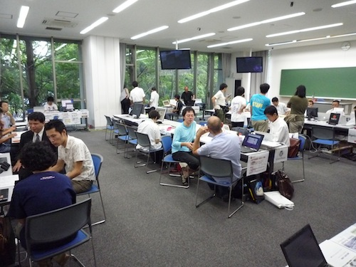
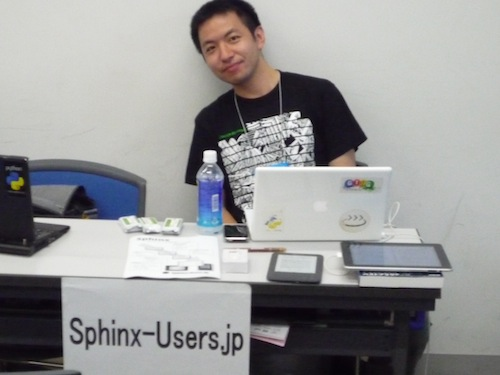
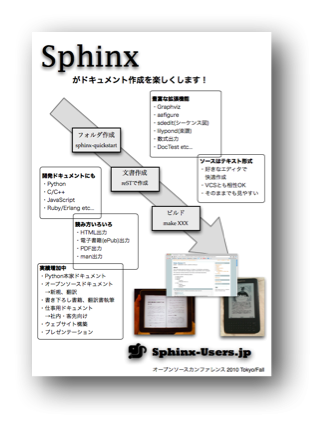

オープンソースカンファレンス2010 Tokyo/Fall(2010/09/10-11)
==========================================================

:日時: 2010年09月10日-11日
:場所: 明星大学
:申し込みサイト: http://www.ospn.jp/osc2010-fall/ 

多摩モノレールの先にある、明星大学のキャンパスで行われた、オープンソースカンファレンス2010 Tokyo/Fallにコミュニティとして出展してきました。とても広く開放的できれいなキャンパスでした。ブースの説明は、渋川、清水川の2人で行いました。

ePub出力のデモとしてiPadと、PDF出力のデモとしてのKindleと、Sphinxを使って翻訳を行った `エキスパートPythonプログラミング <http://sphinx-users.jp/articles/#id5>`_ を並べ、興味を持ってくれた人にチラシを配ったり、動かしてHTMLドキュメントを作るなどのデモをしました。

気づいたのは次のようなことです。

* iPadやKindleの注目度は大きい
* HTMLのビルドをして見せたときの反響は大きかった
* 大きい企業の方々がドキュメンテーションというキーワードで興味を持ってくれた
* 逆に学生さんは、あまりピンと来なかったみたい
* そのままでも読める、静的に扱える、多形式に変換できる、というあたりに興味を持つ人も
* なぜWordで出せないのか、という質問があった

チラシのPDFは `こちら <https://docs.google.com/a/shibu.jp/leaf?id=0B8X4zWf2QEfqMzc4NDVhNjEtZTY2ZC00YjlhLWI4ODMtYTMxMjRiYzBkOTli&sort=name&layout=list&num=50>`_

他のコミュニティと交流
----------------------

OmegaT
~~~~~~

オープンソースの翻訳メモリのOmegaTのコミュニティの `@brandelune <http://twitter.com/brandelune>`_ さんこと、エラリー・ジャンクリストフさんとさまざまなお話をしました。

ハンズオンで操作を見ながらでないと多少難しいかも、と思いましたが、Sphinxとうまく組み合わせることができればかなり高度な翻訳環境が作れそうでした。

reSTは標準のフィルタにはないのですが、とりあえずの方法として、 @brandelune さんから教えてもらったのは次の方法です::

  テキストフィルタにreSTの拡張子を登録する。テキストフィルタの設定で
 「原文を分節する単位」＞「空行」にする。分節は分単位ではなく、
  段落単位（Ctrl+Eのプロジェクト設定）。それで訳したPOファイルの
  内容は同じ段落単位のはずなので使えると思う。

* OmegaTウェブサイト: http://www.omegat.org/

