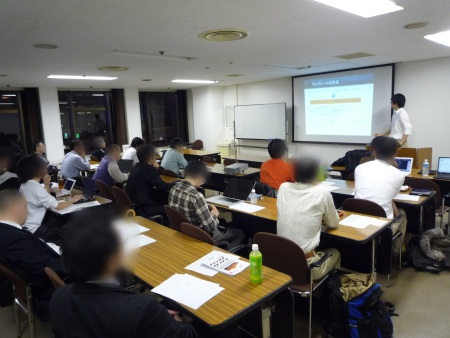

日本UNIXユーザ会 2010年12月勉強会 (2010/12/3)
===============================================

日本UNIXユーザ会の2010年12月の勉強会にて、以下の内容で発表させていただきました。(本ページ末尾から当日資料を閲覧出来ます)

「ドキュメントを作りたくなってしまう魔法のツール Sphinx」
---------------------------------------------------------

:日時: 2010/12/3(金) 18:30～20:30 (受付開始 18:10)
:場所: `すみだ産業会館 第一会議室`_ (錦糸町駅前 墨田区・丸井共同開発ビル9階)
:講師: 渋川よしき、山口能迪、清水川貴之
:詳細: `日本UNIXユーザ会 2010年12月勉強会`_ ページをご確認下さい

発表の様子
-----------

内容:
------

システム開発や運用現場にドキュメントはつきものです。 しかし、作り方がわからない、作る時間が取れないなど悩みは尽きません。本勉強会では、ドキュメントを作成したくなってしまう魔法のツール「Sphinx」をご紹介します。

「Sphinx」は、Wikiに似たマークアップによる効率良い記述と、HTML, ePub, PDFなど多くのフォーマットによる出力が可能なオープンソースのドキュメントツールです。サイトの構築や電子書籍の作成、仕事の納品物の作成はもちろん、作りっぱなしではなく、コードや業務と一体になって共に成長するドキュメント作成のプロセスをサポートしてくれます。実は今年出版された「つまみぐい勉強法」「エキスパートPythonプログラミング」の執筆でも使用されています。

このドキュメント作成を楽しくしてくれるツール「Sphinx」について、以下の構成でご紹介いたします。

* 「Sphinx」基礎、既存の他のツールとの比較
* OSSの話, コミュニティの成り立ち
* 利用例 (ドキュメント、サイト構築、設計書、他)
* デモ, 応用例, サンプル紹介, 拡張の紹介 など
* ビジネスユースの事例
* コミュニティでの今後の取り組み

ドキュメント作りが楽しくなると、ソフトウェア開発や運用はきっともっとずっと楽しくなります。
そしてこの勉強会で、「Sphinx」の先に「Webの未来」をきっと感じることができるでしょう。

対象者:
--------

* 様々な形式に加工できる定番のドキュメンテーションツールを探している方。
* テキストベースで書いた仕様書などを納品物に使える形式に変換できるツールを探している方。
* ドキュメントをどんどん書きたくなる環境を体験したい方。
　
資料:
------

**PDF**

`PDFファイルダウンロード(Google Docs) <https://docs.google.com/viewer?a=v&pid=explorer&chrome=true&srcid=0B8X4zWf2QEfqMzhhYzM3MjAtYWEzNS00NDAyLTk2YjAtNmFmNDIzN2FkYmY5&hl=ja>`_

.. raw:: html

   
<strong style="display:block;margin:12px 0 4px"><a href="http://www.slideshare.net/shimizukawa/sphinx-6084667" title="ドキュメントを作りたくなってしまう魔法のツールSphinx">ドキュメントを作りたくなってしまう魔法のツールSphinx</a></strong><object id="__sse6084667" width="425" height="355"><param name="movie" value="http://static.slidesharecdn.com/swf/ssplayer2.swf?doc=sphinx-101208185959-phpapp01&stripped_title=sphinx-6084667&userName=shimizukawa" /><param name="allowFullScreen" value="true"/><param name="allowScriptAccess" value="always"/><embed name="__sse6084667" src="http://static.slidesharecdn.com/swf/ssplayer2.swf?doc=sphinx-101208185959-phpapp01&stripped_title=sphinx-6084667&userName=shimizukawa" type="application/x-shockwave-flash" allowscriptaccess="always" allowfullscreen="true" width="425" height="355"></embed></object>
View more <a href="http://www.slideshare.net/">presentations</a> from <a href="http://www.slideshare.net/shimizukawa">shimizukawa</a>.

**HTML**

.. toctree::

   20101203_jus_benkyoukai/index

.. _`すみだ産業会館 第一会議室`: http://www.sumidasangyokaikan.jp/info/index.html
.. _`日本UNIXユーザ会 2010年12月勉強会`: 

