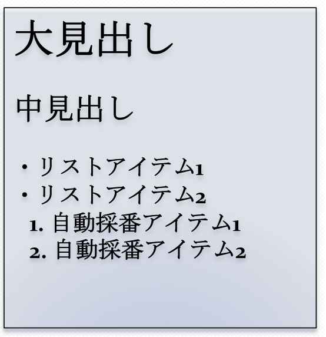
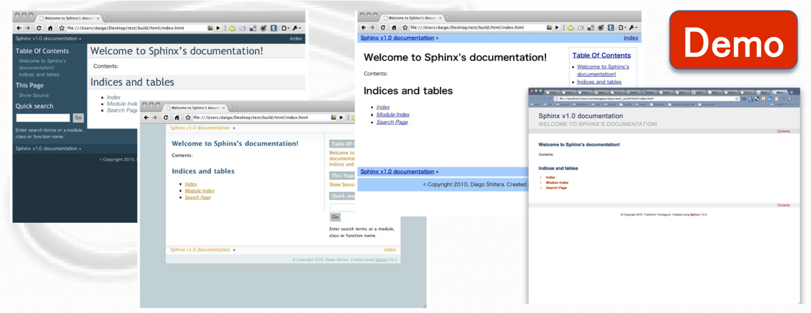
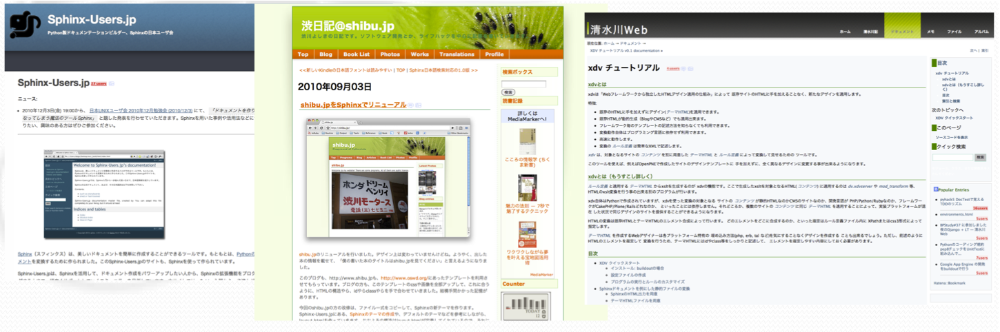
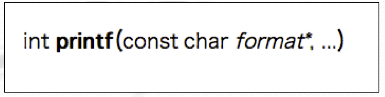
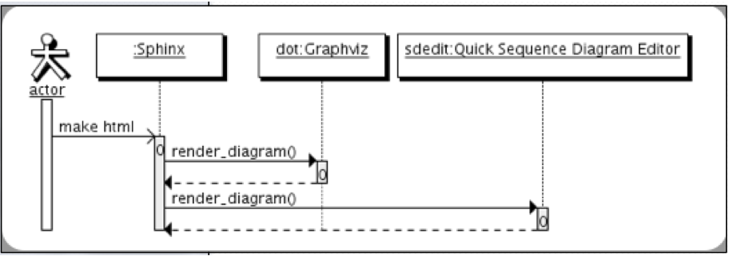
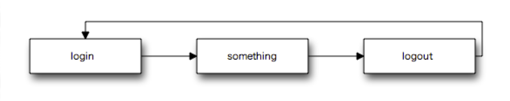

Sphinxの利用例
==============

Sphinxのインストール
--------------------

2分で始めましょう!

必要なもの
~~~~~~~~~~

* Python, easy_install, Sphinxの3点セット
* パッケージ管理ツールを使えば一瞬

  **Ubuntu**

  .. code-block:: bash

     $ sudo apt-get install python-sphinx

  **MacOSX**

  .. code-block:: bash

     $ sudo port install python-sphin

準備完了です

Sphinxプロジェクトの作成
------------------------

“sphinx-­‐quickstart”を使います。

.. code-block:: bash

   $ mkdir Unix-How-to	
   $ cd	Unix-How-to	
   $ sphinx-quickstart	
 
とりあえずはEnterを連打!	

* conf.pyとディレクトリが作成	

この3つだけは回答する	

* プロジェクト名	
* バージョン番号	
* 著者名	

.. code-block:: none
 
   ├── Makefile	
   ├── _build	
   ├── _static	
   ├── _templates	
   ├── conf.py	
   ├── index.rst	
   └── make.bat	

reSTによるドキュメント作成
---------------------------

reST = reStructuredText	

.. note::

   http://sphinx-users.jp/doc10/rest.html

テキストでも見やすい形

* 見出し
* コードブロック(ハイライト付き)
* 文書内/文書外リンク
* 表

toctreeなどを作成する

.. code-block:: rest

   ========	
   大見出し	
   ========

   中見出し	
   ========	

   小見出し
   --------

   - リストアイテム1
   - リストアイテム2

   #. 自動採番アイテム1
   #. 自動採番アイテム2

Sphinxによるドキュメントのビルド
--------------------------------

自動作成されたMakefileをそのまま利用するだけ

.. code-block:: bash

   $ make html	

 
応用例(1/2)
-----------

HTML以外にもデフォルトでLaTeX、PDF、ePubに	

.. code-block:: bash

   $ make latex
   $ make latexpdf
   $ make epub
 
HTMLもデフォルトで複数のテーマを使用可

テンプレートの作成
------------------

テンプレートエンジン“Jinja2”を利用している

**自分でテンプレートを作成することも可能**
 
大まかに分けて2つのhtmlを作成する	

* ドキュメント全体の基礎: :file:`layout.html`
* 各ページ: :file:`page.html`

デフォルトテーマbasicのテンプレート継承により時間が削減

Sphinx実用例
------------

多くのOSSドキュメントやサイトで採用実績あり

* Python 2.6.2ドキュメント	
* OpenPNE Web API仕様書
* groongaドキュメント...他多数	

テンプレート機能を用いてサイトを構成

Sphinx拡張
----------

足りない機能も拡張で補えます	

* ドメイン(Erlang/Ruby/Python/C...)	

  各言語に関するドキュメントを簡単に書けます	

* sdedit	

  UMLを描けます!	

* blockdiag	

  プロック遷移図を簡単な記述だけで作成	

* docx	

  SphinxでWordファイルを作成	

Sphinxドメイン
--------------

ある言語を説明するマークアップとSphinx内のオブジェクトのリンク

* Python以外にも多くの言語に対応	
* ドキュメント内で相互参照が可能	

例) C

.. code-block:: rest	

   .. c:function:: int printf(const char *format, ...)

 
sdedit (Quick Sequence Deiagram	Editor)
---------------------------------------

UML図をテキストから生成するツール

.. code-block:: rest	

   .. sequence-diagram::	
      :maxwidth: 500	
      :linewrap: false	
      :threadnumber: true	

      actor:Actor	
      sphinx:Sphinx[a]	
      dot:Graphviz	
      sdedit:Quick Sequence Diagram Editor	

      actor:sphinx.make html	
      sphinx:dot.render_diagram()	
      sphinx:sdedit.render_diagram()

blockdiag by @tk0miya
---------------------

ブロック遷移図を文字のみで書けます	

sphinxcontrib-blockdiagでSphinxでブロック遷移図を書くことが可能	

.. code-block:: rest

   .. blockdiag::	

      diagram webapp {
        login -> something -> logout -> login
      }

docx
----

SphinxからWord形式で出力する拡張	

現在誠意開発中 by 清水川さん	

まとめ
------

Sphinxは

* インストールが\ **簡単**	
* 設定も\ **簡単**
* 書くのも\ **簡単**
* ビルドも\ **簡単**
* カスタマイズも\ **簡単**
* 拡張もできる
* サイトも作れる

という素晴らしいドキュメントツールだった!	