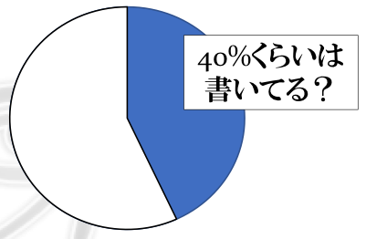
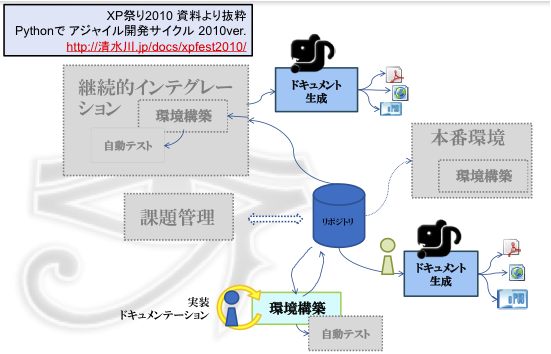

================
業務での利用事例
================

対象

* ソフトウェア開発プロジェクト
* 規模:1名~10名前後

ドキュメント、書いていますか？
==============================

想像してみてください。

この規模、たとえば1名のプロジェクトだとしたらどれくらいドキュメントを書くでしょうか？
あるいは10名だったとしたら、どんな役割分担でドキュメントを書くでしょう。

そもそも、彼らはいつドキュメントを書くでしょうか。
プロジェクトの方針がある場合、無い場合、色々なケースがあると思いますが、ドキュメントを作る事に対してかれらはどんなことを考えるでしょう。

ドキュメントを書いている割合
------------------------------------

業務のプロジェクトには大規模なものから小規模なものまでたくさんありますが、その数に対する「ドキュメントを書いている」比率は意外と低いのではないかと思います。前任者や別の部署・会社から引き継いだプロジェクトにまともなドキュメントがほとんどなかった経験がある方もいるのではないでしょうか。

1件数万円規模のWebサイト立ち上げプロジェクトでドキュメントが残っていないという話はそれこそ山のような件数がありそうです。

40%という数字は、私の経験上の数です。2回に1回はドキュメントが無かった、50%よりは少なかったような気がするという数値です。

ドキュメントが書けない開発現場
--------------------------------------

なぜドキュメントが書けないのか？

**どこに書いて良いか分からない**

   * なにやらWordファイルがたくさんあって、どのファイルのどこに書くのが適切なのかよく分からない

**何を書いて良いか分からない**

   * 突然、基本設計書を書いてって言われたけれど、そもそも基本設計って何を書けばいいの？

**どう書いて良いか分からない**

   * 何から書き始めてどこまで書けば良いのか？

**どんなツールを使えばいいか分からない**

   * ちょっとした図を書くときにも、プロジェクト毎にVisioだったりWord図だったりUMLツールだったりと異なる。

**どこに置けばいいか分からない**

   * 最新のファイルはファイルサーバーから取得したけど、これを上書きして良いのかわからないのでとりあえずファイル名を「詳細設計書2.doc」にしてみた

**どうせドキュメントなんて誰も見ない**

   * 納品に必要だから書かないといけないけど、誰も読まないんでしょ？
   * 納品後にお客さんからくる質問のほとんどが、ドキュメント書いておいたことだった

**ドキュメントはあとで書けばいい**

   * まずは動くものを作ってリリースするのが先。リリースしてからドキュメントを作って後納品でOK！

**めんどくさい**

   * どう初めて良いか分からないことだらけで、めんどくさい。

**楽しくない**

   * もう分かってることをまとめるだけの単調な作業が楽しいはずがない

めんどくさい、楽しくない、というのは直接的すぎるかもしれませんが、要はそういう風に感じている現場の人も多いのではないでしょうか？

意味のあるドキュメントを書いている割合
-----------------------------------------------

では、ただドキュメントを書いているだけではなく、「意味のあるドキュメント」を書いている割合はどのくらいでしょう？

こちらも実際の割合は分かりませんが、あまり想像したくないですね。

問題と対策
==========

それでは、どのような問題があって、どのように対策していくと良いのか考えてみましょう。

.. list-table::
   :header-rows: 1

   - * ドキュメント作成をさぼってしまう原因
     * 原因を取り除いてしまおう
   - * どういう構成で書いたら良いか分からない
     * プロジェクト開始時に構成を整備しておく
   - * 自分は文章を書くのが苦手だ
     * 書き方の指針を決めておく
   - * 誰も見ない文章は書きたくない
     * 能動的にドキュメントを書くよう動機づける
   - * 開発終了に向かうにつれて時間がなくなる
     * 先にドキュメントを書くようにする

今回の業務プロジェクトでは、Sphinxをただ導入するのではなく、ドキュメントを書けるプロジェクトにするために、以下のゴールを設定します。

* ドキュメントを簡単に書けるようにする
* みんなが能動的にドキュメントを書くように動機付ける
* 開発物の品質向上へフィードバックする
* 今回の成果から構成のスケルトンを作成し再利用する

簡単に書けるって何だろう？
-----------------------------------------------

一つには「書けない理由」で紹介したような障害を取り除いた状態です。

なぜドキュメントを書けないの？

* どこに書いて良いか分からない
* 何を書いて良いか分からない
* どう書いて良いか分からない
* どんなツールを使えばいいか分からない
* どこに置けばいいか分からない
* どうせドキュメントなんて誰も見ない
* ドキュメントはあとで書けばいい
* めんどくさい
* 楽しくない

簡単ドキュメンテーションのためには、以下のようなポイントがあります。

* プロジェクト開始時にドキュメントの構成を用意しておく
* 書き方の指針を決めておく
* 必要な文章を必要な時に書けるようにしておく
* ソフトウェアコード同様に段階的に成長させるよう意識する
* ドキュメントを書くための手間を減らす

書き方のルールを決めておく
-------------------------------------

1. 2 つのステップで書く：まずはアイデアにフォーカスし、その後レビューを行ってテキストの形を整えます。
2. 読者のターゲットを明確にする：それを読むのはだれですか？
3. シンプルなスタイルを使用する：わかりやすくシンプルに保ちます。正しい文法を使用しましょう。
4. 情報のスコープを絞る：一度に1 つの概念だけを導入します。
5. 実在するようなコードのサンプルを使用する：Foo、Bar はもうやめましょう。
6. なるべく少なく、かつ十分なドキュメント：あなたが書いているのは書籍ではありません！
7. テンプレートの使用：読み手がどこに何が書いてあるかを把握しやすくなります。

.. note::

   「エキスパートPythonプログラミング」 10章（アスキーメディアワークス刊）より抜粋

   10章: プロジェクトのドキュメント作成 （無料公開中）http://sphinx-users.jp/articles/index.html

読者のターゲット向けに大きく分ける
--------------------------------------------

誰が読むかを意識して構成を作る。例えば以下のように構成。

マネージャ向け
   プロジェクトの目的、要件、機能リスト, FAQ等

設計者向け
   アーキテクチャ, インフラストラクチャ等

開発者向け
   APIリファレンス等

APPENDIX
   議事録、開発メモ等

ドキュメントを書く手間を減らす
-------------------------------------------

開始時に分かっている共有情報をあらかじめ書いておく
~~~~~~~~~~~~~~~~~~~~~~~~~~~~~~~~~~~~~~~~~~~~~~~~~~~~~~~~~~~~~~~~~~~~~~~~~~~

プロジェクト開始前に既に多くのことが書ける状態のはず。あるいはプロジェクト中に決まったことをどんどん書けるようにタイトルだけでも用意します。

* マネージャの共有事項

  * プロジェクトの目的
  * 初期のスケジュール（開始日、マイルストン、リリース）
  * 開発参加者全体の構成

* 設計者の共有事項

  * 最終動作環境の想定構成、選定理由
  * 開発環境の構成、選定理由
  * フレームワークや言語の選定理由

* 開発者の共有事項

  * コードリポジトリの情報
  * 開発サイクル標準
  * 開発手順
  * 単体テスト実行手順

数ステップでドキュメントを書く環境を整えられるようにする
~~~~~~~~~~~~~~~~~~~~~~~~~~~~~~~~~~~~~~~~~~~~~~~~~~~~~~~~~~~~~~~~~~~~~~~~~~~

Sphinxのインストールは開発環境構築と同時に行っておきます。インストール自体も複雑な手順を追うのではなく、開発環境構築そのものを2,3ステップでできるようにしておくのがよいでしょう。あとは “make html” だけです。

共有や閲覧の仕組みを自動化して開発プロセスに組み込む
~~~~~~~~~~~~~~~~~~~~~~~~~~~~~~~~~~~~~~~~~~~~~~~~~~~~~~~~~~~~~~~~~~~~~~~~~~~

共有は開発物とおなじソースコード管理で行いましょう。ドキュメントを変更・コミットしたら自動的にビルドされて、全員が参照できるWebサーバーで最新版が閲覧出来るようになっているとベストです。（sphinx-users.jp サイトはそのようになっています）

デモ
====

もし今日の発表者3名がJUS商事の『サービス基盤構築』を開発したら

**Step1 Sphinxの初期ドキュメントから始める**

   初期ドキュメントから始めると言っても、 “sphinx-quickstart” コマンドで作成しただけの状態のファイルを共有しても、それではドキュメントを書いてくれないでしょう。これは「どう書いて良いか分からない」を解消していません。

**Step2 ドキュメントの最初のアウトプットを作成**

   前述の、読者のターゲット別に章節の構成をおおまかに用意します。この段階でドキュメントの大枠は用意できました。そして、いつでもドキュメントを作成、変更、HTML出力まで動作するようになりました。しかしもう一歩踏み込んで、既に分かっている情報を書いてしまいましょう。

**Step3 既に分かっている情報を書き足します**

   マネージャー、設計者、開発者それぞれに必要となる情報を用意します。ここまでの情報がそろっていれば、プロジェクト開始時にメンバーに情報が行き渡らないということはあまりなくなると思います。

**Step4 段階的にドキュメントに記載していくことで、ドキュメントが成長していきます**

   記載していく途中途中で、章の構成もどんどん変わっていってかまいません。このサンプルでは開発プログラムの中心となる２つのライブラリのために独立した章を追加しました。

**Tips**

* 対象読者と話の焦点を常に意識する
* 読者が異なる場合や焦点が異なる場合は適切なページに記載する、リンクする
* ホワイトボードに記載したことはデジカメで撮って画像にする。図の清書は必要になるまで不要。
* 新しい専門用語が出てきたら、都度glossaryとして記載する
* 専門用語を使うときはglossaryへのリンクとなるようマークアップする
* 最終ドキュメントに含めない予定のメモも全てreStructuredTextで書きAppendixに入れておく
* Appendixの内容はぶら下げる先ができたら移動するなど、時々整理します

ドキュメントステップアップ
====================================

必要な文章を必要な時に書くようにする
-------------------------------------------------

デモで紹介したように、何か作ろうとするならその目的を書けるはず。何か実装しようとしたなら仕様を書けるはずです。

いつドキュメントを更新するか

* プロジェクト開始前
* 環境変更時
* コードと一緒にドキュメント更新
* 顧客ミーティングの議事録
* アーキテクチャ検討、設計などの試行錯誤記録

まず目的を書こう
-------------------------------------------------

デモで紹介したように、考え方の順番を変えるだけでドキュメントの意味は変わってきます。ドキュメントを先に書いて実装イメージを固める方が、目的が明確で間違いが少なくなります。

ただし、「ウォーターフォール的にまず設計しよう」と言っているのではありません。実装などの作業の目的を文章化することでブレや間違いを押さえようということです。開発者の中には実装の目的を忘れて、こまかいライブラリを作り込むことに注力してしまい、実際の目的とずれたものが出来上がるという人もいます。何が必要なのか、どこまで必要なのか、ということは明確にしなければいけません。それを脳内やメモ書きでとどめず「まず気軽にドキュメントに残してみよう」という転換です。

こうすることでドキュメントはソフトウェアコードと一緒に段階的に成長していきます。荒い内容の文章は随時リファクタリングしていけば良いでしょう。

能動的にドキュメントを書く動機付け
-------------------------------------------------

全てのドキュメントはすぐに使われるために書かれます。だれも使わないものを書く必要はありません。

ここでの品質向上の定義は

* 実装の目的を明確にする
* 本当に必要な実装を行う
* 使いやすいAPIを提供する

コードを書く前に、

* コードの目的をドキュメント化する
* コードがAPIなら、その使い方をドキュメント化する
* DocTestを書いて実装との乖離を防止（Pythonの場合）

目的が分からないままで行われる実装、必要のない一般化、使いにくいAPI、複雑な引数などを防止します。

このように、開発者にとっても、その読者にとっても、無駄のないドキュメンテーションを行い、それが短期間で目に見える形で品質へフィードバックされることにより、能動的にドキュメントを書く動機付けとなります。ポイントは、ドキュメンテーション作業と開発実装 作業を分けないことです。

自動化のすゝめ
-------------------------------------------------

煩雑な運用手順は自然に淘汰されます。つまり、ドキュメントの更新や共有のための手順が面倒な場合、その手順は簡略化されて、そのうちドキュメント更新をしなくなるかもしれません。

手動で行う場合：

* ドキュメントを書く
* make html や make pdf で出力
* 出力したファイルをzipで圧縮する
* 共有フォルダに置く / メールで送る / Wikiに添付 / サーバーでも更新、など

こういった手順を例えば以下のように自動化します。

自動化の場合：

* ドキュメントを書く
* コードリポジトリに保存 -> 後は自動的に公開等が行われます

これにより、ドキュメントやマニュアルが常に最新に維持されます。そしてそれ以上に、ここから新たな価値が生まれてくるかもしれません。以下のような効果はその一例です。

* ドキュメンテーションを行う動機付け 
* 最新マニュアルは自分でビルドしなくても特定のURLで閲覧できる
* 開発そのもののクオリティーの向上
* ドキュメンテーション先行を維持することによるクオリティーの維持
* 利用者のことを考えた設計が維持される

ドキュメント作成を開発サイクルに組み込む
---------------------------------------------------

上記はXP祭りというアジャイル系のイベントでの発表資料からの抜粋です。

.. note::

   XP祭り2010 資料より抜粋
   Pythonで アジャイル開発サイクル 2010ver. 
   http://清水川.jp/docs/xpfest2010/

ドキュメント作成を開発サイクルに組み込む、特に、自動化の仕組みに載せる事をお勧めします。この図では、プログラムなどの成果物が常に「継続的インテグレーション」の機構と連動してコミット毎にテストされる仕組みを説明しています。

同様に、開発者がソースコード管理にコミットすることにより、必要なタイミングで別の担当社がドキュメントを取得したり、プロジェクトの継続的インテグレーションサーバーがドキュメントのコミットを検知して自動的にHTMLなどにビルドしてWebサーバーで公開する、ということが出来ます。

全体が繋がる楽しさ！
-------------------------------------------------

これまで、バラバラだった個々の作業を自動化で繋ぐことによって、「読まれないドキュメント」から「常に最新の内容が提供されるドキュメント」に変わります。

ドキュメント記載作業は、もはや単調でつまらないおまけ作業ではなく、すぐそこに読み手のいる、プロジェクトの初期から終了までの全期間において常に必要とされる成果物を生み出す、ワクワクする作業になりました。

ドキュメントポートフォーリオへの昇華
------------------------------------------------------

最後に、次の開発のために、ここまで作成してきたドキュメントを、「ドキュメントポートフォリオ」に昇華させましょう。

すでにデモで紹介したように、ドキュメントのヘルパーとガイドラインを提供すると、読者と作成者の両方の仕事を簡単に改善することができます。

.. note::

   「エキスパートPythonプログラミング」 10章
   （アスキーメディアワークス刊）より抜粋
   10章: プロジェクトのドキュメント作成 （無料公開中）
   http://sphinx-users.jp/articles/index.html

ドキュメント作成者の視点から考えると、ガイドと一緒に再利用可能なテンプレート集が提供され、それをプロジェクトの中でいつどのように使用するのかという説明があると、この目標を達成できます。これをドキュメントポートフォリオと呼びます。

ソフトウェア開発プロジェクトの中で作られるドキュメントには、ソースコードを直接参照するような低レベルなドキュメントから、アプリケーションの概要を伝える設計書まで、多くの種類があります。

実際に、Scott Ambler は、彼の著作の『アジャイルモデリング――XP と統一プロセスを補完するプラクティス』（詳しくはhttp://www.agilemodeling.com/essays/agileArchitecture.htm を参照）の中で、ドキュメントの種類に関する長いリストを定義しました。彼は早期の仕様書から、操作ドキュメントまでのポートフォリオを構築しています。プロジェクト管理のドキュメントもカバーされているので、ドキュメントに関するニーズのすべてが、標準化されたテンプレートのセットで構築されています。

特定のニーズを満たすポートフォリオを作成することもできます。時間をかければ、あなたの仕事の習慣を網羅するような、効果的なポートフォリオを構築することもできるでしょう。

まとめ
======

ドキュメントを簡単に書けるようにする

	７つのルールと構成のテンプレート化

みんなが能動的にドキュメントを書くように動機付ける

	ドキュメント作成と開発を一体化する

開発物の品質向上へフィードバックする

	ドキュメント駆動開発＆フィードバックの形成

今回の成果から構成のスケルトンを作成し再利用

	ドキュメントポートフォリオの構築

