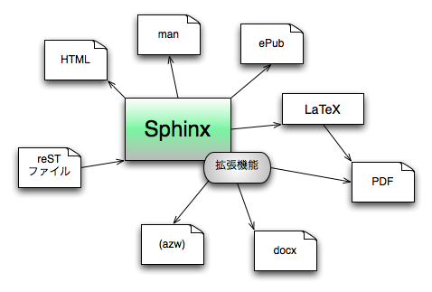

=================
Sphinx概要
=================

Sphinxはドキュメントを作成するためのツールです。reStructuredText(reST)という、Wikiに似たプレーンテキスト形式で元になるファイルを作成し、Sphinxのコマンドを通すと、HTML、LaTeX、ePubなど、さまざまなフォーマットのドキュメントを作成することができます。

プレーンテキストなソースコード
==============================

ソースコードはプレーンテキストで書いていきます。utf-8を利用することで、何も設定しなくても、日本語も問題なく通ります。プレーンテキストであるため、バージョン管理や差分を見ることにも使うことができます。reSTは行指向のフォーマットであるため、差分もみやすくなっています。

ページ間の相互リンク
====================

関数やクラスの定義などに対して、リンクを張ることができます。定義の説明が移動されようとも、追従してくれます。また、索引の自動生成なども行うことができます。巨大なドキュメントを作成する場合、ナビゲーションのしやすさを向上させるには、この機能が必要不可欠です。

強力なコードハイライト
======================

Java、C++、Pythonなど、一般的なものから、nginxの設定ファイルなど、さまざまな形式のファイルのコードハイライトが行えます。

拡張機能でさまざまなことができる
================================

Sphinxは拡張ができます。新しい構文を追加したり、外部ツールの画像生成エンジンを利用してブロック図を挿入したり、新しい出力フォーマットを追加したり・・・今日の説明でもいくつか紹介します。

ドキュメントが日本語化されている
================================

海外製のツールですが、ドキュメントは完全に日本語化されています。また、使用者も増えてきて、コミュニティもあるため、情報は入手しやすくなっています。

多くのドキュメントで使用されている
==================================

日本語でも、さまざまなドキュメントを書くのに使用されています。完全なリストはSphinx-Users.jpのサイトにあります(http://sphinx-users.jp/example.html)。

* TortoiseHg マニュアル: http://tortoisehg.bitbucket.org/manual/0.9-ja/index.html
* Zope 2 関連ドキュメントと記事: http://docs.zope.jp/zope2/
* Kay ドキュメント: http://kay-docs-jp.shehas.net/
* Erlang Efficiency Guide: http://erlang.shibu.jp/efficiency_guide/
* OMakeマニュアル 日本語訳: http://omake-japanese.sourceforge.jp/
* Web Socket 翻訳: http://ymotongpoo.appspot.com/websocket_jp/index.html
* OpenPNE Web API 仕様書: http://www.openpne.jp/developer/webapi/ja/index.html
* Python 2.6.2 ドキュメント: http://pythonjp.sourceforge.jp/dev/index.html
* Google JavaScript Style Guide 和訳: http://cou929.nu/data/google_javascript_style_guide/
* OpenCV C++：日本語リファレンス(訳): http://opencv.jp/opencv-2svn/cpp/
* PyMOTW(Python Module of the Week) 日本語訳: http://www.doughellmann.com/PyMOTW-ja/
