Sphinx-users.jp 2010年総会(2010/12/10)
========================================

:日時: 2010/12/10 19:00～21:00
:場所: `さかえや 恵比寿本店`__

.. __: http://kokucheese.com/event/index/5692/

SphinxUsers.jpの総会を行います。来年の方針や今後やりたいことなどをみんなでワイワイ話ができれば、と思います。こういうことがしたい、こういうのがあるとうれしい、などをみんなでシェアしましょう。

総会については会則を参照してください。 http://sphinx-users.jp/regulations.html

開催の様子
-----------

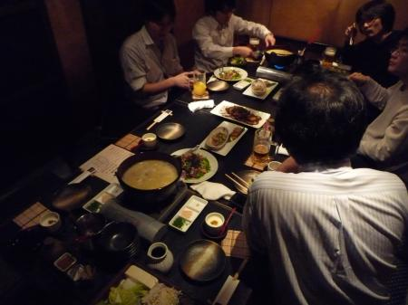

議題など
---------

* 役員の改選

  役員の改選についてはそれぞれ2010年の役員が立候補し、賛成多数により承認されました。

  * 渋川よしき：会長、会計兼務
  * 清水川貴之：副会長
  * 山口能迪：副会長

* 約例の変更

  コミュニティーの所在地は会長の自宅に定めています。会長の渋川さんが引っ越しを予定しているので、コミュニティの所在地は変更になる予定です。ただし、まだ決まっていないため、「決まり次第修正」ということにしようと思います。

* 会計報告

  初回ということもあり、昨年払ったドメイン代も一緒に計上しています。

  * 2009/10/01 sphinx-users.jp ドメイン2009/10-1年  -3180
  * 2010/07/24 Sphinx 1.0リリースパーティー 会員寄付        2840
  * 2010/09/10 オープンソースカンファレンス2010秋東京 パンフレット印刷費 -1100
  * 2010/10/01 sphinx-users.jp ドメイン2010/10-2年  -6360
  * 2010/12/03 日本Unixユーザー会勉強会 謝礼       10000
  * 2010/12/10 sphinx-users.jp 総会 会員寄付 300円

* OSC2011 春 東京

  :doc:`20100910_osc_tokyo_fall` に引き続き、2011年3月4日(金), 5日(土) に参加しようということになりました。

* 来年やって欲しいこと、やりたいこと

  * コマンドラインを触らなくても使えるようなランチャーが欲しい。
  * ウェブサイトのコンテンツの整理をしたい(コンテンツは多いが、実はSphinxの歴史はあっても、概要がトップページになかったりw)
  * アジャイルドキュメンテーションを翻訳して、Sphinx-Users.jpで公開したい。
  * kindle-builderを完成させたい。
  * docx-builderを完成させたいです。
  * pptx-builderとか誰か作って欲しいです。
  * S6-builderを作りたいです。
  * Google Summer of Codeのホストコミュニティになるかもしれないので、学生と一緒にやってもいいかも！？

会場の様子
-----------

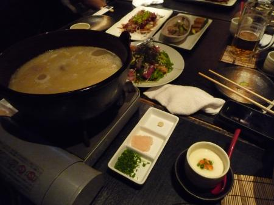

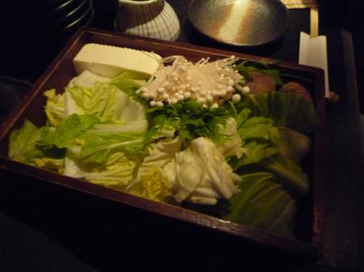

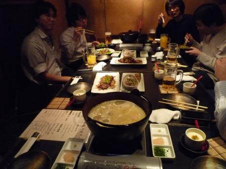

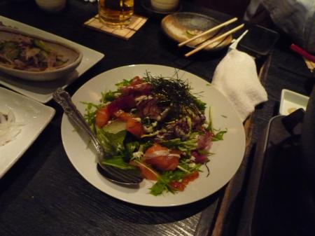

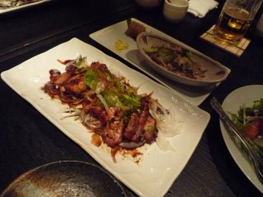

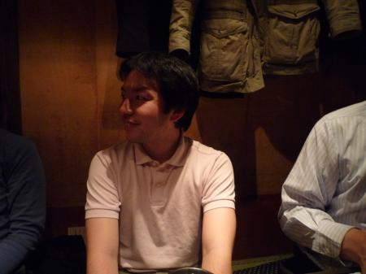

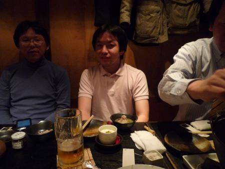

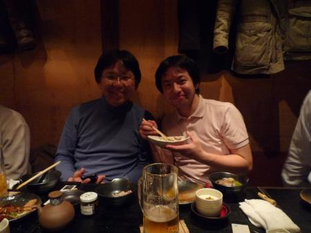

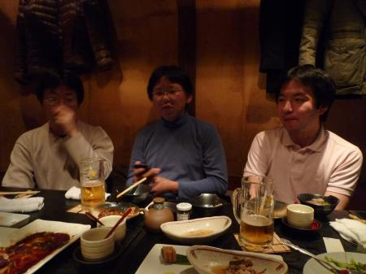

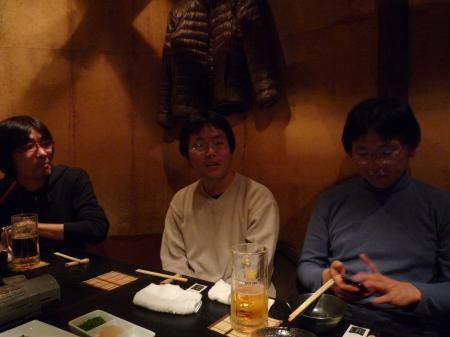

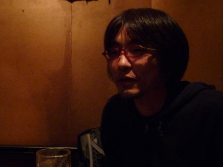

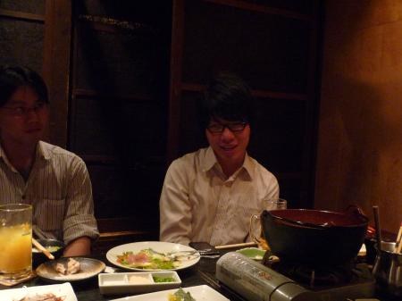

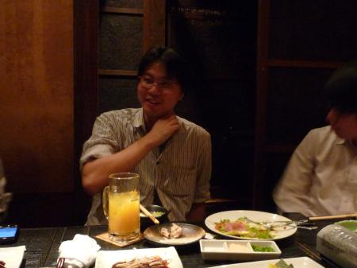

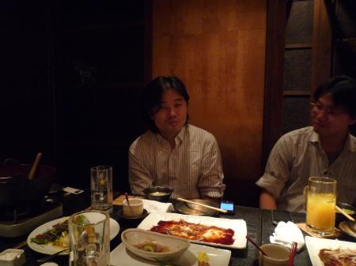

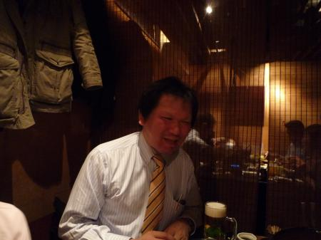

