Sphinx翻訳ハッカソン(2011/2/12)
================================

:日時: 2011/2/12 11:00～19:00
:場所: `オラクル青山センター 13F(東京都港区北青山2-5-8)`__

.. __: http://www.oracle.co.jp/aoyamacenter/

ソフトウェアのドキュメントに興味のある人が集まって、みんなで翻訳しよう、というイベントです。

なお、翻訳するものは問いませんし、Sphinxを使わなくてもOKです。また、一人でやっても、グループでやってもOK。一人では辛くてすぐ飽きちゃう活動も、みんなと一緒ならがんばれる！というのが目的です。また、翻訳とは関係なく、Sphinxを使ってみたい、という人でも歓迎です。

参加申込みはこちら -> `Sphinx + 翻訳 Hack-a-thon 2011.02 : ATND <http://atnd.org/events/12450>`_  (終了しました)

.. image:: 20110212_translating_hackathon/01.jpg

今回のイベントは25名の方々が翻訳したりSphinx利用の練習をしたりしていました。 `PyCon mini JP <https://sites.google.com/site/pyconminijp/>`_ でSphinxに言及した発表やLTが多かったために参加者が増えたのか、あるいは、ついにSphinxの人気が爆発したのかは分かりません。また、参加者の半数近くがPythonではなくPHP利用者だったのも今までとは異なる感じで非常に面白い会だったと思います。

今回は会場にオラクルさんをお借りすることが出来たため、プロジェクターを使用して渋川さんがSphinxの導入セッションを行ったり、午後には突発的にいくつかの発表が行われたりもしました。

会の様子
--------
写真を取り忘れたので、各自の自己紹介や渋川さんの導入セッション、清水川さんの `sphinxjp.themes.s6 <http://pypi.python.org/pypi/sphinxjp.themes.s6>`_ の紹介の写真はありません。

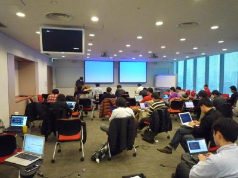

    みなさん黙々と開発しています

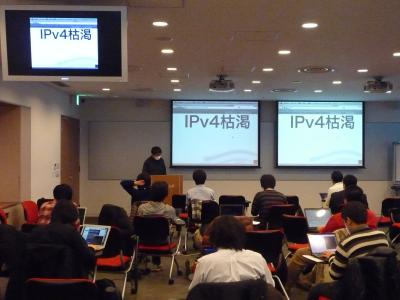

    IPv4枯渇セッション by S6 @tcsh

    さっそく `sphinxjp.themes.s6 <http://pypi.python.org/pypi/sphinxjp.themes.s6>`_ を使ってプレゼンしていました。

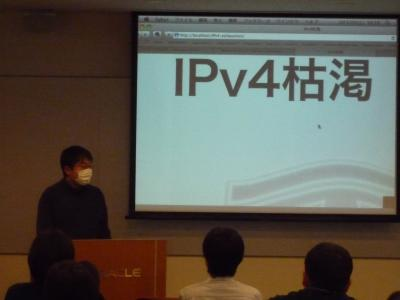

    IPv4枯渇セッション by S6 @tcsh

    枯渇セッションとみせかけておいて、Sphinx導入を始めて1週間時点での成果の紹介でした。経緯はtogetterの `"Sphinx-S6話がreST普及話になり気がついたらgit普及話になっていた。そしてgollum話へ" そしてblockdiagとs6のためにbrewへ <http://togetter.com/li/96648>`_ を参照ください。

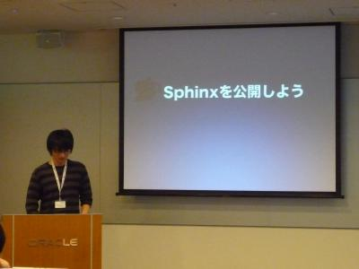

    Sphinxを公開しよう @ymotongpoo

    Sphinxで作成したHTMLの公開方法としての無料ホスティングサービスの紹介。詳しくはこちら: `Sphinxで作ったドキュメントのホスティング <http://sphinx-users.jp/cookbook/hosting/index.html>`_

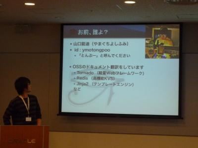

    おまえ、誰よ？

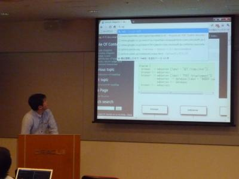

    blockdiagの紹介 @tk0miya

    `ダイアログ図作成ツール blockdiag <http://tk0miya.bitbucket.org/blockdiag/build/html/index.html>`_ についての紹介を行いました。内容は PyCon mini JP でのものと同じですが、さらに深い内容をプレゼンしてくれました。

    また、同系統のツールで `シーケンス図作成ツール seqdiag <http://tk0miya.bitbucket.org/seqdiag/build/html/index.html>`_ についても紹介しました。

    いろいろな人に使って欲しい、いろいろな要望やフィードバックをもらえるとうれしい、ということでした。 @tk0miya まで日本語で連絡お願いします。

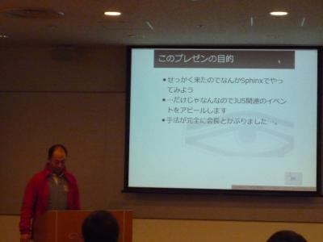

    JUSのイベント紹介 by S6 @S14U

    直近の `JUSイベント <http://www.jus.or.jp/>`_ の紹介。 @S14U さんも `sphinxjp.themes.s6 <http://pypi.python.org/pypi/sphinxjp.themes.s6>`_ を使ってプレゼンしていました。

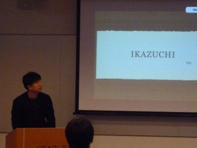

    ikazuchiの紹介 @t2y

    `ikazuchi <http://pypi.python.org/pypi/ikazuchi/>`_ はGoogle翻訳APIなどを利用した英文翻訳ツールです。Vimプラグインを使ってVim上から直接翻訳したり、poファイルの一括翻訳などに対応しています。

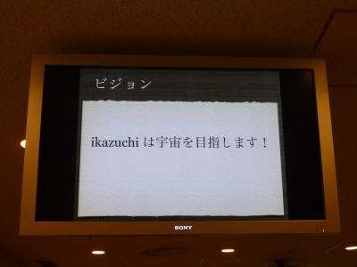

    ikazuchiの紹介 @t2y

    ikazuchiは宇宙を目指します！

    PHPフレームワーク関連のシール配布 @hidenorigoto

    Symfony2翻訳手伝ってくれた方にステッカーあげます、ということでシールを配りました。

    PHPフレームワーク関連のシール配布 @hidenorigoto

    私は翻訳お手伝いしませんでしたが、シールを頂きました。ありがとうございました！

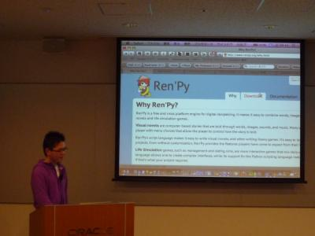

    Ren'Py の紹介 @takuan_osho

    `Ren'Py <http://www.renpy.org/>`_ はPython製のノベルゲーム作成ツールです。Pythonっぽいスクリプトを書いてゲームを作ります。配布形式はWindows, Mac, Linux とマルチプラットフォームなところが良いですね。

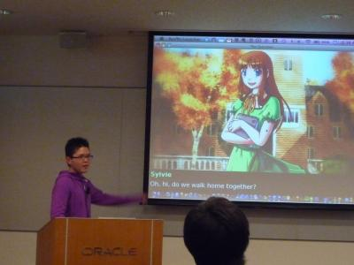

    Ren'Py の紹介 @takuan_osho

    ゲーム画面の文章がチュートリアルになっています。もしかしたらプレゼンツールにも使えるかもしれません。

    懇親会 @ 青山1丁目の和民

    Redbull割

成果報告
--------

今回はみなさんTwitterに書いてくれましたので、togetterにまとめてあります。 `Sphinx + 翻訳 Hack-a-thon 2011.02 #sphinxjp at Oracle <http://togetter.com/li/99948>`_ を参照ください。

以下、参加者のblogエントリ:

* `海外で作られたPython製ノベルゲーム制作ツール、Ren&#39;Pyのドキュメント日本語訳(途中)を仮公開しました！ - ♪～プログラマ行進曲～♪ <http://d.hatena.ne.jp/kutakutatriangle/20110213/1297596936>`_
* `Sphinx + 翻訳 Hack-a-thon 2011.02 に行ってきました - use No::Name; <http://d.hatena.ne.jp/navyfox_sh/20110212/1297533393>`_
* `Sphinx翻訳ハッカソン(2011/2/12) に参加しました - A Better Project＠はてなダイアリー <http://d.hatena.ne.jp/potappo/20110213/1297528023>`_

残念ながら参加出来なかった方のエントリ:

* `CentOS 5.5にsphinxをインストール - b.l0g.jp <http://b.l0g.jp/2011/02/12/>`_

