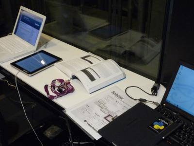
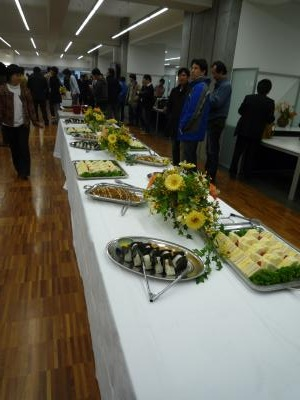
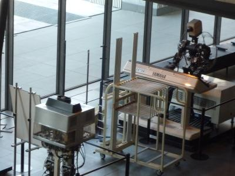

オープンソースカンファレンス2011 Tokyo/Spring(2011/03/04-05)
==============================================================

:日時: 2011年03月04日-05日
:場所: 早稲田大学（西早稲田キャンパス63号館、61号館）
:申し込みサイト: http://www.ospn.jp/osc2011-spring/

オープンソースカンファレンス2011春 東京 に参加します。ブースで説明やデモを行う予定です。また、3月4日(金) 11:00から、 ``「Sphinx入門～利用デモと事例の紹介」`` というタイトルでセミナーを行います。Sphinxを用いた事例や活用法などについて知りたい、興味のある方はぜひご参加ください。セミナーの申し込みは `オープンソースカンファレンス2011春 東京`_ から登録してください。 (終了しました)

.. _`オープンソースカンファレンス2011春 東京`: http://www.ospn.jp/osc2011-spring/

前回の様子はこちら: :doc:`20100910_osc_tokyo_fall`

OSCでの活動内容
----------------
* セミナー ``「Sphinx入門～利用デモと事例の紹介」``

    30名強の方が参加されました。資料は後日公開します。

* ブースでの紹介

    約70枚のパンフレットを配り切りました。
    最後はパンフレットが不足して配ることが出来なくなるくらい盛況でした！
    ブースに来て頂いた皆様、ありがとうございました！
    Sphinxを使うとドキュメント作成が楽になるイメージを持ってくれた人が多かった印象です。

ブースやセミナーでのFAQと要望
------------------------------

* Wordのドキュメントがたくさんあるんですが、Sphinxに変換する拡張はありますか？
    * 現状ありません。docx出力は実装出来そうなので将来的に簡単なものは出来るようになるかもしれません。

* todoディレクティブで書いた内容を一覧表示出来ますか？
    * どこかのrstに ``..todolist::`` を書いてください

* WikiのようにWebで編集出来ますか？
    * Web編集ツールなどはありません。TracがreStructuredTextを解釈できますが、Sphinxでビルドすることは出来ません。

* TracのWikiをSphinxでbuildする方法はありますか？
    * 現状ありません。TracのWikiは階層化されていないので変換するのは難しいかも。

* WordのようなWYSIWYGエディタはありますか？
    * 現状ありません。Web用のシンプルなWYSIWYGエディタを改造して作ることは出来るかも。

* blockdiag_ をGUIで修正出来ますか？
    * 現状できません。GUIで修正してコードをSphinxに貼り付けるというアイディアは良いかも。

.. _blockdiag: http://pypi.python.org/pypi/sphinxcontrib-blockdiag/

* blockdiag_ に吹き出しやコメントを付けることは出来ますか？
    * 現状できません。

* Windowsで動きますか？
    * はい、動作します。blockdiagの画像出力やPDFへの出力についても全て可能です。

* Windowsで簡単にインストールできますか？
    * Pythonがインストールされていれば、あと数手順でインストール出来ます。ただ、手順はほとんどがコンソール操作です。参考: :doc:`../gettingstarted/index`

* GUIで操作出来ますか？
    * 現状ありません。GUIでスケルトンを生成したり、ビルドしたり、変更監視して自動ビルドしたり出来るようになるとうれしいという話はよく言われます。

* Emacsの入力補完などはありますか？
    * ありません。SyntaxハイライトはEmacs/Vimともあります。

* sphinxで図表番号を出せますか？
    * 現状出せません。

* `Sphinxのプレゼンテーション表示 <http://pypi.python.org/pypi/sphinxjp.themes.s6/>`_ をPowerPointやPDFに出せますか？
    * 現状出せません。pptx出力は作れそうな気はします。

* MediaWiki との連携機能が欲しい

* ワンクリックで環境が整うインストーラが欲しい

* ドキュメントテンプレート集が欲しい。製品マニュアル向けや設計書など。

* 自動ビルド(ホスティング)環境が欲しい
    * http://readthedocs.org/ (`日本語での説明 <http://readthedocs.org/docs/readthedocs-doc-ja/>`_)はあります

会の様子
--------

    Sphinx-users.jp ブース。

    Sphinxの紹介が載っている
    `エキスパートPythonプログラミング <http://www.amazon.co.jp/dp/4048686291>`_
    を置いておきました。Sphinx本だと思われた方多数。
    なお、良いドキュメントの書き方とSphinxの使い方について書かれている エキPy10章は
    :doc:`../articles/index` で無料公開しています。

    1日目のOSC出展者の懇親会

    2日目にSphinxブース。案内中。

    2日目は1日目以上に大勢の方がブースに訪れてくれました。 Sphinx-users
    以外の発表でSphinxを使っているという紹介を頂いて訪れた方が多かった
    ようです。Sphinxをご紹介頂いた 運用研究会, 日本Symfonyユーザー会
    のみなさん、ありがとうございました！

    早稲田大学のピアノ演奏ロボットWASUBOTが会場入り口にいました

