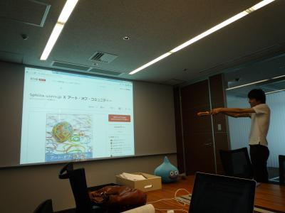
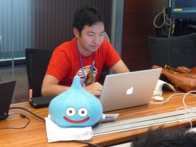
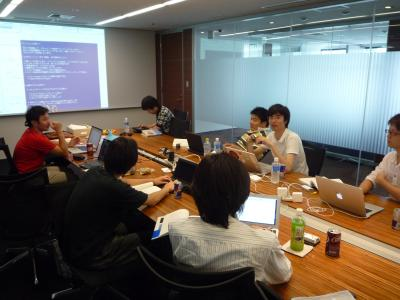
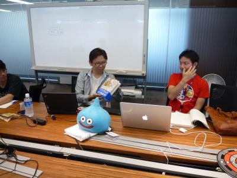

Sphinx-users.jp Ｘ アート・オブ・コミュニティー (2011/7/23)
============================================================

**Sphinx-users.jpサイトを改善セヨ**

:日時: 2011/7/23(土) 13:00～18:00
:場所: DeNA (新宿)
:募集: http://atnd.org/events/17992 (終了しました)

2章を読みます。書籍にある内容をSphinx-users.jpに適用して読み解いていった内容を以下にメモとして残しています。

.. contents::

会の内容
---------

コミュニティーの定義
~~~~~~~~~~~~~~~~~~~~~~
なにかの成果を達成することを目的とした集団。Sphinx-users.jpは利用者向けの情報提供を目的としている。

2.2.3 読み手 vs 書き手
~~~~~~~~~~~~~~~~~~~~~~~~
Sphinx-users.jp は読み手のコミュニティー。Sphinx開発を中心としたコミュニティーではない。利用者の視点に立って、利用者に向けての情報を提供することが目的。ただし、開発に関連した情報を提供しない、というわけではない。比重が **読み手** 寄り。

今後、開発向け情報を提供していくときには、開発向けページを用意して、利用者向けとは明確にパーティショニングして提供していきたいですね。

2.3 コミュニティーのデザイン
~~~~~~~~~~~~~~~~~~~~~~~~~~~~~~
* ミッションは何か？

  Sphinxを活用して、ドキュメント作成をパワーアップしたい人から、
  Sphinxの拡張機能をプログラミングする人まで、幅広くサポートしていく
  コミュニティを目指しています。

* コラボレーションを行う機会、及び領域はどこか？

  * 新しい人が来たときに、どういうことが出来る、というのがすぐに分かるか
  * どうやって使ってもらうか、使ったら何が変わるか
  * 採用事例とか、ショウケースとか
  * 翻訳Hack-a-thonに参加していろいろやる
  * いろいろな機会(イベントやML)で意見を伝える
  * サイトの読み手が積極的に自分の情報をサイトにフィードバックできるか

    * pull-request でサイトの更新を更新できる
    * IssueTrackerでたれ込み

* 必要なスキルは何か?

  * コミュニティーにどのようなスキルが必要か？

    * Python? Sphinx? ドキュメント能力?
    * Pythonは必須では無いでしょう
    * Sphinx(reST)は覚えていきましょう

  * Webサイトに貢献したい人はbitbucketが使えた方がいいね
  * IssueTracker, ML, Twitter に投稿することを怖がらない

ミッションの掘り下げ
~~~~~~~~~~~~~~~~~~~~~~

ドキュメント作成をパワーアップしたい人
Sphinxの拡張機能をプログラミングする人

* コミュニティーの核は何か

  * Sphinxを広める

* コミュニティーの主な活動はなにか

  * Webサイトでの情報発信
  * 勉強会等イベントの開催, OSC,JUS等での発表
  * MLの運営

* コミュニティー運営の原則は

  * ドキュメントと翻訳で苦労している人を助ける
  * 日本で散らばっているSphinx関連情報を集める
  * 収集した情報を発信する

* どのようにしてサポートしていくか

  Webサイト、勉強会、イベント、チャット

2.3.2 ミッションステートメントの構築
~~~~~~~~~~~~~~~~~~~~~~~~~~~~~~~~~~~~~~
ミッションステートメントには、コミュニティーが達成しようとしている約束、機会、定義を書きます。

ここまでで作成したミッションや機会や定義などを使って400字程度の文章にまとめ、テスト1,テスト2,テスト3で確認します。

.. glossary::

   Sphinx-users.jp とは

      Sphinx-Users.jp(略称#sphinxjp)は、ドキュメンテーションツールのSphinxの普及を
      主眼としたコミュニティです。

      日本で散らばっているSphinx関連情報を集めて、Webサイト、イベントを通じてSphinx
      情報を発信します。また、MLやチャットでの情報交換、勉強会の開催などを通じて、
      ドキュメントをパワーアップしたい人、ドキュメントや翻訳で苦労している人、
      Sphinxの拡張機能を開発したい開発者たちに”Fun”を提供していきます。

* "Fun" -- Sphinxはなぜ楽しいのか？

  * つまらないこと(TeXのコンパイルエラー等)に躓かない
  * 見た目にとらわれずに本質を書いていける
  * Plain Textのように書けるので(プログラマは)楽
  * 提出はPDFやHTMLなど体裁を求められてしまう場合もbuildで簡単
  * Webサイトとして公開など、簡単にドキュメントを公開する仕組みがある
  * なぜかglossary機能で用語集/indexを作り始めてしまう
  * 開発者は仕事のツールを自作し始めてしまうように、Sphinxを使っているといろいろなドキュメントをどんどん書き足していきたくなる(用語集など)
  * プログラミング向けのハイライト機能などが充実していて気持ちいい
  * Textなのでバージョン管理が簡単

.. 
.. 対象者
..    * ドキュメントを書くのに苦労しているユーザ
..    * Sphinxの拡張機能を開発したり、
..    * Sphinx本体のハックをしたい開発者
.. 
.. なにするの
..    * 疑問点を教えあったり、
..    * 成果を発表しあったり、
..    * 情報交換を 行ったりする場
.. 
.. ユーザーのサポート
..    * 勉強会、チャットにおいて対話での学び舎を提供します。
..    * また、イベント、Webサイトにおいて情報を配信を行います。
..
.. 私たちはSphinxを使ってこんなに元気になりました
..    * ユーザの声:
..     “このような、プログラマーがドキュメントを書きたくなってしまうすばらしいツールに乾杯！”

3 風通しのようコミュニケーション
~~~~~~~~~~~~~~~~~~~~~~~~~~~~~~~~~
コミュニケーションのツール

:質問: メーリングリスト -> :doc:`../../mailinglist`
:Q&A: http://answer.pythonpath.jp にsphinxタグで
:課題要望報告: bitbucketのIssueTracker https://bitbucket.org/shibu/sphinx-usersjp-web/issues

Sphinx-users.jp サイト改善ToDo
-------------------------------

6.3.1章から考えるWebサイトの現状の課題

* トップページを見た後迷子になる

  * サイトの全体像が分かりにくい(目次があれば良い?)
  * コミュニケーションのための入り口が分かりにくい(MLやIssue)

* 現在の構成

  * `Sphinxドキュメント` と `ドキュメント資料集` どっちが何だか分からない(mergeしよう)
  * 右柱の目次の順番がけっこう滅茶苦茶

    * 会の情報、ドキュメント、ノウハウ、イベントなどが同レベルで混在
    * 以下のようにすればよい？

      * Sphinx本体(技術的要素): リファレンス、チュートリアル、歴史、クックブック等
      * 事例集: 採用事例、使用しているサイト、ひな形テンプレ、喜びの声
      * Sphinx-users.jp(ユーザー会的要素): 会則やML、イベント等

会場の様子
-----------

   会場にDeNAさんをお借りしました。会議室のスクリーン、でかくて良いですね！

   Sphinx-users.jp会長、アート・オブ・コミュニティーの翻訳者の @shibukawa と今日の司会のスライム(@rokujyouhitoma のお土産)

   会の様子

   会長, 副会長, 司会者

   スライム忍者

