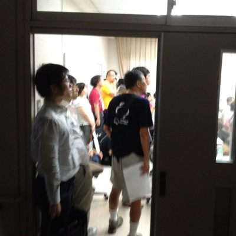
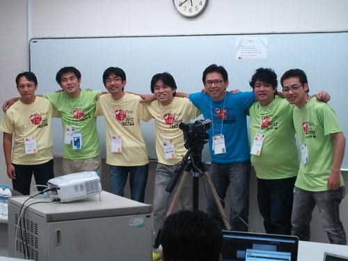

SphinxCon JP 2012 (2012/9/16)
================================

.. toctree::
   :hidden:

   index_en

.. note::

   `English page is here <index_en.html>`_

`PyCon JP 2012 <http://2012.pycon.jp/>`_ とのジョイントイベントである、
SphinxCon JP 2012 を 9/16(日)に開催しました。

.. image:: SphinxConJP2012-logo.png
   :align: center
   :width: 580
   :height: 93
   :alt: SphinxCon 2012 logo

:日時: 2012/9/16(日) (併設のPyConJP2012は前日の15(土)から17(祝)まで開催されます)
:場所: 産業技術大学院大学 併設トラック (Room-452)
:参加費: 3,000円

開催報告
----------

私たちは世界で最初のSpinx Conferenceを開催し、成功させました！
来場頂いた皆様、ご協力頂いた皆様、ありがとうございました。

SphinxConでは7つの発表を行い、それぞれスライドとビデオを参照できます。
資料とビデオは次のセクションに追記しています。

   セッションには立ち見が出るほど。
   部屋には入れない方もいました。

   初めてのSphinxConで発表した7人！

   左から @r_rudi, @tk0miya, @shkumagai, @takanory, @shimizukawa, @usaturn, @hekyo

2012/9/16 (日) タイムテーブル
-------------------------------

発表者募集に応募頂いた内容から選考を行い、プログラムを決定いたしました。応募頂いた皆様、ありがとうございました！

決定したプログラムは以下の通りです。

.. list-table::
   :widths: 15 1 14 70
   :header-rows: 2

   - - 時刻
     - 近影
     - 発表者
     - タイトル

   - - 15:15 - 15:40 (25分)
     - |tk0miya|
     - 小宮 健 (@tk0miya)
     - :ref:`session-16-1515-Room452-ja`

   - - 15:40 - 16:00 (20分)
     - |r_rudi|
     - しろう (@r_rudi)
     - :ref:`session-16-1540-Room452-ja`

   - - 16:00 - 16:45 (45分)
     -
     -
     - Tea Break

   - - 16:45 - 17:10 (25分)
     - |shkumagai|
     - @shkumagai
     - :ref:`session-16-1645-Room452-ja`

   - - 17:10 - 17:35 (25分)
     - |shimizukawa|
     - 清水川 (@shimizukawa)
     - :ref:`session-16-1710-Room452-ja`

   - - 17:35 - 17:45 (10分)
     -
     -
     - 休憩

   - - 17:45 - 18:00 (15分)
     - |usaturn|
     - @usaturn
     - :ref:`session-16-1745-Room452-ja`

   - - 18:00 - 18:15 (15分)
     - |takanory|
     - 鈴木たかのり
     - :ref:`session-16-1800-Room452-ja`

   - - 18:15 - 18:30 (15分)
     - |hekyo|
     - @hekyou
     - :ref:`session-16-1815-Room452-ja`

.. |shkumagai| image:: shkumagai.jpeg
.. |shimizukawa| image:: shimizukawa.jpg
.. |usaturn| image:: usaturn.png
.. |takanory| image:: takanory.jpg
.. |hekyo| image:: hekyo.jpg

PyCon JP 2012 全体のタイムテーブルについては `プログラム - PyCon JP 2012 <http://2012.pycon.jp/program/index.html>`_ を参照して下さい。

セッション詳細
-----------------

.. _session-16-1515-Room452-ja:

Sphinx ではじめるドキュメント生活 2012
######################################
すぐれたドキュメントツールである Sphinx を使って、あなたのドキュメントを書いてみませんか。
Sphinx は多くの OSS のマニュアル、リファレンスで採用されている他、
IT企業でも利用されはじめています。
ドキュメントを作りたくなってしまうとまで言われる Sphinx の魅力を皆さんにご紹介します。

:言語: 日本語
:日時: Sep 16 15:15-15:40
:場所: Room 452

Takeshi Komiya

(株)タイムインターメディア所属

blockdiag、Sphinx などといったドキュメンテーションツールに興味を持ち、
ツール、拡張モジュールの開発やコミュニティ活動を行なっている。

:発表資料:
   http://www.slideshare.net/TakeshiKomiya/sphinx-2012-pyconjp-sphinxconjp
:ビデオ:
   http://www.youtube.com/watch?v=YRa-eN9Chy0

.. _session-16-1540-Room452-ja:

sphinx拡張 探訪
###############
Sphinxの魅力の一つに多種多様な拡張があります。多くの人がさまざまな目的で開発したSphinx拡張を紹介し、Sphinxがいろいろなニーズに応えられることを伝えます。

:言語: 日本語
:日時: Sep 16 15:40-16:05
:場所: Room 452

Shiro Wakayama

sphinx-jp, blockdiagなど

:発表資料:
   http://tdoc.info/sphinxcon2012/
:ビデオ:
   *(録画失敗)*

.. _session-16-1645-Room452-ja:

Sphinx HTML theme 事始め
########################
Sphinx には組み込みで複数のHTMLテーマが付属しており、defaultのテーマも用意されたパラメータに値を指定すれば、印象をガラリと変えることが可能になります。
今回はSphinxのHTMLテーマの基本的な構成に触れながら、組み込みのテーマでできること、組み込みのHTMLテーマからのもうひと工夫の仕方を軸に、自分が考えるSphinxテーマカスタマイズ手法を紹介したいと思います。

:言語: 日本語
:日時: Sep 16 16:45-17:10
:場所: Room 452

Shoji Kumagai

.. image:: shkumagai.jpeg
   :alt: Shoji Kumagai

某A社, テストエンジニア

:発表資料:
   http://shkumagai.github.com/slides/sphinxcon.jp.201209/#/title
:ビデオ:
   http://www.youtube.com/watch?v=Po4yAQQ2qLc&feature=plcp

.. _session-16-1710-Room452-ja:

Sphinxを使って本を書こう
########################
私の過去2冊の翻訳・執筆した本の経験から、Sphinxを活用して執筆環境を自動化したときの手順とそのメリットなどを紹介します。

:言語: 日本語
:日時: Sep 16 17:10-17:35
:場所: Room 452

Takayuki Shimizukawa

.. image:: shimizukawa.jpg
   :alt: Takayuki Shimizukawa

BeProud所属。Sphinx-users.jp 副会長。訳書・著書「エキスパートPythonプログラミング」「Pythonプロフェッショナルプログラミング」。

:発表資料:
   http://www.slideshare.net/shimizukawa/sphinx-pyconjp-2012
:ビデオ:
   http://www.youtube.com/watch?v=7VOJpFHnPWg&feature=plcp

.. _session-16-1745-Room452-ja:

Sphinxの平凡な使い方 ～業務での利用事例～
#########################################
ターゲットは、Sphinxに興味はあるけど、まだ使ったことが無い人です。

:言語: 日本語
:日時: Sep 16 17:45-18:00
:場所: Room 452

Goh Yamada

.. image:: usaturn.png
   :alt: Goh Yamada

所属: ネットサポート株式会社

:発表資料:
   http://www.slideshare.net/goyamada92/sphinx-14566291
:ビデオ:
   http://www.youtube.com/watch?v=SoehUIC3RKc&feature=plcp

.. _session-16-1800-Room452-ja:

社内でのSphinx、reSTの広め方
############################
自分以外誰も Sphinx, reStructuredText を使ったことがない状況で、8名ほどのチームメンバーが全員が普通に使用するようになるまでの物語。

:言語: 日本語
:日時: Sep 16 18:00-18:15
:場所: Room 452

Takanori Suzuki

.. image:: takanory.jpg
   :alt: Takanori Suzuki

PyCon JP 2011, 2012 スタッフ
Plone 研究会
Python mini Hack-a-thon の主催の一人

:発表資料:
   http://www.slideshare.net/takanory/how-to-spread-rest-and-sphinx
:ビデオ:
   http://www.youtube.com/watch?v=vKuhuxcCxM0&feature=plcp

.. _session-16-1815-Room452-ja:

Sphinxにおけるdocutilsの役割
############################
docutilsがreStructuredTextを処理する流れについて
docutilsの使い方の概要

:言語: 日本語
:日時: Sep 16 18:15-18:30
:場所: Room 452

@hekyou

.. image:: hekyo.jpg
   :alt: @hekyou

blockdiag, bookathon

:発表資料:
   https://gist.github.com/3730720
:ビデオ:
   http://www.youtube.com/watch?v=kiUMwzTjMGY&feature=plcp

イベント参加方法
--------------------

本イベントは PyCon JP の一部として実施され、
参加者/発表者ともに PyCon JP のチケット購入が必要です。

イベントの参加申し込みなどはPyCon JP 2012の方で行い、入場受付後はPyCon JP 2012とSphinxCon JP 2012
どちらのセッションにも参加することができます。

参加申し込みは以下のURLからお願いいたします。
http://2012.pycon.jp/registration/index.html (終了しました)
