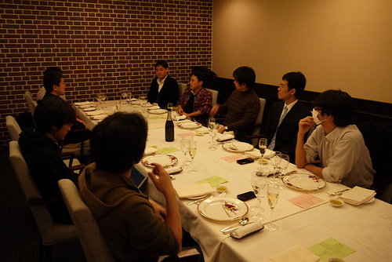
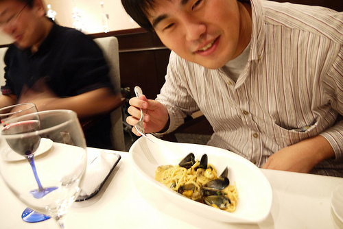
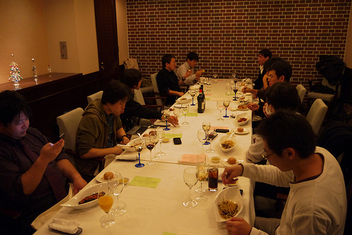
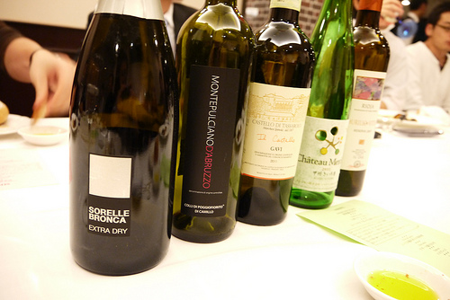
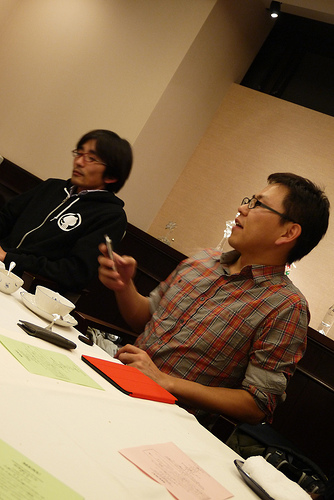
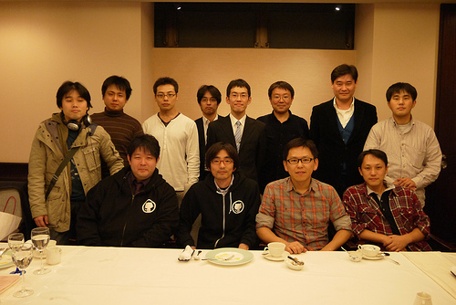

Sphinx-users.jp 2012年総会(2012/12/12)
========================================

:日時: 2012/12/12 19:00～21:00
:場所: `レストラン アルファーロ (市ヶ谷・曙橋)`__ (関東IT健保)
:参加費: 3000円前後（運営費カンパ含む）
:持ち物: 関東IT健保の方は保険証

.. __: http://www.its-kenpo.or.jp/restaurant/itigaya/index.html

2012年のSphinx-Users.jp総会を行いました。

総会について詳しくは :doc:`../../regulations` を参照してください。

参加方法
---------

sphinx-users MLにて募集を募り、11/7に締め切りました。

議事進行
---------

* 開会の挨拶(カンパイ)
* 会長挨拶
* 役員の改選
* 約例の変更
* 会計報告
* 活動の振り返り
* 来年やって欲しいこと、やりたいこと表明

議事録
---------

活動の振り返り
+++++++++++++++

- イベント

  * `Sphinx朝会@十三 <http://atnd.org/events/23747>`_ (2012/1/21)
  * `Sphinxハンズオン#2 <http://atnd.org/events/23587>`_ (2012/1/25)
  * `Sphinx+翻訳 Hack-a-thon 2012.02 <http://connpass.com/event/277/>`_ (2012/2/15)
  * `Sphinxハンズオン#3 <http://atnd.org/events/25060>`_ (2012/2/22)
  * `Sphinx朝会@神戸 <http://atnd.org/events/25549>`_ (2012/3/4)
  * `Sphinxハンズオン#pyfes 出張版 <http://www.zusaar.com/event/158001>`_ (2012/3/17)
  * `Sphinx+翻訳 Hack-a-thon 2012.03 <http://connpass.com/event/305/>`_ (2012/3/25)
  * `Sphinx+翻訳 Hack-a-thon 2012.04 <http://connpass.com/event/379/>`_ (2012/4/22)
  * `Sphinx+翻訳 Hack-a-thon 2012.05 <http://connpass.com/event/462/>`_ (2012/5/27)
  * `Sphinx+翻訳 Hack-a-thon 2012.06 <http://connpass.com/event/572/>`_ (2012/6/16)
  * `Sphinx+翻訳 Hack-a-thon 2012.07 <http://connpass.com/event/662/>`_ (2012/7/21)
  * `Sphinx+翻訳 Hack-a-thon 2012.08 <http://connpass.com/event/816/>`_ (2012/8/19)
  * :doc:`../20120916_sphinxconjp/index`
  * `Sphinx+翻訳 Hack-a-thon 2012.10 <http://connpass.com/event/1046/>`_ (2012/10/13)
  * `Sphinx+翻訳 Hack-a-thon 2012.11 <http://connpass.com/event/1237/>`_ (2012/11/11)
  * `Sphinxハンズオン#4 <http://connpass.com/event/1315/>`_ (2012/11/11)
  * `Sphinx Advent Calendar 2012 <http://connpass.com/event/1441/>`_ (2012/12/1 - 12/25)
  * :doc:`../20121212_general_meeting/index`
  * `Sphinx+翻訳 Hack-a-thon 2012.12 <http://connpass.com/event/1380/>`_ (2012/12/16)

- 他

  - shimizukawa が Sphinx のCo-maintainerになりました！

役員の改選
+++++++++++++++

会長は @tcsh の推薦があり、満場一致にて @shimizukawa に決定しました。

:会長: 清水川(@shimizukawa)
:副会長: 山田(@usaturn)
:副会長: 若山(@r_rudi)
:会計: 清水川(@shimizukawa)(会長兼任)

.. todo::

   役員改選にともない、会則の変更が発生します。

   また、昨年総会にてstaff MLを廃止していましたが、会則にはstaff ML前提の
   記述が残っていました。これについても変更を実施します。

会計報告
+++++++++++++++

当日に細かい数字は共有出来ませんでしたが、2011年度繰越金と総会寄付金とで1万円、そこから2年分のドメイン料約6000円と、SphinxConJP2012でのパンフレット代して5010円を使用した旨を共有しました。(shimizukawa)

以下は、後日sphinx-users MLにて共有した内容から少しアップデートしています。2012年に発生した項目を記載しています。

確定分
-------

.. list-table::
   :header-rows: 1

   - *
     * 収入
     * 支出

   - * 2011年残金
     * 9,500
     *

   - * 2012/1/12 sphinx-users.jp 2011年総会会員寄付
     * 3,550
     *

   - * 2012/01/12 2012年のドメイン更新料2年分
     *
     * 6,360

   - * 2012/09/15 SphinxConJP2012 パンフレット印刷費
     *
     * 5,010

   - * 2012/12/12 sphinx-users.jp 総会 会員寄付
     * 1,1550
     *

   - * 2012/12/14 海外郵便(GeorgBrandlへTシャツと写真を送付)
     *
     * 670

   - * [2012年内予定] sphinx-users.jp さくらレンタル(初期1000円,年間一括5000円)
     * 6,000
     *

   - * 2013年への繰り越し
     *
     * 6,560

なお、ドメイン代は2012/1/12に渋川さんに預け、2012年10月に支払われました。
次回支払は2014年10月の予定です。

現在sphinx-users.jpのホスティングは渋川さんの個人契約のさくらインターネットのレンタルサービスに相乗りしていますが、shellの権限を渋川さんしか持つことが出来ないという課題があり、sphinx-users.jpとして個別の契約を行うことにしました。このための費用6,000(仮)を計上しています。

2013年やりたいこと、やって欲しいこと
++++++++++++++++++++++++++++++++++++

順不同

- テーマのまとめサイトとか、簡単に配布・インストールできる仕組みがほしい (r_rudi)
- Sphinx-Users.JP のコンテンツを英訳して本家にフィードバック (r_rudi)
- 2013年は OSC併設でSphinxCon JP 2013 Spring を開催するよ！みんな参加してね！ (shimizukawa)
- pdf出力のノウハウで、表に出せるものは出していきたい (shkumagai)
- Sphinx公式ドキュメントの翻訳形態をpoファイルに移行し、最新版に追従しよう (shimizukawa)

会場の様子
-----------

   開始待ち、歓談中。

   前会長

   ワイン美味しかったです。こんなに飲んだかな・・

   前副会長(左)、新会長(右)

   総会参加者全員で集合写真。この写真をプリントしてGeorg Brandlにも送りました。
