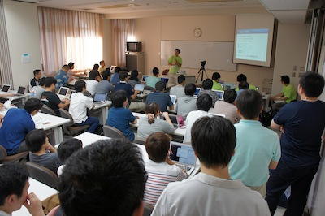

SphinxCon JP 2013 Spring 開催 (2013/2/23)
===============================================

`オープンソースカンファレンス 2013 Tokyo/Spring`_
との併設イベントとして、SphinxCon JP 2013 Spring を 2013/2/23(土)に開催します。

.. _`オープンソースカンファレンス 2013 Tokyo/Spring`: http://www.ospn.jp/osc2013-spring/

.. image:: SphinxConJP2013Spring-logo.png
   :align: center
   :width: 580
   :height: 93
   :alt: SphinxCon 2013 Spring logo

:日時: 2013/2/23(土) (併設のOSCは前日の22(金)も開催されます)
:場所: `明星大学`_ 日野キャンパス 28号館
:参加費: 無料
:交通:
   * 多摩モノレール 「中央大学・明星大学駅」から大学まで直結。会場まで徒歩6分
   * `[アクセスマップ]`_ `[キャンパスマップ]`_ `[OpenStreetMap]`_
   * ご来場の際は公共交通機関をご利用下さい

.. _`明星大学`: http://www.meisei-u.ac.jp/
.. _`[アクセスマップ]`: http://www.meisei-u.ac.jp/access/hinomap/index.html
.. _`[キャンパスマップ]`: http://www.meisei-u.ac.jp/campus/hino.html
.. _`[OpenStreetMap]`: http://osm.org/go/7Q5NCaP8O-

   2012年に開催した :doc:`../20120916_sphinxconjp/index` の様子

開催概要
----------

私たちは世界で2回目のSpinx Conferenceを開催します！

すぐれたドキュメントツールである Sphinx を使って、あなたのドキュメントを書いてみませんか。 Sphinx は多くの OSS のマニュアル、リファレンスで採用されている他、 IT企業でも利用されはじめています。 ドキュメントを作りたくなってしまうとまで言われる Sphinx の魅力を皆さんにご紹介します。

SphinxCon JP 2013 Spring では、セミナー・ハンズオン・ハッカソンの組み合わせで、これから Sphinx を始めてみたい方や実際に運用を始めている方に向けて Sphinx の魅力をお伝えします。

イベント参加方法
--------------------

本イベントは、オープンソースカンファレンス 2013 Tokyo/Spring の一部として
実施され、参加者/発表者ともに入場は無料です。

イベントの参加に際し、参加者の方へのご連絡や、会場の広さに対する混み具合など
を共有するために、お手数ですが以下のURLから参加登録をお願いいたします。

* http://connpass.com/event/1379/preview/

注意事項
   当日は参加登録の確認は行いません。
   もし人数超過となった場合は登録者を優先させて頂きます。

タイムテーブル 2013/2/23 (土)
-------------------------------

詳細は決定次第お伝えいたします

全体
   10:00〜15:00

セミナー
   調整中

ハンズオン
   調整中

   :持ち物: PC
   :ネットワーク: 会場の無線LANが利用できます
   :電源: 会場の電源を利用可能 (タップ持参を推奨)
   :飲食: 自由
   :途中入退場: 可

ハッカソン
   Sphinx-users.jp が毎月開催している、ディスカッションやコーディングを
   自由に行うことのできるイベントの出張版です。
   自由入退出可ですので、PC をお持ちになって一緒に Sphinx を使ってみましょう。
   自分でやりたいテーマや聞きたいことを持ち寄って、楽しくハックしましょう。

   :持ち物: PC、ハックするテーマ もしくは聞きたいこと
   :ネットワーク: 会場の無線LANが利用できます
   :電源: 会場の電源を利用可能 (タップ持参を推奨)
   :飲食: 自由
   :途中入退場: 可

