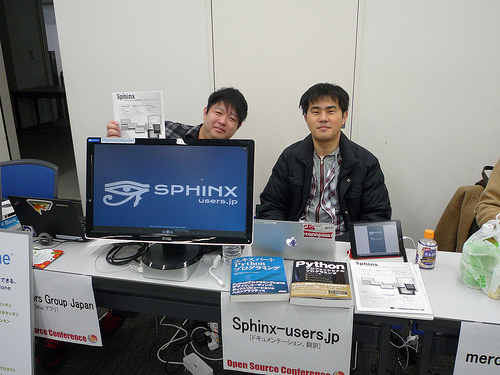
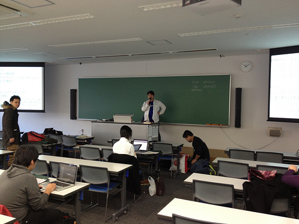
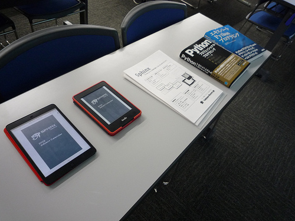

SphinxCon JP 2013 Spring (2013/2/23)
===============================================

`オープンソースカンファレンス 2013 Tokyo/Spring`_
との併設イベントとして、SphinxCon JP 2013 Spring を 2013/2/23(土)に開催しました。

.. contents::
   :local:

.. _`オープンソースカンファレンス 2013 Tokyo/Spring`: http://www.ospn.jp/osc2013-spring/

:日時: 2013/2/23(土) (併設のOSCは前日の22(金)も開催されます)
:場所: `明星大学`_ 日野キャンパス 28号館 4F 402教室
:参加費: 無料, `イベント参加方法`_ をご確認ください
:交通:
   * 多摩モノレール 「中央大学・明星大学駅」から大学まで直結。会場まで徒歩6分
   * `[アクセスマップ]`_ `[キャンパスマップ]`_ `[OpenStreetMap]`_
   * ご来場の際は公共交通機関をご利用下さい

.. _`明星大学`: http://www.meisei-u.ac.jp/
.. _`[アクセスマップ]`: http://www.meisei-u.ac.jp/access/hinomap/index.html
.. _`[キャンパスマップ]`: http://www.meisei-u.ac.jp/campus/hino.html
.. _`[OpenStreetMap]`: http://osm.org/go/7Q5NCaP8O-

.. .. figure:: sphinxcon-jp-2012-attendees.jpg
.. 
..    2012年に開催された :doc:`../20120916_sphinxconjp/index` の様子

開催概要
----------

私たちは世界で2回目のSpinx Conferenceを開催します！

すぐれたドキュメントツールである Sphinx を使って、あなたのドキュメントを書いてみませんか。 Sphinx は多くの OSS のマニュアル、リファレンスで採用されている他、 IT企業でも利用されはじめています。 ドキュメントを作りたくなってしまうとまで言われる Sphinx の魅力を皆さんにご紹介します。

SphinxCon JP 2013 Spring では、セミナー・ハンズオン・ハッカソンの組み合わせで、これから Sphinx を始めてみたい方や実際に運用を始めている方に向けて Sphinx の魅力をお伝えします。

イベント参加方法
--------------------

本イベントは、オープンソースカンファレンス 2013 Tokyo/Spring の一部として
実施され、参加者/発表者ともに入場は無料です。

イベントの参加に際し、参加者の方へのご連絡や、会場の広さに対する混み具合など
を共有するために、お手数ですが以下のURLから参加登録をお願いいたします。

* http://connpass.com/event/1379

注意事項
   当日は参加登録の確認は行いません。
   もし人数超過となった場合は登録者を優先させて頂きます。

タイムテーブル 2013/2/23 (土)
-------------------------------

全体(確定)
   * 10:00 - 10:30 開会式他
   * 15:50 - 16:00 閉会式

セミナー(確定)
   * 11:30 - 12:00 Sphinxの紹介プレゼン
   * 15:00 - 15:30 Sphinxの紹介プレゼン

ハンズオン(確定)
   * 10:30 - 11:10 ハンズオン(インストール)
   * 13:00 - 14:30 ハンズオン(クイックスタート)

   :持ち物: PC
   :ネットワーク: 会場の無線LANが利用できます
   :電源: 会場の電源を利用可能 (タップ持参を推奨)
   :飲食: 自由
   :途中入退場: 可

ハッカソン(確定)
   * 10:30 ～ 15:30 hack-a-thon

   Sphinx-users.jp が毎月開催している、ディスカッションやコーディングを
   自由に行うことのできるイベントの出張版です。
   自由入退出可ですので、PC をお持ちになって一緒に Sphinx を使ってみましょう。
   自分でやりたいテーマや聞きたいことを持ち寄って、楽しくハックしましょう。

   :持ち物: PC、ハックするテーマ もしくは聞きたいこと
   :ネットワーク: 会場の無線LANが利用できます
   :電源: 会場の電源を利用可能 (タップ持参を推奨)
   :飲食: 自由
   :途中入退場: 可

開催報告
---------

   2/22(金)のブースの様子

   ブースには金曜日に40人くらいの来客がありました。

   2/23(土) SphinxCon 2013 オープニング

   朝10時に多摩まで来る人が少なかったのが残念。

   Sphinx関連書籍、AdventCalendar2012のeBook

   ブースやSphinxConに展示した書籍関連です。eBookは `Sphinx Advent Calendar 2012`_
   の内容をSphinxでePub, mobiに変換したものを表示しています。

* オープニング挨拶 (副会長 山田, 会長 清水川) [Video__]

  .. raw:: html

     <iframe width="560" height="315" src="http://www.youtube.com/embed/6264hZI5pN8" frameborder="0" allowfullscreen></iframe>

.. __: http://www.youtube.com/watch?v=6264hZI5pN8

* 発表: `Sphinxで始めるドキュメント生活 2013`_ (小宮) [Video__]

  .. raw:: html

     <iframe width="560" height="315" src="http://www.youtube.com/embed/vUodkdUpsiI" frameborder="0" allowfullscreen></iframe>

.. _`Sphinxで始めるドキュメント生活 2013`: http://www.slideshare.net/TakeshiKomiya/sphinx-2013

.. __: http://www.youtube.com/watch?v=vUodkdUpsiI

* 発表: Sphin利用事例 (末広) [Video__]

  .. raw:: html

     <iframe width="560" height="315" src="http://www.youtube.com/embed/j3RyrCrhpLA" frameborder="0" allowfullscreen></iframe>

.. __: http://www.youtube.com/watch?v=j3RyrCrhpLA

* 発表: `Sphinx 1.2 Preview`_ (清水川)[Videoなし]

  .. raw:: html

     <iframe width="560" height="420" src="http://shimizukawa.bitbucket.org/sphinx120-preview/index.html" frameborder="0"></iframe>

.. _`Sphinx Advent Calendar 2012`: http://connpass.com/event/1441/
.. _`Sphinx 1.2 Preview`: http://shimizukawa.bitbucket.org/sphinx120-preview/index.html
