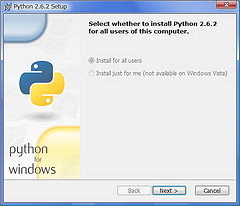

=======================
Windowsへのインストール
=======================

Pythonのインストール
======================

Windowsの場合は、Pythonが入っていない場合がほとんどだと思いますので、Pythonのインストールから説明します。すでにPythonを利用している人は、この項目を飛ばしてください。

.. image:: pythonorg.jpg

http://python.org を開きます。Pythonの総本山です。英語が多いですが、恐れないで行きましょう！左側のサイドバーから、Quick Linksの中のWindows Installerをクリックしてダウンロードして、インストールします。

.. warning::
   Pythonには2系と3系がありますが、Sphinxはまだ3系では動作しないため、2.6、2.7の系列をインストールしてください。

良くあるWindowsのインストーラに従うとインストールが完了します。

インストールが完了したら、コマンドラインからPythonが起動できるように、環境変数のパスに追加しましょう。

* マイコンピュータのアイコンを右クリックして、プロパティダイアログを開きます
* 詳細タブの下の方にある環境変数ボタンをクリックします
* システム変数のPATHを編集して、パスを追加します

追加するのは以下の変数です。以下はPython2.6系の場合です。Python2.5系や2.7系では26の数字の部分が代わります。下記のパスを、セミコロン(;)で区切って追加します。

.. list-table:: 追加するパス
   :widths: 10 40
   :header-rows: 1
   
   * - パス
     - 説明
   * - C:¥Python26
     - Pythonのコマンドが含まれるフォルダ
   * - C:¥Python26¥Scripts
     - 次に説明するeasy_installコマンドや、Sphinxのコマンドが格納されるフォルダ

スタートメニューから、 **コマンドプロンプト** を起動するか、「名前を指定して実行」で ``cmd`` と入力してみましょう。ウィンドウが表れたら、 ``python[Enter]`` とタイプします。インストールしたPythonのバージョンを表す文章に続いて、 ``>>>`` という文字が表示されればインストールは成功です。 ``Ctrl+Z`` キーを押して終了しましょう。

.. _install_easy_install:

easy_installコマンドのインストール
==================================

Pythonには ``easy-install`` という、外部ライブラリをインストールするのに便利なコマンドがあります。何かインストールしたいプログラムやライブラリがあったとすると、コマンドを一つ入力するだけで、実行するのに必要なものも一緒にダウンロードしてくれます。

* http://peak.telecommunity.com/dist/ez_setup.py

上記のリンクを右クリックして保存します。URLを開くと、ブラウザによってはそのままダウンロードできます。ファイルの中身が見えても、おちついて、右クリックで保存をすれば大丈夫です。

ダウンロードしたら、コマンドラインを起動し、該当のファイルのあるところまで移動してから、以下のように実行します。

.. code-block:: bat

   > python ez_setup.py

これで ``easy_install`` コマンドがインストールされます。ここまで行けば次はとうとうSphinxのインストールになります。

.. _install_sphinx:

Sphinxのインストール
====================

setuptoolsまでインストールされていれば、後は一瞬です。コマンドラインから以下のようにタイプします。

.. code-block:: bat

   > easy_install sphinx

これで完了です。インストールが終わったら、コマンドラインから、 ``sphinx-quickstart[エンター]`` とタイプしてみます。以下のように表示されていればインストールは成功です。Ctrl+Cキーを押して中断しましょう。インストール作業は以上です。次は :doc:`make_project` に進んでください。

