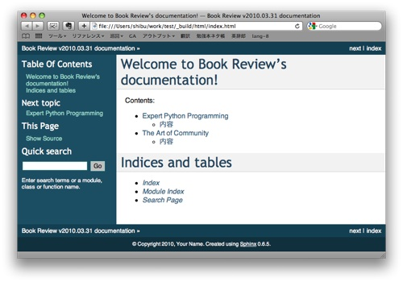

==================
プロジェクトを作る
==================

sphinx-quickstartの実行
=======================

Sphinxでプロジェクトを作成するには、以下のようにタイプします。

.. code-block:: bash

   $ sphinx-quickstart

いくつか質問されます。絶対に回答しなければならないのは、次の項目です。後はEnterキーだけで大丈夫です。

* プロジェクト名
* バージョン番号
* 著者の名前

今回は、自分の書評ページなので、プロジェクト名は ``"Book Review"`` 、バージョン番号は今日の日付、著者名には自分の名前を入れましょう。

.. toctree::
   
   sphinxquickstart

ページ構成を作っていこう
=========================

ひな形ができたので、次にページを足して、ドキュメントを作成していきます。など、ここでは上記の質問で、ディレクトリ設定に関してはデフォルト(ソースとビルドを分けない、プリフィックスは ``_``)であるとします。

"Expert Python Programming"と、"The Art of Community"という本を紹介したいとします。それぞれ、1ファイルに書くことにして、以下の様なページ構成にします::

   index.rst
     +- expert_python.rst
     +- art_of_community.rst

Sphinxでドキュメントを書く場合には、何種類かのディレクティブ(命令)をドキュメントの中に入れていきますが、その中でも一番重要なディレクティブが ``.. toctree::`` です。これは、文章の親子関係を定義するディレクティブです。マスタードキュメントである、 ``index.rst`` には既にこのディレクティブがありますので、そこに項目を追加します。なお、このファイルの先頭数行はコメントですので、省略してあります。

**index.rst:**

.. code-block:: rst
   :linenos:

   Welcome to Book Review's documentation!
   =======================================

   Contents:

   .. toctree::
      :maxdepth: 2

      expert_python
      art_of_community

   Indices and tables
   ==================

   * :ref:`genindex`
   * :ref:`modindex`
   * :ref:`search`

.. note::
   ``:maxdepth:`` と、ファイル名(拡張子無し)のリストの間には空行を入れましょう。

それでは、子供のファイルも作ってみましょう。なお、日本語を入力する場合、文字コードはUTF-8エンコードにします。

**expert_python.rst:**

.. code-block:: rst
   :linenos:

   =========================
   Expert Python Programming
   =========================

   :著者: Tarek
   :出版社: Packt Publishing

   内容
   ====

   Pythonのエキスパート向けの本。Pythonの内部のアルゴリズムにも言及しつつ
   マニアックな文法の適切な使い方の紹介に始まり、アジャイルソフトウェア開発
   をPythonで行うためのテストツール、継続的インテグレーションのツールなどの
   紹介や、よりよいプログラムのための、Pythonのためのデザインパターン、
   パフォーマンスチューニングなど、幅広く、深い内容の本。

**art_of_community.rst:**

.. code-block:: rst
   :linenos:

   ====================
   The Art of Community
   ====================

   :著者: Jono Bacon(Ubuntu Linuxのコミュニティマネージャ)
   :出版社: O'reilly

   内容
   ====

   コミュニティの運営について幅広く書かれた本。コミュニティの作り方、
   コミュニティ運営に役立つツール、コミュニティの測定方法、管理組織など、
   超巨大なコミュニティ運営にも耐えうる方法論が展開される一方、
   Buzzの作り方、物理イベントや、オンラインイベントの開催方法、
   ケンカの仲裁の仕方、スポンサーの集め方にいたるまで、経験に裏打ちされた
   様々なトピックが並ぶ。

ファイルができたら、下記のコマンドを実行して、HTMLファイルを作ってみましょう。

.. code-block:: bash

   $ make html

``_build/html`` フォルダ内にHTMLが生成されます。おめでとうございます！これがSphinxで生成したドキュメントになります。

HTMLを見ると、ページのタイトルがtoctreeディレクティブのあるところに子供のページのタイトルが表示されていることが分かります。次は、このメカニズムを見ていきます。Sphinxで一番重要なのが、このtoctreeの仕組みを知ることです。

toctreeの仕組み
===============

Sphinxのすべてのページにはセクションタイトルが含まれます。

先に挙げた、3つの例では、セクションのタイトルとして、 ``=`` 記号を使っていることが分かります。Sphinxでは、 ``#``, ``*``, ``=``, ``-``, ``^``, ``~``, ``"`` などの記号を使うことができます。記号は上下に記号を並べる方式と、アンダーラインのようにする方式の2つがあります。記号の種類と書き方(上下、下のみ)で色々なフォーマットが実現できますが、1つのファイル内の登場順で、レベルが決まり、階層化されます。上記のサンプルでは、子供ファイルのタイトル(``=`` の上下)がレベル1, 内容と書かれている部分(``=`` の下だけ)がレベル2になります。

toctreeディレクティブは、子供のセクションタイトル情報を持ってきて、目次を作ります。ここでは ``maxdepth`` オプションが2なので、レベル2までのタイトルを持ってきます。この仕組みのおかげで、ある程度の深さを持ったドキュメントであっても、見通しが良くなり、情報が探しやすくなります。

また、toctreeは1ページにいくつも書くことができます。また、toctreeが書かれている場所のセクションタイトルのレベルの影響も受けます。toctreeの位置のセクションタイトルのレベルが2であれば、子供のドキュメントのレベル1, レベル2のセクションタイトルは、親ドキュメントのレベル3, レベル4相当として扱われます。以下の図がこれを説明したサンプルです。このドキュメント全体を ``maxdepth 2`` としてtoctreeで子供に設定すると、孫のレベル1のタイトルを含め、赤字のタイトルまでが取り込まれることになります。

.. image:: toctree.png

.. note::
   セクションタイトルがないファイルは、警告が表示されます。

それでは、次に、 :doc:`Sphinxのドキュメントをパワーアップさせる <use_markup>` 、各種マークアップやディレクティブを紹介します。
