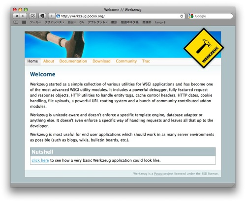
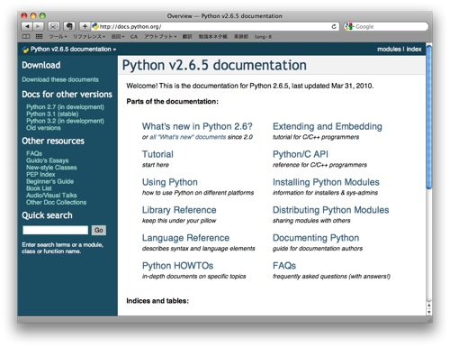

=============
Sphinxの歴史
=============

リリースされるまで
==================

Pythonの世界では2種類のドキュメントの作成方法が行われてきました。1つは、手書きで作成されるドキュメント。もう1つは、ソースコードの情報を抽出して作成されるドキュメントです。それぞれ、以下のような特徴があります。

.. list-table::
   :widths: 10 20 20
   :header-rows: 1

   * - 方式
     - 長所
     - 短所
   * - 手書き
     - 品質の高いドキュメントが作れる
     - メンテナンスに時間がかかる
   * - 自動生成
     - 最新のコードと、歩調を合わせやすい
     - 作成やメンテナンスに手間がかかる

Sphinxを作っている, pocooというグループでは、さまざまなソフトウェアを提供していますが、その中に、 `Werkzeug <http://werkzeug.pocoo.org/>`_ というウェブアプリケーションのフレームワークがあります。

Werkzeugのバージョン0.1では、品質の高いドキュメントを作るために、手書きでドキュメントが作成されましたが、とても大変だったそうです。そのため、バージョン0.2では、この2つの手法の良い所を組み合わせた方式を取り入れました。Werkzeugの0.2がリリースされたのが2008年の2月14日。その時に使われたツールを機能アップし、汎用的に使えるツールとして、2008年の3月21日に最初のバージョンがリリースされました。

Python標準のドキュメントツールに
================================

その後は機能拡張されて、 `Pythonの2.6以降のドキュメント <http://docs.python.org/>`_ を生成するためのツールとしても使われるようになり、それまで使われてきたTeXの独自スタイルから置き換えられました。

その後は拡張APIが整備されたり、テンプレートエンジンが柔軟なJinja2になったり、Sphinxの機能も拡張されました。

特に、充実したクロスリファレンス機能と、toctreeによるドキュメントの階層化により、書籍にすると数冊分のPythonオンラインドキュメントでもうまくドキュメント化されるほど、大規模なドキュメントでも破綻せずに書けるようになっています。

その後はPython系のツールやライブラリを中心に、数多くのプロジェクトでも、ドキュメントツールとして活用されるようになりました。

.. note::
   `Project Using Sphinx <http://sphinx.pocoo.org/examples.html>`_ 

今後のSphinx
============

今までは、最大のドキュメントがPythonのリファレンスだったということで、他の言語でも使えないことはないのですが、APIのドキュメント作成機能は、Pythonに特化した機能に限定されていました。Pythonであれば、ソースコードからパースして自動生成したドキュメントも作ることができます。また、PythonとCであれば、論理的なリンクを自動で張ってくれます。

1.0以降は、PythonとC以外の言語でも、適切なリンクが作成されるようになり、C++などの言語で書かれたライブラリのドキュメントを作成することも可能になります。

また、iPadで読むことができる、ePubフォーマットでビルドすることもできます。今後ますます活躍の場が広がっていくでしょう。

参考URL: `Armin Ronacherのブログ <http://lucumr.pocoo.org/2008/3/21/sphinx-python-documentation-tool-released>`_