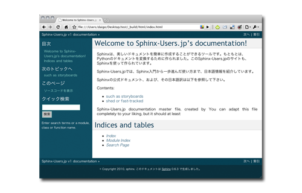

.. トップページ

Sphinx-Users.jp
===============

**ニュース:**

* 2010年12月3日(金) 19:00から、 :doc:`event/20101203_jus_benkyoukai` にて、 ``「ドキュメントを作りたくなってしまう魔法のツール Sphinx」`` と題した発表を行わせていただきます。Sphinxを用いた事例や活用法などについて知りたい、興味のある方はぜひご参加ください。

----------------

\ `Sphinx <http://sphinx.pocoo.org/>`_\ （スフィンクス）は、美しいドキュメントを簡単に作成することができるツールです。もともとは、\ `Pythonのドキュメント <http://docs.python.org/dev/>`_\ を変換するために作られました。このSphinx-Users.jpのサイトも、Sphinxを使って作られています。

Sphinx-Users.jpは、Sphinxを活用して、ドキュメント作成をパワーアップしたい人から、Sphinxの拡張機能をプログラミングする人まで、幅広くサポートしていくコミュニティを目指しています。本サイトでは、Sphinx入門から一歩進んだ使い方まで、日本語で情報を発信するとともに、 :doc:`mailinglist` や、 `Lingrによるチャット <http://lingr.com/room/sphinxjp>`_ を通じた情報交換の場、各種 :doc:`event/index` を開催していきます。

.. toctree::
   :maxdepth: 1
   :hidden:

   history
   example
   gettingstarted/index
   doc
   articles/index
   regulations
   mailinglist
   cookbook/index
   event/index

参加方法
--------

ご自由に :doc:`mailinglist` や、 `Lingrのsphinxjpチャンネル <http://lingr.com/room/sphinxjp>`_ などにご参加ください。また、Sphinx-Users.jpが行うイベントも定期的に行います。

イベント情報などは、Twitterの `SphinxUsers.jp公式アカウント <http://twitter.com/sphinxjp>`_ でも呟きます。また、コミュニティのハッシュタグは `#sphinxjp <http://twitter.com/#search?q=%23sphinxjp>`_ になります。

もし、ここに掲載している内容にミスが見つかったり、追加のコンテンツの希望、もしくは「これを載せて」という方は、このサイトのソースをホスティングしている、Bitbukcet内の `課題トラッカー <http://bitbucket.org/shibu/sphinx-usersjp-web/issues?status=new&status=open>`_ のチケットを作成してください。
