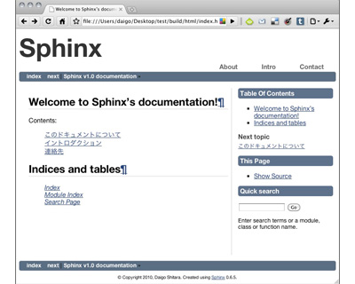

スタイルシートを適用する
=============================
レイアウトを作成したら、あとは実際に生成されるドキュメントにスタイルシートを適用し、見た目を整えるだけです。

ファイルの配置を確認する
--------------------------
オリジナルテーマ固有のCSSファイルは、テーマディレクトリ内の\ ``static``\ ディレクトリに配置します。

CSSの指定は、"basic"等の他のテーマを継承している場合は\ ``theme.conf``\ で指定したCSSが適用されますが、他のテーマを継承せずにテーマを作成する場合は、\ ``theme.conf``\ でスタイルシートを指定するだけではなく、以下のlink要素でCSSを指定する必要があります。

.. code-block:: jinja

   <link rel="stylesheet" href="{{ pathto('_static/' + style, 1) }}" type="text/css" />

.. note::

   "theme.conf"で使用したスタイル名は"style"というグローバル変数に設定されるため、テンプレート側で指定する必要があります。

複数のCSSを使用する必要がある場合には、テンプレートにlink要素を追加するか、CSSファイル内で\ ``@import``\ を利用することが出来ます。

また、"pygments_style"を指定している場合には、同様に以下のlink要素が必要になります。

.. code-block:: jinja

   <link rel="stylesheet" href="{{ pathto('_static/pygments.css', 1) }}" type="text/css" />

適当なCSSを読み込めばオリジナルのテーマを作ることができます。

作成したレイアウトにスタイルシートを適用したら、ドキュメントに適用するためプロジェクトを設定します。\ :doc:`application`\ に進んでください。
