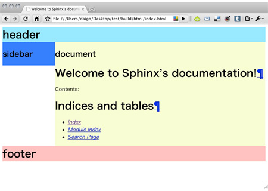
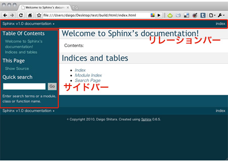
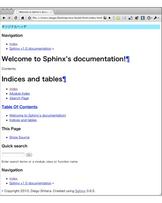

テンプレートを作成する
===========================
出力されるドキュメントのひな型としてHTMLのテンプレートを作成します。Sphinxでは、デフォルトのHTMLテンプレートとして\ `Jinja <http://jinja.pocoo.org/>`_\ が使用されます。

必要となるテンプレート
-------------------------
オリジナルのテーマを作成する際に、最低限必要なテンプレートは次のテンプレートです。

* ドキュメント全体の基礎となるテンプレート
* 基礎となるテンプレートを基にドキュメントを表示するテンプレート

以降の例では、前者のテンプレートを\ ``layout.html``\ 、後者のテンプレートを\ ``page.html``\ とします。

Sphinxでは、作成したドキュメント(.rstのファイル)の他に、検索ページ(search.html)や、索引ページ(genindex.html)も生成されます。次の様に\ ``theme.conf``\ で継承元を指定しない場合には、生成される全てのページに対してのテンプレートが必要になります。

\ ``theme.conf``\ で、以下の様に継承元のテーマを指定すれば、実際に全てのドキュメントに対してテンプレートを作成する必要はありません。オリジナルテーマで用意していないテンプレートの代わりに継承元の\ ``basic``\ テーマで用意されているテンプレートが適用されます。 ::

    inherit = basic

ドキュメントの枠組みを作成する
-------------------------------
テーマディレクトリ内に\ ``layout.html``\ を作成し、基本となる枠組みを作成します。Jinjaの記法については、\  `公式のドキュメント <http://jinja.pocoo.org/2/documentation/>`_\ を参照してください。

\ ``layout.html``\ には、全ページ共通のヘッダー、サイドバー、ドキュメント部、フッターを記述します。

.. code-block:: jinja

  
  <!DOCTYPE html PUBLIC "-//W3C//DTD XHTML 1.0 Transitional//EN"
  "http://www.w3c.org/TR/xhtml1/DTD/xhtml1-transitional.dtd">
  
  <html xmlns="http://www.w3.org/1999/xhtml">
  <head>
    <meta http-equiv="Content-Type" content="text/html; charset=UTF-8">
    <title>{{ title }}</title>
    <link rel="stylesheet" href="{{ pathto('_static/' + style, 1) }}" type="text/css" />
  </head>
  <body>
  

  
    

      <h1>header</h1>
    

  
  
    

      <h2>sidebar</h2>
    

  
  
    

      <h2>document</h2>
      
    

  
  

  
  

    <h1>footer</h1>
  

  
  </body>
  </html>

次に、各ページのドキュメント内容を読み込む\ ``page.html``\ を作成し、各ドキュメントの内容を読み込みます。

.. code-block:: jinja

   
   
   {{ body }}
   

\ ``page.html``\ では、\ ````\ の様に\ ``layout.html``\ を継承します。テンプレートの継承については :ref:`extends` を参照して下さい。

一旦、ドキュメントの出力内容を確認するために、以下のスタイルシートを適用しました。

main.css

.. code-block:: css

  #header {
    background-color: #a2e8fe;
  }

  #sidebar {
    background-color: #4b7afd;
    float: left;
    width: 20%;
  }

  #document {
    background-color: #f7fed3;
    float:left;
    width: 80%;
  }

  #footer {
    background-color: #fcc1c1;
    clear: both;
  }

  h1 {
    margin: 0;
  }

この\ ``main.css``\ は、テーマディレクトリ内の\ ``staticディレクトリ``\ 内に配置します。

ここで、\ ``make html``\ コマンドでドキュメントを生成すれば、オリジナルのテーマを適用したドキュメントは以下の様になります。

.. _extends:

テンプレートを継承する
--------------------------
現在のところ、以下のパーツから成るドキュメントのテンプレートを作成しています。

* header
* sidebar
* document
* footer

このドキュメントに足りていないサイドバー内のパーツ、リレーションバーを作成します。
以下のスクリーンショットは"basic"テーマを適用した際の各バーツです。

実際のところ、上記のパーツを1から作る必要はありません。ここでは、"basic"テーマの\ ``layout.html``\ を継承して、各パーツをオリジナルのテーマに組込みます。

"basic"テーマのテンプレートを継承する場合は、テンプレートの先頭に以下の1行を記述します。

.. code-block:: jinja

   

継承元のテーマ名を省略した場合は、同テーマ内のテンプレートを継承します。

他のテンプレートを継承した場合、オリジナルテーマの\ ``layout.html``\ に記述するべきパーツは、継承元のテンプレートとの差異になる部分だけです。以下の\ ``layout.html``\ では、"basic"テーマの\ ``layout.html``\ を継承して、新たにオリジナルのヘッダを追加しています。

**layout.html**

.. code-block:: jinja

   
   
   

       
オリジナルヘッダ

   

   

追加したヘッダ以外は、"basic"テーマのテンプレートが適用されるため、サイドバー内の目次や検索ボックス、リレーションバーが生成されています。

また、継承元のテンプレートで用意されているバーツに、さらにオリジナルテーマのパーツを加えたい場合があります。

以下の例では、"basic"テーマのリレーションバーに、外部サイトへのリンクを追加します。

.. code-block:: jinja

    
    
    

        
オリジナルのヘッダ

    

    
    
    <a href="http://projecthome.com/">Project Homepage</a>
    {{ super() }}
    

\ ``relbar1``\ ブロックを定義する際に、\ ``{{ super() }}``\ と記述している事に注意してください。

\ ``{{ super() }}``\ は、継承元のテンプレートで定義されている内容を維持したい場合に記述します。記述しない場合には、継承元のブロックを上書きするため、継承元の内容は表示されません。

テンプレートを継承する方法として、以下のように"!"を記述する方法もあります。

.. code-block:: jinja

   

"!"を継承するテンプレート名につける事で、ユーザが用意したテンプレートを継承元として参照する事になります。

ユーザが用意したテンプレートとは、"conf.py"の ``templates_path`` で設定されているパスに配置されているものです。ドキュメントに使用されるテンプレートは以下の順番で探索されます。

* ``template_path``\ で指定されたディレクトリ内のテンプレート
* 選択されたテーマ内のテンプレート
* テーマが継承しているテンプレート

"basic"テーマでは、Sphinxで作成されたドキュメントの基本になるテンプレートが提供されています。"basic"テーマに組み込まれているパーツ(ブロック)や組込の関数、変数を利用する事で、さらに細かいオリジナルテーマを作成する事ができます。

"basic"テーマに組み込まれているパーツ(ブロック)や関数については、Sphinxドキュメントの\ `組み込みテンプレートの働き <http://sphinx.shibu.jp/templating.html#id2>`_\ を参照してください。

.. _themeoption:

オプションを設定する
----------------------
\ ``theme.conf``\ にoptionsセクションを用意することで、テーマを使用するユーザが簡単にテーマをカスタマイズすることが出来る様になります。

まず、\ ``option.css_t``\ の様な\ ``_t``\ で終わる名前のCSSファイルを用意します。このファイルを静的テンプレートと言います。カスタマイズ不要な項目については、別のCSSファイルに記述しておき、静的テンプレート側でインポートする様にします。

静的テンプレートでは、以下の様にプロパティの値として変数を設定し、\ ``theme.conf``\ のoptionsセクションには、\ ``変数 = デフォルト値``\ という形式で、ユーザが変更出来る項目を指定します。

**theme.conf**

.. code-block:: jinja

  [theme]
  inherit = basic
  stylesheet = option.css
  pygments_style = sphinx

  [options]
  linkcolor     = blue
  headerbgcolor = #FFFFFF

.. note::

   \ ``theme.conf``\ のstylesheetには、静的テンプレートを\ ``_t``\ を抜いた名前で指定します。

設定したオプションにアクセスするには、\ `theme_変数名`\ の形式で記述します。

**option.css_t**

.. code-block:: jinja

   @import "main.css";

   a:link {
       color: {{ theme_linkcolor }};
   }

   #header {
       background-color: {{ theme_headerbgcolor }}
   }

\ ``theme.conf``\ の設定値はデフォルト値なので、オプションをユーザ側の設定で利用するには\ ``conf.py``\ の\ `html_theme_options`\ の値をPythonの辞書形式で設定します。

.. code-block:: python

  # Theme options are theme-specific and customize the look and feel of a theme
  # further.  For a list of options available for each theme, see the
  # documentation.
  html_theme_options = {
    'linkcolor': 'red',
    'headerbgcolor': 'blue'
  }

オプションはCSSの指定だけではなく、HTMLテンプレート内で使用する変数としても利用することができます。例としてグローバルメニューを作ってみましょう。事前に、新たなソースファイル(.rstファイル)として以下のファイルを作成しました。

* about.rst
* introduction.rst
* contact.rst

\ ``conf.py``\ の\ `html_theme_options`\ の値を以下の様に、\ `'タイトル':'ソースファイル'`\ という形でナビゲーションの要素を設定し、\ ``layout.html``\ でオプションとして設定したナビゲーション要素を取出します。

**conf.py**

.. code-block:: python

   html_theme_options = {
     'navigation': [
       ('About', 'about'),
       ('Intro', 'introduction'),
       ('Contact', 'contact')
     ]
   }

**layout.html**

.. code-block:: jinja

  
  
  

    <h1><a href="{{ pathto('index') }}">{{ project }}</a></h1>
    

      <ul>
        
        <li><a href="{{ pathto(href) }}">{{ title }}</a></li>
        
      </ul>
    

  

  {{ super() }}
  

ここまでで、基本的なレイアウトの作成ができました。次は\ :doc:`css`\ に進んでください。
