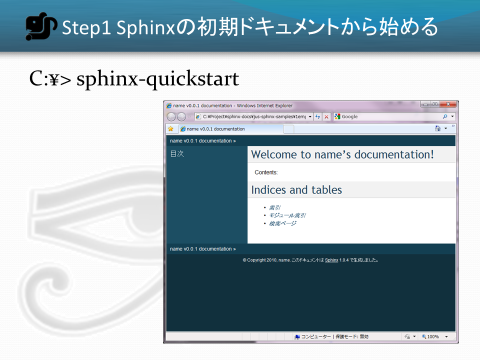
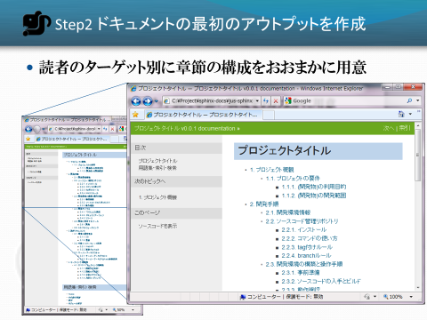
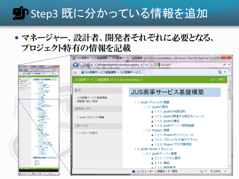
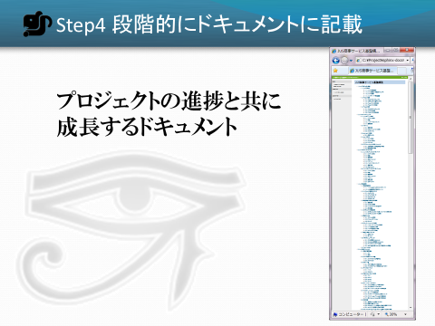

==========================================
Sphinxのドキュメントサンプル：業務利用例
==========================================

:doc:`../../event/20101203_jus_benkyoukai` の発表で使用した
`ドキュメントを作りたくなってしまう魔法のツール Sphinx`
のデモで使用したドキュメントのひな形です。プレゼンテーションの全文は
:doc:`../../event/20101203_jus_benkyoukai/index` にあります。

デモで使用したSphinxのドキュメントサンプルを以下のリンクからダウンロード出来ます。

* Step2:ドキュメントの例(Sphinxデータ) :download:`2portfolio.zip <2portfolio.zip>`
* :doc:`Step2:ドキュメントの例(HTML) <2portfolio/index>`

Step1 Sphinxの初期ドキュメントから始める
=========================================

初期ドキュメントから始めると言っても、 :command:`sphinx-quickstart` コマンドで作成しただけの状態のファイルを共有しても、それではドキュメントを書いてくれないでしょう。これは「どう書いて良いか分からない」を解消していません。

Step2 ドキュメントの最初のアウトプットを作成
=============================================

前述の、 :ref:`読者のターゲット別に章節の構成 <readers-targeting>` をおおまかに用意します。この段階でドキュメントの大枠は用意できました。そして、いつでもドキュメントを作成、変更、HTML出力まで動作するようになりました。しかしもう一歩踏み込んで、既に分かっている情報を書いてしまいましょう。

* Step2:ドキュメントの例(Sphinxデータ) :download:`2portfolio.zip <2portfolio.zip>`
* :doc:`Step2:ドキュメントの例(HTML) <2portfolio/index>`

Step3 既に分かっている情報を書き足します
=========================================

:ref:`マネージャー、設計者、開発者それぞれに必要となる情報を用意 <sharing-information>` します。ここまでの情報がそろっていれば、プロジェクト開始時にメンバーに情報が行き渡らないということはあまりなくなると思います。

Step4 段階的にドキュメントに記載していく
==========================================

段階的にドキュメントに記載していくことで、ドキュメントが成長していきます。記載していく途中途中で、章の構成もどんどん変わっていってかまいません。

* Tips

   * 対象読者と話の焦点を常に意識する
   * 読者が異なる場合や焦点が異なる場合は適切なページに記載する、リンクする
   * ホワイトボードに記載したことはデジカメで撮って画像にする。図の清書は必要になるまで不要。
   * 新しい専門用語が出てきたら、都度glossaryとして記載する
   * 専門用語を使うときはglossaryへのリンクとなるようマークアップする
   * 最終ドキュメントに含めない予定のメモも全てreStructuredTextで書きAppendixに入れておく
   * Appendixの内容はぶら下げる先ができたら移動するなど、時々整理します

.. toctree::
   :hidden:

   2portfolio/index

