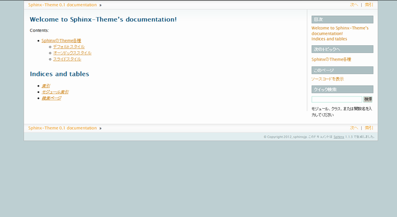
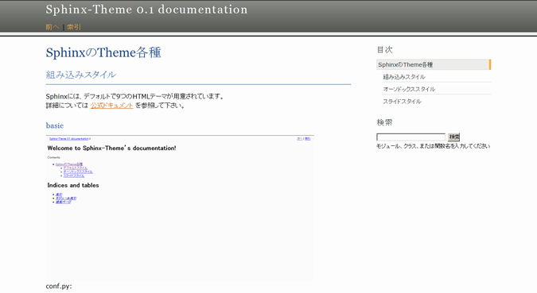
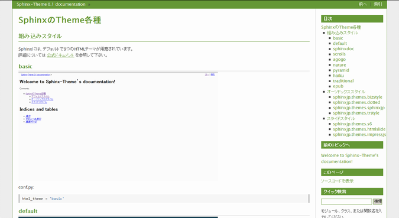

=============
テーマの変更
=============

.. contents:: 目次
   :depth: 2

概要
=====
Sphinxには、標準で以下の9つのテーマ [#f1]_ が用意されています。

* default
* basic
* sphinxdoc
* scrolls
* agogo
* nature
* pyramid
* haiku
* traditional
* epub

まずは、標準のテーマを他のテーマへ変更する方法を確認しましょう。
詳細については `公式ドキュメント <http://docs.sphinx-users.jp/theming.html>`_ を参照して下さい。

手順
=====
テーマを変更するには、\ ``conf.py``\ の以下の部分を編集します。

.. code-block:: python

   # -- Options for HTML output ---------------------------------------------------

   # The theme to use for HTML and HTML Help pages.  See the documentation for
   # a list of builtin themes.
   #html_theme = 'default'
   html_theme = 'default'

   # Theme options are theme-specific and customize the look and feel of a theme
   # further.  For a list of options available for each theme, see the
   # documentation.
   #html_theme_options = {}

   # Add any paths that contain custom themes here, relative to this directory.
   #html_theme_path = []

標準では、\ ``html_theme``\ には\ ``default``\ が指定され、テーマのパスを指定する項目\ ``html_theme_path``\ はコメントアウトされています。

\ ``conf.py``\ の\ ``html_theme``\ の値を、組込みテーマから選択して指定すれば、指定したテーマに変更する事が出来ます。以下の例では、sphinxdocテーマを指定しています。

.. code-block:: python

   # The theme to use for HTML and HTML Help pages.  Major themes that come with
   # Sphinx are currently 'default' and 'sphinxdoc'.
   html_theme = 'sphinxdoc'

\ ``conf.py``\ を書き換えた後、\ :command:`make html`\ を実行すれば指定したテーマのhtmlが出力されます。

.. _default_theme:

組み込みテーマの紹介
====================

default
--------
下記が\ **default**\ テーマです。
\ ``default``\ テーマは\ ``sphinx-quickstart``\ コマンドで
プロジェクトを生成した直後に設定されているテーマです。

.. image:: img/default.png

basic
------
.. image:: img/basic.png

sphinxdoc
----------

scrolls
--------

agogo
------

nature
-------

pyramid
--------

haiku
------
.. image:: img/haiku.png

traditional
------------

epub
-----
.. image:: img/epub.png

サードパーティ製テーマの紹介
=============================
標準で提供されているテーマの他に、有志によって様々なテーマが公開されています。
ここで紹介するサードパーティ製のテーマはPythonのパッケージ管理ツール\ :command:`easy_install`\ や\ :command:`pip`\ を用いてインストールします。

.. tip::

   Sphinx 1.2でsphinxjp.themecoreの機能が標準に取り込まれました。
   そのため、1.2以降をお使いの場合はhtml_themeを書き換えるだけでテーマ
   の変更が可能です。1.2より前をお使いの場合は、sphinxjp.themecoreをイ
   ンストールしたうえで、以下の行を \ ``conf.py``\ に追加してください。

   ::

     extensions = ['sphinxjp.themecore']

sphinxjp.themes.bizstyle
-------------------------
http://pypi.python.org/pypi/sphinxjp.themes.bizstyle/

.. image:: img/bizstyle.png

* インストール方法例::

    easy_install sphinxjp.themes.bizstyle

* conf.pyの書き換え::

    html_theme = 'bizstyle'

    # 下記オプションでバックグラウンドの色を変更する事が可能です。※必須ではありません
    html_theme_options = {'maincolor' : "#696969"}

sphinxjp.themes.dotted
-----------------------
http://pypi.python.org/pypi/sphinxjp.themes.dotted/

.. image:: img/dotted.png

* インストール方法例::

   easy_install sphinxjp.themes.dotted

* conf.pyの書き換え::

   html_theme = 'dotted'

sphinxjp.themes.sphinxjp
-------------------------
http://pypi.python.org/pypi/sphinxjp.themes.sphinxjp/

.. image:: img/sphinxjp.png

* インストール方法例::

   easy_install sphinxjp.themes.sphinxjp

* conf.pyの書き換え::

   html_theme = 'sphinxjp'

sphinxjp.themes.trstyle
------------------------
http://pypi.python.org/pypi/sphinxjp.themes.trstyle/

* インストール方法例::

    easy_install sphinxjp.themes.trstyle

* conf.pyの書き換え::

    html_theme = 'trstyle'

sphinxjp.themes.basicstrap
---------------------------
https://pypi.python.org/pypi/sphinxjp.themes.basicstrap/

* インストール方法例::

    easy_install sphinxjp.themes.basicstrap

* conf.pyの書き換え::

    html_theme = 'basicstrap'

    # 下記オプションで内部テーマを変更する事が可能です。※必須ではありません
    # また、これ以外にも細かい設定変更が可能です。
    html_theme_options = {
        'inner_theme': True,
        'inner_theme_name': 'bootswatch-amelia',
    }

また、細かく設定を変更すれば、フォントサイズの変更や `Google Web Fonts <http://www.google.com/fonts>`_ の利用、 `Bootswatch <http://bootswatch.com/>`_ の各種テーマの利用ができます。
詳しくは、 `ドキュメント <http://pythonhosted.org/sphinxjp.themes.basicstrap/>`_ や
作者ブログ記事（ `0.2.0リリース <http://tell-k.hatenablog.com/entry/2013/02/13/005959>`_ / `0.3.0リリース <http://tell-k.hatenablog.com/entry/2013/07/06/143329>`_ ）もご覧ください。

以下、利用できるテーマの一覧です。

+------------------------------------------------------------+------------------------------------------------------------+------------------------------------------------------------+
|    bootswatch-amelia                                       |    bootswatch-cerulean                                     |    bootswatch-cosmo                                        |
+------------------------------------------------------------+------------------------------------------------------------+------------------------------------------------------------+
| .. figure:: img/basicstrap/bootswatch-amelia.png           | .. figure:: img/basicstrap/bootswatch-cerulean.png         | .. figure:: img/basicstrap/bootswatch-cosmo.png            |
|    :scale: 28 %                                            |    :scale: 28 %                                            |    :scale: 28 %                                            |
|    :alt: bootswatch-amelia                                 |    :alt: bootswatch-cerulean                               |    :alt: bootswatch-cosmo                                  |
+------------------------------------------------------------+------------------------------------------------------------+------------------------------------------------------------+
|    bootswatch-cyborg                                       |    bootswatch-flatly                                       |    bootswatch-journal                                      |
+------------------------------------------------------------+------------------------------------------------------------+------------------------------------------------------------+
| .. figure:: img/basicstrap/bootswatch-cyborg.png           | .. figure:: img/basicstrap/bootswatch-flatly.png           | .. figure:: img/basicstrap/bootswatch-journal.png          |
|    :scale: 28 %                                            |    :scale: 28 %                                            |    :scale: 28 %                                            |
|    :alt: bootswatch-cyborg                                 |    :alt: bootswatch-flatly                                 |    :alt: bootswatch-journal                                |
+------------------------------------------------------------+------------------------------------------------------------+------------------------------------------------------------+
|    bootswatch-readable                                     |    bootswatch-simplex                                      |    bootswatch-slate                                        |
+------------------------------------------------------------+------------------------------------------------------------+------------------------------------------------------------+
| .. figure:: img/basicstrap/bootswatch-readable.png         | .. figure:: img/basicstrap/bootswatch-simplex.png          | .. figure:: img/basicstrap/bootswatch-slate.png            |
|    :scale: 28 %                                            |    :scale: 28 %                                            |    :scale: 28 %                                            |
|    :alt: bootswatch-readable                               |    :alt: bootswatch-simplex                                |    :alt: bootswatch-slate                                  |
+------------------------------------------------------------+------------------------------------------------------------+------------------------------------------------------------+
|    bootswatch-spacelab                                     |    bootswatch-united                                       |                                                            |
+------------------------------------------------------------+------------------------------------------------------------+------------------------------------------------------------+
| .. figure:: img/basicstrap/bootswatch-spacelab.png         | .. figure:: img/basicstrap/bootswatch-united.png           |                                                            |
|    :scale: 28 %                                            |    :scale: 28 %                                            |                                                            |
|    :alt: bootswatch-spacelab                               |    :alt: bootswatch-united                                 |                                                            |
+------------------------------------------------------------+------------------------------------------------------------+------------------------------------------------------------+
|    bootswatch-spruce                                       |    bootswatch-superhero                                    |    geo-bootstrap                                           |
+------------------------------------------------------------+------------------------------------------------------------+------------------------------------------------------------+
| .. figure:: img/basicstrap/bootswatch-spruce.png           | .. figure:: img/basicstrap/bootswatch-superhero.png        | .. figure:: img/basicstrap/geo-bootstrap.png               |
|    :scale: 28 %                                            |    :scale: 28 %                                            |    :scale: 28 %                                            |
|    :alt: bootswatch-spruce                                 |    :alt: bootswatch-superhero                              |    :alt: geo-bootstrap                                     |
+------------------------------------------------------------+------------------------------------------------------------+------------------------------------------------------------+

mitsuhiko / flask-sphinx-themes
--------------------------------
https://github.com/mitsuhiko/flask-sphinx-themes

* インストール方法例
    このテーマは手動でインストールが必要です。

    #. githubからソースを取得する::

        git clone https://github.com/mitsuhiko/flask-sphinx-themes.git

       gitについて良くわからない場合は、githubの「Download ZIP」のボタンからダウンロードしても構いません。

    #. sourceフォルダ直下に「_themes」フォルダを作成し、以下のように配置する。（flask以外にflask_smallもあり）::

        source/_themes/flask/theme.conf

* conf.pyの書き換え::

    # 出来るだけ先頭に以下を記述する。
    sys.path.append(os.path.abspath('_themes'))

    html_theme = 'flask'
    html_theme_path = ['_themes']

詳しくは、githubページのREADMEをご覧ください。

Pylons / pylons_sphinx_theme
-----------------------------
https://github.com/Pylons/pylons_sphinx_theme

* インストール方法例
    このテーマは手動でインストールが必要です。

    #. githubからソースを取得する::

        git clone https://github.com/Pylons/pylons_sphinx_theme.git

       gitについて良くわからない場合は、githubの「Download ZIP」のボタンからダウンロードしても構いません。

    #. sourceフォルダ直下に「_themes」フォルダを作成し、以下のように配置する。（pylons以外にpylonsfwやpyramidもあり）

        source/_themes/pylons/theme.conf

* conf.pyの書き換え::

    # 出来るだけ先頭に以下を記述する。
    sys.path.append(os.path.abspath('_themes'))

    html_theme = 'pylons'
    html_theme_path = ['_themes']

詳しくは、githubページのREADMEをご覧ください。

kellycreativetech / proBlue
-----------------------------
https://github.com/kellycreativetech/proBlue

* インストール方法例
    このテーマは手動でインストールが必要です。

    #. githubからソースを取得する::

        git clone https://github.com/kellycreativetech/proBlue.git

       gitについて良くわからない場合は、githubの「Download ZIP」のボタンからダウンロードしても構いません。

    #. sourceフォルダ直下に「_themes」フォルダを作成し、以下のように配置する。（proBlueフォルダは自分で作る）

        source/_themes/proBlue/theme.conf

* conf.pyの書き換え::

    # 出来るだけ先頭に以下を記述する。
    sys.path.append(os.path.abspath('_themes'))

    html_theme = 'proBlue'
    html_theme_path = ['_themes']

詳しくは、githubページのREADMEをご覧ください。

.. rubric:: 脚注

.. [#f1] バージョン1.2現在。
