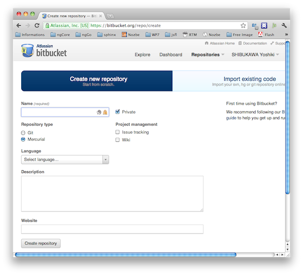
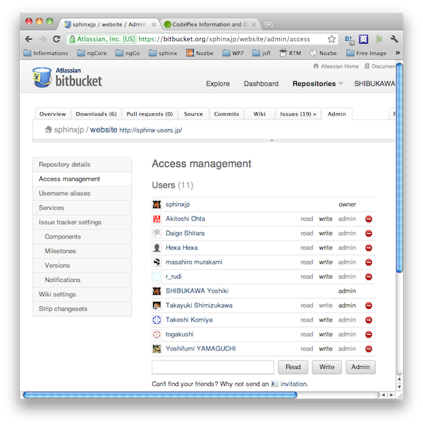

さくらインターネットで自動ビルド
================================

:日時: 2012/1/25
:作者: 渋川よしき

Sphinx-Users.jpで2008年ぐらいから使っている方法を紹介します。常駐のできない、一番安価なさくらのスタンダードプランとBitbucketを使う方法です。

この方法には以下のようなメリットがあります。

* サーバのパスワードを公開することなく、複数人でコンテンツの管理を行うことができる
* BitbucketのウェブUIを使って、権限設定などを簡単に行うことができる
* ウェブのコンテンツをすべてバージョン管理で制御できる
* 自前のテンプレートや特別な拡張機能がいくらでも使える
* 問題の報告や管理に、Bitbucketのチケットのシステムが利用できる
* パッチの受け取りに、pull-requestを使うこともできる

リポジトリの準備
----------------

http://bitbucket.org のサイトにアクセスし、リポジトリを作成します。ユーザがない場合には、ユーザを最初に作る必要があります。

.. note::

   本説明ではMercurialを使いますので、Google Code、CodePlexなどのMercurialをサポートしたサービスを代わりに使うこともできます。

   また、リポジトリアクセスの部分を変更すると、Githubなど、他のサービスを利用することもできるでしょう。

リポジトリができたら、AdminタブのAccess managementで共同編集者の名前を追加しましょう。

* write権限を与えると、書き込みを許可します
* admin権限を与えると、ユーザ管理などができるようになります

あとは、Mercurialを使って、コンテンツをどんどんリポジトリに登録していきます

.. note::

   `Bitbucketドキュメント日本語訳 <http://confluence.atlassian.jp/pages/viewpage.action?pageId=25133116>`_

ビルドシステムの環境設定
------------------------

さくらインターネットにSphinxをインストールします。さくらインターネットのスタンダードプランでは、権限の関係でそのままではsite-packages以下にSphinxをインストールすることができませんので、自分のホーム以下にPythonの環境一式を作るvirtual-pythonをインストールします。

.. code-block:: csh

   % mkdir virtualpython
   % cd virtualpython
   % wget http://peak.telecommunity.com/dist/virtual-python.py
   % python virtual-python.py --prefix=/home/ユーザ名/virtualpython

これで :file:`~/virtualpython` 以下にPythonの実行ファイルやライブラリ一式の環境ができあがります。 :file:`.cshrc` を編集し、このPythonが優先的に使われるようにしてみましょう。次の行を追加します。

.. code-block:: csh

   setenv PYTHONPATH $HOME/virtualpython
   setenv PATH $HOME/virtualpython/bin:$PATH

設定したら再ログインして、設定を有効にします。

くわしくは、cimadaiさんの `さくらインターネットにpythonを再インストール <http://d.hatena.ne.jp/cimadai/20080713/1215964300>`_ なども参照してください。

Sphinxなどをインストールするために、pipをインストールします。Pythonのインストーラ系のシステムが更新されるまでは、pipが事実上のデファクトとなっているようです。(pycon-jp 2011の基調講演より)

.. code-block:: csh

   % curl -O http://pypi.python.org/packages/source/p/pip/pip-1.0.2.tar.gz
   % tar xvzf pip-1.0.2.tar.gz
   % cd pip-1.0.2
   % python setup.py install
   % rehash

あとは、必要なモジュール類をインストールしていきます。

.. code-block:: csh

   $ pip install sphinx
   $ pip install mercurial
   $ rehash

継続的ビルドの組み込み
----------------------

ビルドを行うスクリプトを作成します。すべて :file:`~/website_work/` というフォルダで作業を行うとします。

まずは、Bitbucketからサイトのソースを落としてきます。自分のユーザ名以下に ``website`` というプロジェクトがあったとします。

.. code-block:: csh

   % mkdir website_work
   % cd website_work
   % hg clone ssh://hg@bitbucket.org/ユーザ名/website

次に、ビルドを行うシェルスクリプトを作成します。Bitbucketが更新されていたら、リポジトリから最新のコードを落としてきて、ビルドし直すスクリプトになっています。今回は、自分のホームページスペースの直下に全コンテンツを置くことを前提としています。 :file:`website_work/task.sh` という名前で保存します。

.. code-block:: csh

   #! /bin/csh

   cd $HOME/website_work/website

   set local_version = `hg id -i`
   set remove_version = `hg id -i -r tip https://ユーザ名@bitbucket.org/ユーザ名/website`

   if ( $local_version != $remove_version ) then
       hg pull
       hg update
       make html
       cp -r _build/html/* ~/www/
   else
       echo "not changed"
   endif

このスクリプトを、cronで一定時間ごとに実行するようにしましょう。

.. code-block:: none

   0       *       *       *       0,1,2,3,4,5,6   /home/ユーザ名/website_work/task.sh 1>> /home/ユーザ名/cron.log 2>> /home/ユーザ名/crone.log

これで、毎時0分にリポジトリから最新のコードを取ってきてビルドしています。

この状態で、誰かがBitbucketにコードがコミットされると、1時間以内にはウェブサイトが最新の状態に更新されるようになります。

Sphinx-Users.jpのウェブサイトはこのような形で管理されています。

.. note::

   上記のシェルスクリプトでは簡単化のために省略していますが、sphinx-users.jpは仮想ドメインで運用されているため、ビルド済みのフォルダから、シンボリックリンクでwww以下に擬似的にコピーしています。また、ビルド中おかしな結果が表示されないように、別の場所でビルドして、完了してから一気にリンク先の張替えを行なっています。

