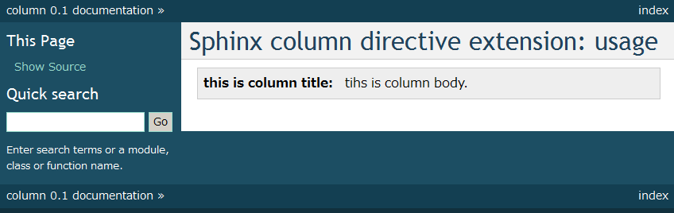

==========================
Columnディレクティブの紹介
==========================

概要
====
`Sphinxをはじめよう <http://www.oreilly.co.jp/books/9784873116488/>`_ の執筆時に `Takayuki Shimizukawa <https://bitbucket.org/shimizukawa>`_ が作成した `Sphinx Column Directive Extension <https://gist.github.com/shimizukawa/2927d6ef049fe39fc3c4>`_ の使い方を紹介します。

*Columnディレクティブ* とは Noteディレクティブにタイトルが付けられるようなイメージです。※admonitionディレクティブに似ていると思う方もいらっしゃるかもしれません

.. gist:: https://gist.github.com/shimizukawa/2927d6ef049fe39fc3c4

使い方
======

conf.pyへのコピー
-----------------

`gistのconf.py <https://gist.github.com/shimizukawa/2927d6ef049fe39fc3c4#file-conf-py>`_ より適用させたい *Sphinxプロジェクト* の *conf.py* にソースコードをコピーして下さい

custom.cssの作成
----------------

gistより `custom.css <https://gist.github.com/shimizukawa/2927d6ef049fe39fc3c4#file-custom-css>`_ をダウンロード、またはコピー＆ペーストで作成し適用させたい *Sphinxプロジェクト* の *_static* ディレクトリに配置して下さい。

reSTソースコードの作成とドキュメントのmake
------------------------------------------

`gistのindex.txt <https://gist.github.com/shimizukawa/2927d6ef049fe39fc3c4#file-index-txt>`_ がColumnディレクティブの記法となります。

まずは、そのままコピーして *make html* して見て下さい。下記のように出力されるでしょう。

