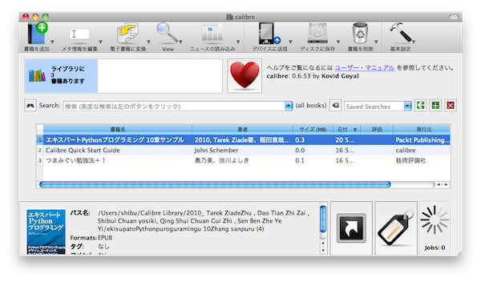
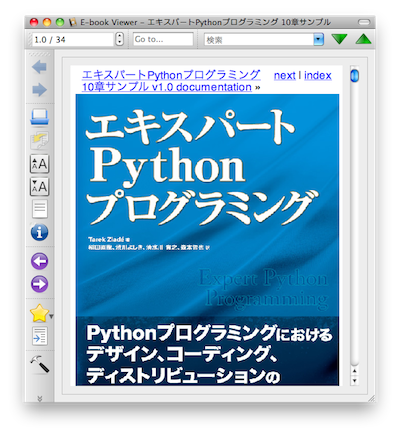
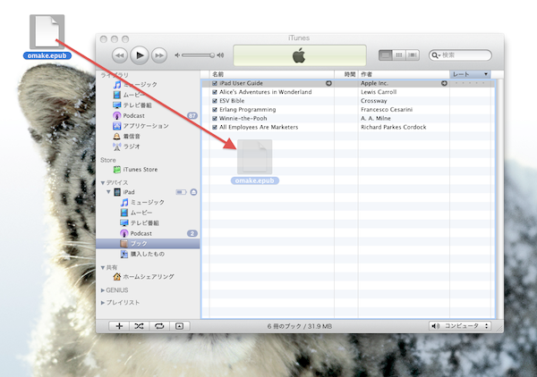
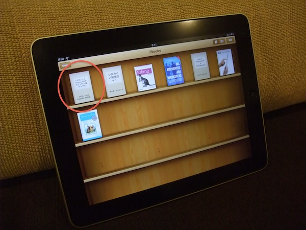
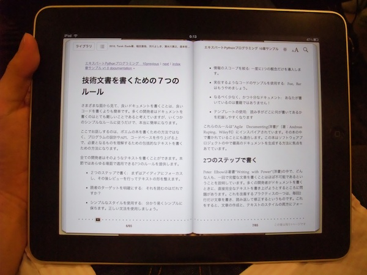

================================
SphinxでかんたんePubファイル作成
================================

:日時: 2010/05/21
:作者: 渋川よしき
:最終更新: 2010/09/13

Sphinxの1.0からは、ePubファイルのビルドができるようになります。ePubファイルというのは、iPadやソニーの電子ブックリーダーなどで利用できる、電子ブックのフォーマットです。原理的にはHTMLに、決まった形式のメタデータを含むファイルを追加して、zipで固めて拡張しをepubにしたものですが、Sphinxを使えば簡単に出力することができます。

.. note::
   iPadでの表示、インストールの仕方は @takabow に協力いただきました。ありがとうございます。

Sphinx 1.0のインストール
========================

まずはSphinx 1.0以降をインストールします。通常の ``easy_install`` (もしくはdistribute, pip)を利用したインストール方法でインストールできます。

.. code-block:: bash

   $ sudo python setup.py -U install

必要なファイルも取得してインストールしてくれます。これで準備完了です。

プロジェクトの作成
==================

通常通り、 :program:`sphinx-quickstart` コマンドを使ってドキュメントのプロジェクトフォルダの環境を設定します。ただし、1.0になると、いくつかビルダーの選択肢が増えるとともに、いくつかオプションが変わっていますので、既存のドキュメントをePub化したい場合にも、 :program:`sphinx-quickstart` を実行して :file:`Makefile` などを作り直すことをおすすめします。なお、現在のバージョンでは生成される :file:`conf.py` はほぼ変わっていませんが、これから手が加わる可能性もあります(後からマニュアルを見ながら追加すればいいので問題はありません)。

後はチュートリアルなどを見ながら、通常通りにSphinxを使ってドキュメントを書き上げていきます。make htmlを使ってプレビューをしながら書いていくのが良いでしょう。

ePubの設定を追加
================

次に、 `ePubのオプション <http://www.sphinx-doc.org/ja/stable/config.html#options-for-epub-output>`_ を見ながら、 :file:`conf.py` にePub用の設定を追加していきます。以前のバージョンの :program:`sphinx-quickstart` でプロジェクトを作った場合には、 :file:`conf.py` にこれらのオプションの追加をしてくれないため、自分で書き加える必要があります。

現在のバージョンでは、途中で「ePub用の設定を加えるか？」ということを聞いてきます。忘れずに「Y」を選択しましょう。

.. code-block:: bash

   Sphinx can also add configuration for epub output:
   > Do you want to use the epub builder (y/N) [n]: 

次のリストは、ePub関連の、生成されるファイルに直に効いてくるオプションの一覧です。

:epub_basefile: ePubファイルの名前になります。省略すると生成されなくなりますので注意。
:epub_theme: テーマファイルです。デフォルトは ``epub`` です。
:epub_tocdepth: 索引の深さを指定します。文書量にもよりますが、2〜3が適当でしょう。

次のリストは、ePubのページ構成に変更を与えるオプションです。

:epub_pre_files: 文章のページの前に埋め込むファイル群
:epub_post_files: 文章のページの後ろに埋め込むファイル群
:epub_exclude_files: ePub化するときには除外するファイル群

次のリストは、メタデータとして書き込まれるオプションです。

:epub_title: ドキュメントのタイトルです。iPadの先頭ページに埋め込まれます。
:epub_author: ドキュメントの著者名です。iPadの先頭ページに埋め込まれます。
:epub_language: 言語
:epub_publisher: 出版社
:epub_copyright: 著作権
:epub_identifier: 識別子。ISBN, URLなど。
:epub_scheme: 識別子の種類。 ``ISBN`` か ``URL``
:epub_uid: ユニークな識別子。

Expert PythonのサンプルePubを生成する :file:`conf.py` では次のように設定しています。

.. code-block:: python

   project = u'エキスパートPythonプログラミング 10章サンプル'
   epub_title = project

   copyright = u'Packt Publishing 2008, ASCII MEDIA WORKS Inc., Copyright 2010'
   epub_author = u'2010, Tarek Ziade著、稲田直哉、渋川よしき、清水川貴之、森本哲也訳'

   epub_basename = 'expert_python_programming_sample'
   epub_language = u'ja'
   epub_publisher = u'Packt Publishing / アスキー・メディアワークス'
   epub_identifier = u'http://ascii.asciimw.jp/books/books/detail/978-4-04-868629-7.shtml'
   epub_scheme = 'URL'
   epub_tocdepth = 3

刊行物であれば ``epub_identifier`` はISBNになりますが、あくまで10章サンプルと、本そのものは違うということで、ここでは書籍情報のURLを設定しています。

.. warning::
   現時点のバージョンでは、 ``language`` オプションを ``'ja'`` に設定するとエラーになります。

ビルドと確認
============

いつものように ``make`` します。ビルダー名は ``epub`` になります。

.. code-block:: bash

   (sphinx10)MacBook:chapter10 shibu$ make epub
   sphinx-build -b epub -d _build/doctrees   . _build/epub
   Making output directory...
   Running Sphinx v1.0pre
   (中略)
   writing expert_python_programming_sample.epub file...

   Build finished. The epub file is in _build/epub.

:file:`_build/epub/` フォルダの下に `expert_python_programming_sample.epub` ファイルが作成されます。

PC上で確認するには、PC用のePubビューアを利用します。ここでは、Python製のオープンソース版電子ブック用iTunesとも言うべき、 `Calibre <http://calibre-ebook.com/>`_ を利用しました。

.. note::
   なぜかAdobe Digital Editionでは文字化けしてしまい、読むことができませんでした。

.. warning::
   電子ブックなのでKindleビューアを利用したくなるかもしれませんが、KindleはePubではなく、別形式(azw/mobi)を利用しているため利用できません。

ライブラリのページにドラッグ＆ドロップすると追加されます。追加されたドキュメントを右クリックして、 ``View -> View`` を選ぶか、選択状態でキーボードの ``V`` を叩くと、表示されるようになります。

iPadへのインストールと表示
==========================

iPadに入れるには、iPadをコンピュータに接続します。次にiTunesを開き、接続したiPadの ``ブック`` というフォルダにePubファイルをドラッグ＆ドロップします。

iPadのiBooksを起動すると、ライブラリに追加されています。これで後から読むことができます。

1.0のsphinx-quickstartで追加される内容
=======================================

Sphinx 1.0のsphinx-quickstartでは、途中でEPubビルダーを使用するか質問があります。
もし、間違ってNにしてしまった、過去のバージョンから乗り換えたが、既に色々書き換えてしまったのでconf.pyの再作成は手間がかかるのでやりたくない、という方はこれをコピペして修正してください。

.. code-block:: python

   # -- Options for Epub output ---------------------------------------------------

   # Bibliographic Dublin Core info.
   epub_title = 'プロジェクト名'
   epub_author = '著者名'
   epub_publisher = '著者名'
   epub_copyright = '年＋著者名'

   # The language of the text. It defaults to the language option
   # or en if the language is not set.
   #epub_language = ''

   # The scheme of the identifier. Typical schemes are ISBN or URL.
   #epub_scheme = ''

   # The unique identifier of the text. This can be a ISBN number
   # or the project homepage.
   #epub_identifier = ''

   # A unique identification for the text.
   #epub_uid = ''

   # HTML files that should be inserted before the pages created by sphinx.
   # The format is a list of tuples containing the path and title.
   #epub_pre_files = []

   # HTML files shat should be inserted after the pages created by sphinx.
   # The format is a list of tuples containing the path and title.
   #epub_post_files = []

   # A list of files that should not be packed into the epub file.
   #epub_exclude_files = []

   # The depth of the table of contents in toc.ncx.
   #epub_tocdepth = 3

   # Allow duplicate toc entries.
   #epub_tocdup = True

変更履歴
========

:2010/09/13: Sphinx 1.0正式リリースの変更点に合わせて修正
