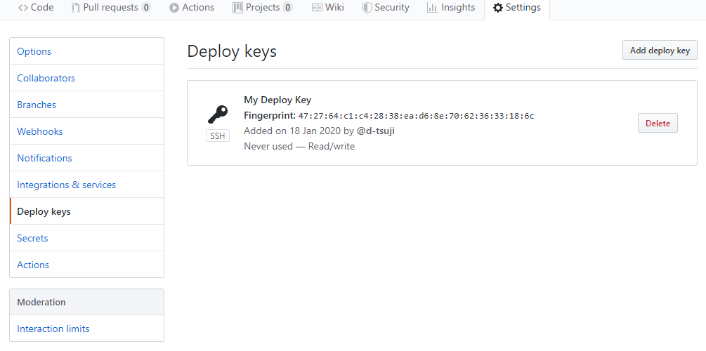
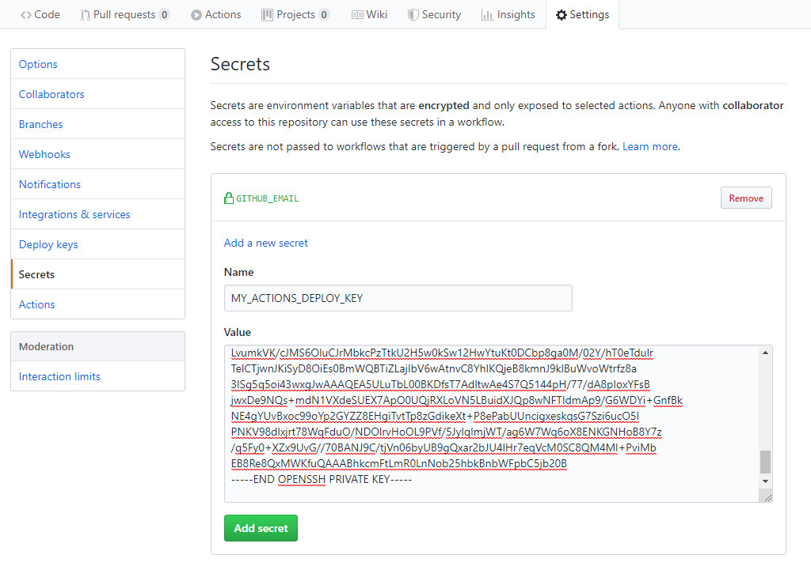
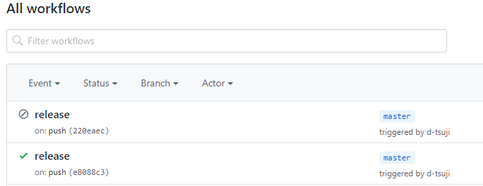
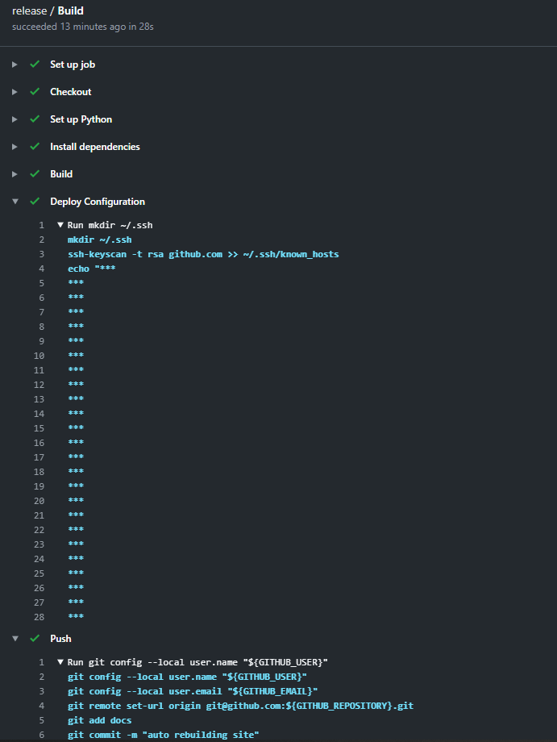

===============================================================
GitHub Actionsを用いてGitHub Pagesへのデプロイを自動化する
===============================================================

:日時: 2020/01/18
:作者: 辻大志郎

概要
=========================================

GitHub Actions を用いて HTML ファイルの生成とデプロイを自動化します。ドキュメントのホスティング方法はいくつかありますが、ここでは GitHub Pages を用います。 ``master`` ブランチの ``/docs`` に公開するファイルを格納し、公開するようにします。``gh-pages`` ブランチにデプロイして公開する方法もありますが、今回は割愛します。

GitHub Pages を使ったホスティング方法は `Github Pagesを使ってドキュメントを公開 <https://sphinx-users.jp/cookbook/hosting/index.html?highlight=html#github-pages>`_ もご覧ください。

リポジトリのディレクトリ構成
=========================================

下記のディレクトリ構成を想定します。

.. code-block:: console

  .
  ├── .github/workflows/main.yml   // GitHub Actions の設定
  ├── Makefile
  ├── README.rst
  ├── docs                         // sphinx-build で生成するファイルの格納先
  ├── make.bat
  ├── requirements.txt
  └── source                       // rst ファイルの格納先

``Makefile`` は以下のように ``docs`` 以下にビルドファイルを生成するようにします。

.. gist:: https://gist.github.com/d-tsuji/ba173ba1c00a0c65a99391a7e0959a2f

.. note::

  GitHub Pages でホスティングする場合は ``docs`` ディレクトリに ``.nojekyll`` を含めておく必要があります。``.nojekyll`` 自体は空のファイルで OK です。

GitHub Pages の設定
=========================================

GitHub Actionsで自動生成したファイルをコミットするためにプロジェクトの ``Deploy keys`` を設定します。

.. warning::

  ``GITHUB_TOKEN`` や ``Personal access tokens`` を用いる場合でもコミットすることはできますが、ページがデプロイされないという問題があります。`こちら <https://github.community/t5/GitHub-Actions/Github-action-not-triggering-gh-pages-upon-push/td-p/26869>`_ の GitHub の Community Forum でも同じような議論があり、現在(2020/01/18)は解決はされていません。そのため ``Deploy keys`` を使ってコミットします。

Deploy keys の設定
-----------------------------------------

以下のようにして公開鍵と秘密鍵のペアを生成します。

.. code-block:: bash

  ssh-keygen -t rsa -b 4096 -C "$(git config user.email)" -f my-repo -N ""

そうすると以下の 2 つのファイルが生成されます。

* my-repo.pub (公開鍵)
* my-repo     (秘密鍵)

公開鍵は、プロジェクトの ``Settings -> Deploy Keys`` の ``Add deploy key`` で登録します。秘密鍵は ``Settings -> Secrets`` の ``Add a new secret`` で登録します。Secret は ``MY_ACTIONS_DEPLOY_KEY`` という名前で登録しておくことにします。

* 公開鍵の登録

.. image:: img/deploy_key.png
  :scale: 100

* 秘密鍵の登録

.. image:: img/action_key_success.png
  :scale: 100

GitHub Actions の設定
=========================================

GitHub Actions のワークフローを設定します。yaml ファイルは以下の ``main.yml`` のようになります。

.. warning::

  注意点として Deploy Keys を用いてコミットする場合、GitHub Actions 上で無限ループになる可能性があります。つまり GitHub Actions でコミットしたイベントをトリガーにして、次の GitHub Actions のワークフローを呼び出してしまうことです。``GITHUB_TOKEN`` を用いてコミットする場合は無限ループは発生しません、そうでない場合に無限ループになるのは GitHub Actions の仕様によるものです。`こちら <https://github.community/t5/GitHub-Actions/Workflow-infinite-loop/td-p/34471>`_ に GitHub Staff による回答があります。

  無限ループを回避する方法の一つとして、GitHub Actions でコミットしたときの条件では GitHub Actions のワークフローが実行されないように制御する方法があります。以下のワークフローの設定では ``if: "!contains(github.event.head_commit.message, 'auto rebuilding site')"`` として無限ループにならないようにしています。

.. gist:: https://gist.github.com/d-tsuji/834a94a4b46044aca7da801b11febb10

上記の GitHub Actions の設定を実施しておくと GitHub リポジトリにコミットするときにワークフローが実行されます。以下のような結果を見ることができます。

また参考までに GitHub Actions のデプロイのログの一部を載せておきます。

サンプル
=========================================

* サンプルページ: https://d-tsuji.github.io/sphinx-sample
* ソース: https://github.com/d-tsuji/sphinx-sample

