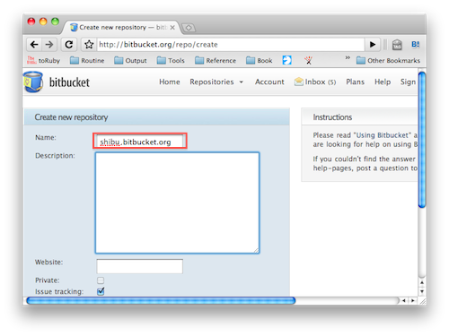

========================================
Sphinxで作ったドキュメントのホスティング
========================================

:日時: 2010/09/05
:更新日: 2015/03/17
:作者: 渋川よしき、山口能迪、清水川貴之

Sphinxでドキュメントを作ったら公開したいですよね？自分のホームページ作成のように、FTPを使って、プロバイダーなどで提供されている所に置くというのも当然できますが、ここではいくつか別の方法を紹介します。

.. contents::

Github Pagesを使ってドキュメントを公開
======================================

Github Pagesを使えば、個人や組織のウェブサイト、リポジトリのウェブサイトを作ることができます。

必要なもの
----------

* Githubのアカウント
* git

ケース1: 個人や組織のウェブサイトの公開手順
-------------------------------------------

1. ``ユーザ名.github.io`` という名前のリポジトリを作成します(ここのユーザ名は個人のアカウント名、もしくは組織名です)。
2. SphinxでビルドしたHTML群を登録します。
3. ``.nojekyll`` という空のファイルを作って登録します。これを登録しないと、Githubのサーバ側でJekyllというツールがディレクトリ内のファイルを変換しようとしたり、 ``_`` で始まるディレクトリが無視されたりします。
4. ``master`` ブランチにpushします。
5. ``http://アカウント名.github.io`` にアクセスすると、作成したファイルが見られます。

ケース2: リポジトリのウェブサイトの公開手順
-------------------------------------------

すでに何らかのソフトウェアのソースコードが格納されているリポジトリがあるものとします。

1. まず、 ``gh-pages`` ブランチを作ります。過去の履歴は必要ないので ``--orphan`` オプションを付けます。

   .. code-block:: bash

      $ git checkout --orphan gh-pages
      Switched to a new branch 'gh-pages'

2. 現在のソースコードがコミットされてはないものの、git addされてindexに登録されている状態になっているので、すべて削除します。

   .. code-block:: bash

      $ git rm -rf .
      rm '.gitignore'
      rm 'README.rst'
      rm 'LICENSE.rst'

3. SphinxでビルドしたHTML群を登録します。
4. ``.nojekyll`` という空のファイルを作って登録します。これを登録しないと、Githubのサーバ側でJekyllというツールがディレクトリ内のファイルを変換しようとしたり、 ``_`` で始まるディレクトリが無視されたりします。
5. ``gh-pages`` ブランチにpushします。
6. ``http://ユーザ名.github.io/リポジトリ名`` にアクセスすると、作成したファイルが見られます(ここのユーザ名は個人のアカウント名、もしくは組織名です)。

サンプル
--------

* 出来上がり: https://shibukawa.github.io/curl_as_dsl/
* ソース: https://github.com/shibukawa/curl_as_dsl/tree/gh-pages

ケース2の応用編
---------------

Sphinxのソースコード自体や、ビルド結果のHTMLは本体のコードと同期をとって管理したいはずです。で、結果のファイル群だけを ``gh-pages`` ブランチに入れたいですよね？

.. code-block:: none

   / プロジェクトのトップ
      src/ ソースコード
      doc/ Sphinxのソース

ディレクトリの構成が上記のような構造だったとします。Sphinxでソースと成果物のフォルダを分ける設定にしていなければ、 ``/doc`` 内で ``make html`` すると、 ``/doc/_build/html`` に成果物のファイルが入ります。

.. code-block:: bash

   $ git submodule add -b gh-pages git@github.com:[ユーザ名]/[リポジトリ名].git doc/_build/html

これで、 ``doc/_build/html`` が ``gh-pages`` ブランチそのものになりました。 ``make html`` 後にこのフォルダ内でコミットしてpushしつつ、プロジェクトのルートで ``doc/_build/html`` をコミットすればプロジェクトのコード等と結果のHTMLの同期がをとることができます。また、JavaScript関連のリポジトリで、プロジェクトをビルドした結果をサンプルコードとして提供したい場合も、プロジェクトのビルド結果をここに入れるようなビルドスクリプトでも用意してあげると捗ると思います。

subtreeという仕組みを使う方法もありますが、gitのsubmoduleの方が慣れている人が多いと思われるのでこちらを紹介しました。もしチャレンジしたい方は下記のページを参考にどうぞ。

* http://qiita.com/mizchi/items/17e2eb04c34b18aff921

.. warning::

   サブモジュール化した状態でmake cleanすると、デフォルトの設定だとサブモジュールの対象のフォルダがまるごと消えてしまいます。
   htmlフォルダは削除されないように修正してください。

   .. code-block:: make

      clean:
          rm -rf $(BUILDDIR)/html/*
          rm -rf $(BUILDDIR)/doctrees

   .. code-block:: bat

      if "%1" == "clean" (
          for /d %%i in (%BUILDDIR%\html) do rmdir /q /s %%i
          del /q /s %BUILDDIR%\html\*
          for /d %%i in (%BUILDDIR%\doctrees) do rmdir /q /s %%i
          del /q /s %BUILDDIR%\doctrees\*
          goto end
      )

参考
----

* https://help.github.com/articles/creating-project-pages-manually/ 公式ドキュメント
* http://d.hatena.ne.jp/hide_o_55/20130526/1369555706 Doxygenで生成したドキュメントをGitHub Pagesで手軽に公開する方法(応用編)

GitLab Pages を使ってドキュメントを公開
===========================================

GitLabを使えば、GitLab PipelineによるSphinxのドキュメントビルドと、GitLab PagesでのHTMLホスティングができます。

必要なもの
----------

* GitLabのアカウント
* git

手順
---------------

1. まずGitLabにリポジトリを作ります。例として、hellosphinxというリポジトリを作りました。

   - https://gitlab.com/shimizukawa/hellosphinx

2. このリポジトリに、Sphinxの 'conf.py' と 'index.rst' ファイルを作成します。

   既存のSphinxプロジェクトがあればそれを使っても構いません。

   - https://gitlab.com/shimizukawa/hellosphinx/blob/master/index.rst
   - https://gitlab.com/shimizukawa/hellosphinx/blob/master/conf.py

3. リポジトリに '.gitlab-ci.yml' を作成します。

   公式のドキュメントにある内容をそのまま使ってOKです。

   - https://gitlab.com/pages/sphinx#gitlab-ci

   今回は、Makefileを用意していないので、ちょっと書き換えました。
   以下のファイルでは ``make html`` コマンドの代わりに ``sphinx-build -M html . _build`` を実行しています。

   - https://gitlab.com/shimizukawa/hellosphinx/blob/master/.gitlab-ci.yml

4. '.gitlab-ci.yml' があると、自動的にGitLab Pipelineが実行されます。

   - https://gitlab.com/shimizukawa/hellosphinx/pipelines

5. ビルドしたHTMLが公開されました！

   URLは ``<username|groupname>.gitlab.io/<reponame>`` です。

   - https://shimizukawa.gitlab.io/hellosphinx/

なお、GitLabではプライベートリポジトリを無料で作成できますが、GitLab Pagesに公開したページは誰でもアクセスできます。アクセス権を設定する要望が `gitlab-ce#33422 <https://gitlab.com/gitlab-org/gitlab-ce/issues/33422>`__ で行われています。今のところ（2017/6/11現在）、一般公開したくないページについては、GitLab Pagesでこっそり公開するか、別のところで公開する必要があります。

参考

- https://pages.gitlab.io/
- https://gitlab.com/pages/sphinx

Bitbucket.orgを使ってドキュメントを公開
============================================

Bitbukcet上に、 ``http://ユーザ名.bitbucket.io`` という名前でドキュメントを公開できます。

必要なもの
----------

* Bitbucketのアカウント
* Mercurial/git

公開手順
--------

1. ``ユーザ名.bitbucket.io`` という名前のリポジトリを作ります。

2. リポジトリを作った後のOverviewのページに表示されているコマンド(hg clone)を実行します
3. SphinxでビルドしたHTML群を登録します。
4. コミットして、Bitbucketに変更をPushします。
5. ``http://ユーザ名.bitbucket.io`` にアクセスすると、作成したファイルが見られます。

.. tip::

   DirectoryIndexのように、index.htmlが無い場合に自動的にファイル一覧を表示する機能は無いので、
   サブディレクトリに複数のドキュメントを分けて置きたい場合等は、ルートディレクトリに自分で
   index.htmlを用意する必要があります。

参考: `Free Hosting at BitBucket <http://hgtip.com/tips/beginner/2009-10-13-free-hosting-at-bitbucket/>`_

Google App Engineを使ってドキュメントを公開
===========================================

Google App Engine上で静的ファイルを公開する方法を使ってホスティングします。

必要なもの
----------

* Google App Engineのアカウントと `開発環境 <http://code.google.com/intl/ja/appengine/docs/python/gettingstarted/devenvironment.html>`_

公開手順
--------

#. Google App Engine （以下GAE）のアプリケーションを作成します。
   詳細は `公式サイト <http://code.google.com/intl/ja/appengine/docs/java/gettingstarted/uploading.html>`_ を参照してください。
   ここでは ``hoge`` というアプリケーションを作成します。

#. GAEプロジェクトディレクトリをローカルに作成し、Sphinxドキュメントのビルドディレクトリにシンボリックリンクを張ります。

   .. code-block:: bash

      $ mkdir hoge
      $ cd hoge
      $ ln -s /home/sphinxuser/docs/hoge/_build/html hoge_document
 

#. プロジェクトディレクトリ直下に ``app.yaml`` を作成します。

   .. code-block:: yaml

      application: hoge
      version: 1
      runtime: python
      api_version: 1
      
      handlers:
      - url: /hoge_document
        static_dir: hoge_document

   この時点でディレクトリは下記のようになっているはずです。

   .. code-block:: none

      hoge
      ├── app.yaml
      └── hoge -> /home/sphinxuser/docs/hoge/_build/html
      
#. appcfg.pyを使ってGAEへデプロイします。この時appcfg.pyに渡すのはディレクトリ名であることに注意してください。

   .. code-block:: bash

      $ appcfg.py update hoge
      Application: hoge; version: 1.
      Server: appengine.google.com.
      Scanning files on local disk.
      Scanned 500 files.
      Initiating update.
      Could not guess mimetype for hoge_document/objects.inv.  Using application/octet-stream.
      Cloning 35 static files.
      Cloning 403 application files.
      Cloned 100 files.
      Cloned 200 files.
      Cloned 300 files.
      Cloned 400 files.
      Uploading 403 files and blobs.
      Uploaded 403 files and blobs.
      Deploying new version.
      Checking if new version is ready to serve.
      Will check again in 1 seconds.
      Checking if new version is ready to serve.
      Will check again in 2 seconds.
      Checking if new version is ready to serve.
      Will check again in 4 seconds.
      Checking if new version is ready to serve.
      Closing update: new version is ready to start serving.
      Uploading index definitions.
      

#. （おまけ）デプロイの自動化をするには下記のようなスクリプトを作成してcrontabに登録しておくとよいでしょう。パスワードはappcfg.pyに渡せないので、スクリプト化するには `expect` を使う必要があります。

   .. code-block:: bash

      #!/bin/bash
      
      DOCS_HOME=${HOME}/src/docs
      GAE_SDK_HOME=${HOME}/tool/google_appengine
      GAE_APP_HOME=${HOME}/gae/
      GAE_APP_NAME=hoge
      GAE_USER=<user mail address>
      GAE_PASS=<password>
      
      PASSWD_MSG="Password for "${GAE_USER}
      
      make html
      sleep 60
      
      cd ${GAE_APP_HOME}
      
      expect -c "
      spawn $GAE_SDK_HOME/appcfg.py update --email=$GAE_USER --passin $GAE_APP_NAME
      set timeout -1
      expect $PASSWD_MSG
      send $GAE_PASS
      interact
      "   
