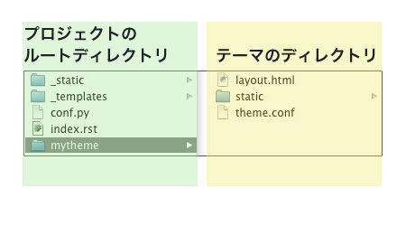

テーマ作成前の準備
=======================
実際にテーマを作成していく前に、必要なものと環境を準備します。

必要なファイル、ディレクトリ
------------------------------
テーマはテーマ名のついたディレクトリ、またはzipファイルで提供され、以下のファイルが含まれます。

**theme.conf**
   テーマの設定ファイル

**HTMLテンプレート**
   文書のレイアウトや表示する内容のひな形になるファイル
   レイアウトの変更時に必要に応じて用意する

**staticディレクトリ**
   CSS、スクリプト、画像ファイル等の静的ファイルを配置するディレクトリ

このドキュメントでは、以降、テーマをディレクトリとして作成し解説していきます。

テーマ作成環境を作成する
--------------------------
作成するテーマ名の名前をつけたディレクトリは、\ ``conf.py``\ の\ ``html_theme_path``\ で設定した場所に配置します。以下の例では、\ ``conf.py``\ と同じディレクトリ内に\ `mytheme`\ というテーマを作成します。

.. note ::
   \ ``html_theme_path``\ は、\ ``conf.py``\ からの相対パスで指定して下さい。

.. code-block:: python

   html_theme = 'mytheme'
   html_theme_path = ['.']

\ ``mytheme``\ というディレクトリを作成し、その中で\ ``theme.conf``\ 、\ ``static``\ ディレクトリ、htmlテンプレートを作成します。htmlテンプレートは、\ ``.html``\ の拡張子が付いたファイルになります。

準備が整ったら、\ :doc:`conf`\ に進んでください。
