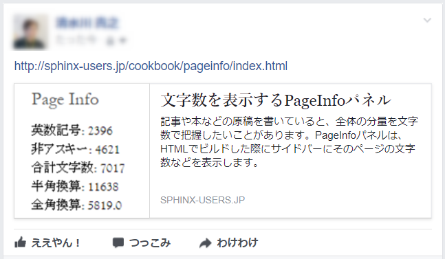

===========================================================
Twitter/Facebookへのページシェアでコンテンツを埋め込む(OGP)
===========================================================

概要
====

Sphinxで作成したページのURLをTwitterやFacebookといったSNSに投稿することがあります。このとき、そのページの内容数行と画像が投稿内容に自動的に表示されれば、その投稿を見た人が内容により興味を持ってくれるかもしれません。

このような、SNS投稿にコンテンツ内容を表示するための仕組みとして、 `Open Graph protocol (OGP) <http://ogp.me/>`__ という仕組みがあります。OGPは、HTMLのメタタグを適切に持たせることで、投稿先SNS等が表示するべきコンテンツ内容を把握し、その情報を表示してくれる仕組みです。

   OGP対応ページの投稿

この拡張が出力するmetaタグ
==========================

この拡張は、以下のHTMLタグを出力します。

.. code-block:: html

   <meta name="twitter:card" content="og:type" />
   <meta property="og:site_name" content="Python製ドキュメンテーションビルダー、Sphinxの日本ユーザ会">
   <meta property="og:title" content="Twitter/Facebookへのページシェアでコンテンツを埋め込む(OGP)">
   <meta property="og:description" content="Sphinxで作成したページのURLをTwitterやFacebookといったSNSに投稿することがあります。このとき、そのページの内容数行と画像が投稿内容に自動的に表示されれば、その投稿を見た人が内容により興味を持ってくれるかもしれません。このような、SNS投稿にコンテンツ内容を表示するための仕組みとして、Open Graph protocol (OGP)という仕組みがあります。OGPは、HTMLのメタタグを適切に持たせることで、投稿先SNS等が表示するべきコンテンツ内容を把握し、その情報を表示してくれる仕組み...">
   <meta property='og:url' content="http://sphinx-users.jp/cookbook/ogp/index.html">
   <meta property="og:image" content="http://sphinx-users.jp/_images/sphinx-ogp-no-image.png">

.. note::

   このタグが出力されるためには、Sphinxテーマで使っているテンプレートが ``metatags`` を出力している必要があります。Sphinx組み込みのテーマ、alabaster, sphinx_rtd_theme はこの出力に対応しています。

コード
======

以下の内容をそれぞれのファイル名でSphinxプロジェクトに組み込んでください。

.. code-block:: python
   :caption: conf.py

   import sys
   import os
   sys.path.append(os.path.abspath('_ext'))

   extensions = [
       'ogtag',
   ]

   og_site_url = 'http://sphinx-users.jp/'

``conf.py`` の ``og_site_url`` には、HTML公開先のドキュメントルートのURLを記載します。

.. code-block:: python
   :caption: _ext/ogtag.py

   from docutils import nodes
   from sphinx import addnodes
   from urllib.parse import urljoin

   class Visitor:

       def __init__(self, document):
           self.document = document
           self.text_list = []
           self.images = []
           self.n_sections = 0

       def dispatch_visit(self, node):
           # toctreeは飛ばす
           if isinstance(node, addnodes.compact_paragraph) and node.get('toctree'):
               raise nodes.SkipChildren

           # 画像を収集
           if isinstance(node, nodes.image):
               self.images.append(node)

           # 3つ目のセクションまではテキスト収集する
           if self.n_sections < 3:

               # テキストを収集
               if isinstance(node, nodes.paragraph):
                   self.text_list.append(node.astext())

               # セクションに来たら深さを追加
               if isinstance(node, nodes.section):
                   self.n_sections += 1

       def dispatch_departure(self, node):
           pass

       def get_og_description(self):
           # TODO: 何文字までが良いのか?
           text = ''.join(self.text_list)
           if len(text) > 200:
               text = text[:-3] + '...'
           return text

       def get_og_image_url(self, page_url):
           # TODO: 必ず最初の画像で良いのか
           if self.images:
               return urljoin(page_url, self.images[0]['uri'])
           else:
               return None

   def get_og_tags(context, doctree, site_url):
       # page_url
       page_url = urljoin(site_url, context['pagename'] + context['file_suffix'])

       # collection
       visitor = Visitor(doctree)
       doctree.walkabout(visitor)

       # og:description
       og_desc = visitor.get_og_description()

       # og:image
       og_image = visitor.get_og_image_url(page_url)

       ## OGP
       tags = '''
       <meta name="twitter:card" content="og:type" />
       <meta property="og:site_name" content="{ctx[shorttitle]}">
       <meta property="og:title" content="{ctx[title]}">
       <meta property="og:description" content="{desc}">
       <meta property='og:url' content="{page_url}">
       '''.format(ctx=context, desc=og_desc, page_url=page_url)
       if og_image:
           tags += '<meta property="og:image" content="{url}">'.format(url=og_image)
       return tags

   def html_page_context(app, pagename, templatename, context, doctree):
       if not doctree:
           return

       site_url = app.config['og_site_url']
       context['metatags'] += get_og_tags(context, doctree, site_url)

   def setup(app):
       app.add_config_value('og_site_url', None, 'html')
       app.connect('html-page-context', html_page_context)
       return {
           'version': '0.1',
           'parallel_read_safe': True,
           'parallel_write_safe': True,
       }

Twitterでの追加手順
===================

Twitterの場合、ogタグのあるページを検証サイトに入力して、承認してもらう必要があります。詳しくは以下のページにある「検証ツールでURLを実行して申請」を参照してください。

* https://dev.twitter.com/ja/cards/overview

参考
========

* https://dev.twitter.com/ja/cards/overview
* https://developers.facebook.com/docs/opengraph/getting-started/
* `https://get.slack.help/hc/ja/articles/204399343-Slack-でリンクを共有する- <https://get.slack.help/hc/ja/articles/204399343-Slack-%E3%81%A7%E3%83%AA%E3%83%B3%E3%82%AF%E3%82%92%E5%85%B1%E6%9C%89%E3%81%99%E3%82%8B->`__
* http://ogp.me/

