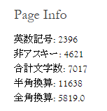

==============================
文字数を表示するPageInfoパネル
==============================

概要
====

記事や本などの原稿を書いていると、全体の分量を文字数で把握したいことがあります。PageInfoパネルは、HTMLでビルドした際にサイドバーにそのページの文字数などを表示します。

   pageinfo の出力例

コード
======

.. gist:: https://gist.github.com/shimizukawa/e486b01d22fcafd4d57d29e3d429a550

