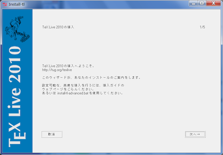

=========================================================
インストーラによるTeX Liveインストール (Windows / UNIX)
=========================================================

インストーラのダウンロード
--------------------------

開発元が推奨しているのは、ネットワークインストールです。下記のページから、install-tl.zip (Windows用)か、install-tl-unix.tar.gzをダウンロードして、展開してください。

* `TeX Live のネットワークインストーラ <http://www.tug.org/texlive/acquire-netinstall.html>`_

DVDイメージ(2GBある)もあります。社内から外にアクセスしにくいなどの環境でインストールする場合はこちらが良いでしょう。
bittorrentを使ってダウンロードすることもできます。ダウンロードしたら、DVDに焼いたり、イメージファイルをマウントしてください。

* `DVDイメージダウンロード <http://www.tug.org/texlive/acquire-iso.html>`_

インストール
------------

プログラムを実行してインストールしてください。WindowsではGUIのインストーラが、それ以外ではコンソールのインストーラが起動しますが、使い勝手に差はありません。

基本的にはデフォルトの設定のままで大丈夫です。もしインストール先を換えたい場合などは、インストーラの最初の設定画面で設定できます。

