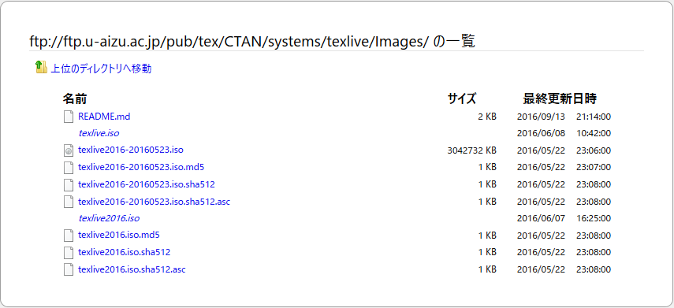

=============================================================
インストーラによるTeX Liveインストール (Windows / UNIX 系 OS)
=============================================================

Windows のみ
============
Windows の場合のみ別途 make コマンドが必要がです。
推奨されている物はありませんので `Gow (Gnu On Windows) <https://github.com/bmatzelle/gow/releases>`_ や `Make for Windows <http://gnuwin32.sourceforge.net/packages/make.htm>`_ などをインストールしてパスを通して下さい。

TeX 環境の構築
==============
TeX 環境は TeX のディストリビューション「TeX Live」のインストールを推奨します。最新版の TeX Live [#texlive]_ をインストールしましょう。
開発元が推奨しているのはネットワークインストーラの利用ですが、ISO イメージをダウンロードしてインストールするのが確実です。

以下は Windows へのインストール例ですが、UNIX 系 OS でターミナルからインストールする際は CUI で表示されるだけで、
ほぼ同様の手順で進められますのでコマンドや環境については適宜読みかえて下さい。

1. 配布サイトにアクセスし「download from a nearby CTAN mirror」をクリックします。アクセス元から最適なダウンロード先が表示されます。

    http://www.tug.org/texlive/acquire-iso.html

2. *texlive2016.iso* をクリックしダウンロードします。

3. ISO イメージをマウントします。Windows8 以上の場合はダブルクリックで仮想ドライブにマウントされます。
   Windows7 の場合は標準機能で ISO イメージがマウントできませんので別途 Virtual CloneDrive [#virtualclonedrive]_ や Win CDEmu [#wincdemu]_ 等の仮想ドライブツールをインストールして下さい。

4. マウントした仮想ドライブをエクスプローラで開き *install-tl-windows.bat(UNIX 系 OS の場合は install-tl)* が存在する事を確認します。

5. *install-tl-windows.bat(UNIX 系 OS の場合は install-tl)* をダブルクリックしインストーラを起動します。
   表示内容を確認し「次へ」をクリックします。

6. インストール先のフォルダ指定を聞かれますが、今回は標準の ``C:\texlive\2016`` のまま進めます。
   また、必要なディスク容量が表示されていますのでディスク容量が足りている事を確認し「次へ」をクリックします。

7. 「用紙のサイズ」「メニューのショートカット」「TeXworks フロントエンド」について聞かれます。
    PDF 出力するだけであれば「TeXworks フロントエンド」のみ不要ですのでチェックを外して「次へ」をクリックして下さい。

8. インストール設定内容が表示されますので確認し「導入」をクリックします。

9. インストールが開始されます。環境にもよりますが30分～2時間程で下記画面が出ますので「終了」をクリックします。

10. コマンドプロンプトが残っているので何かキーを押して終了させて下さい。

11. パスを通す為に Windows を再起動します。

12. パスが通った確認をします。コマンドプロンプトを起動して以下のように platex コマンドを打ち正しい結果が表示される事を確認します。 ::

      platex --version

          e-pTeX 3.14159265-p3.7-160201-2.6 (sjis) (TeX Live 2016/W32TeX)
          kpathsea version 6.2.2
          ptexenc version 1.3.4
          以下略

再起動後、今回の手順には必須ではありませんが ``tlmgr update --self --all`` というコマンドで TeX Live のアップデートをする事ができます。
TeX のパッケージが改良されていたり増えたりする事もありますので時間のある時にアップデートして下さい。

Windows 以外の OS へのインストールについては TeX Wiki [#texlive-install]_ を確認して下さい。

.. [#texlive] 2016年10月現在の最新版は TeX Live 2016
.. [#virtualclonedrive] Virtual CloneDrive http://www.elby.ch/
.. [#wincdemu] Win CDEmu http://wincdemu.sysprogs.org/
.. [#texlive-install] TeX Wiki https://texwiki.texjp.org/ TeX をインストールしよう → TeX 入手法 → TeX をインストールする方法

