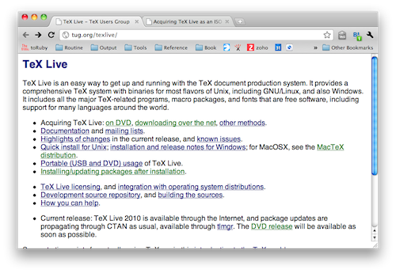

====================
LaTeX経由でのPDF作成
====================

:日時: 2010/10/10
:作者: 渋川よしき/小宮健/波田野裕一
:最終更新: 2014/01/26

Sphinxの標準機能に、LaTeXを経由したPDF出力が入っています。英語の文章であれば簡単に成功しますが、日本語ではスムーズに行かないところもあります。

ここでは日本語ならではの情報を集約します。

.. warning::

   追加情報や、協力してくれる方がいらっしゃいましたら、 `Sphinx-users <http://sphinx-users.jp/howtojoin.html>`_ までご連絡ください。

Sphinx で利用する TeXディストリビューション
=============================================

Sphinx で日本語文章を書く場合は文字コードに UTF-8が利用されるため、PDF を作成する際には UTF-8 対応版の pLaTeX である必要があります。
内部では ebb, mendex, platex, dvipdfmx の各コマンドを利用していますので、これらが利用できる環境を用意します。

.. ここでは TeX ディストリビューションである TeX Live (2011以降) を例にして説明します。

.. TeXディストリビューションのインストール
.. ========================================

.. TeX系の処理系には色々あります(pLaTeX、tetex、xetex、pdflatexなど)が、現在活発に開発されていているのが、
.. `TeX Live <http://tug.org/texlive/>`_ というディストリビューションです。

ここでは、Windows、OSX、Linux、FreeBSDなどに対応しており、環境の作りやすさを考慮して、 `TeX Live <http://tug.org/texlive/>`_ というディストリビューションを使って説明をしていきます。

.. note::

  TeXの処理系の中には、アスキー・メディアワークスが開発を行っていて、日本語の扱いに長けたpTeX/pLaTeXがあります。
  TeX Live 2010からは、このpLaTeXも内蔵されたため、簡単に品質の高い日本語のドキュメントが作れるようになりました。

TeX Liveのインストール
========================================

.. toctree::
   :maxdepth: 1

   ./latex-install-tl
   ./latex-install-osx
   ./latex-install-linux
   ./latex-install-freebsd

Sphinxへのパッチ適用
========================

Sphinx1.1.3については、打田さんのパッチを適用することで、日本語 LaTeX 経由でのPDF出力を改善することができます。

.. toctree::
   :maxdepth: 1

   ./latex-sphinx113

.. note::

   Sphinx-1.2 (2013/12/10リリース)に打田さんのパッチが取り込まれています。
   1.2以降を使用している場合はこの手順は不要です。

Sphinxプロジェクトの作成/再作成
================================

`sphinx-quickstart` コマンドでSphinxプロジェクトを作成します。

もし既存のプロジェクトがある場合でも、新規にプロジェクトを作成して rst ファイルやテンプレート、静的ファイルなどを上書きコピーしてください。
これは、古いバージョンのSphinxで生成された conf.py や Makefile が 日本語出力に対応していないために上書き更新をするために行ないます。

.. note::

  既にindex.rstのコンテンツがある場合は、一旦退避して、sphinx-quickstart後に書き戻します。

Sphinxプロジェクトの設定変更
============================

`sphinx-quickstart` コマンドで生成した ``conf.py`` に日本語用の設定を書き加えます。

.. code-block:: python

   # 言語の設定
   language = 'ja'

   # LaTeX の docclass 設定
   latex_docclass = {'manual': 'jsbook'}

.. note::
  この設定をしない場合、「しおり」が作成されなかったり、文字化けすることがあります。

ビルドの実行
============

``make latexpdfja`` と実行すれば、ファイルが生成されます。

.. code-block:: bash

   $ make latexpdfja
   sphinx-build -b latex -d build/doctrees   source build/latex
   Making output directory...
   Running Sphinx v1.1.2
   loading translations [ja]... done
   loading pickled environment... not yet created
   building [latex]: all documents
   updating environment: 1 added, 0 changed, 0 removed
   reading sources... [100%] index
   
   looking for now-outdated files... none found
   pickling environment... done
   checking consistency... done
   processing test.tex... index
   resolving references...
   writing... WARNING: no Babel option known for language 'ja'
   done
   copying TeX support files... done
   build succeeded, 1 warning.
   Running LaTeX files through platex and dvipdfmx...
   make -C build/latex all-pdf-ja
   (略)
   pdflatex finished; the PDF files are in build/latex.

お疲れ様でした！これでPDFファイルができました。

PDFの完成
============

ビルドディレクトリ配下のlatexディレクトリ(デフォルト設定の場合は _build/latex)にPDFファイルが生成されているはずです。

.. note::

   このPDFはフォント埋め込みタイプではありませんので、Kindleなどに入れると文字が出ません。
   フォント埋め込みはdvipdfmxの設定で行えるようになるはずです。検証したらまた追記します。

変更履歴
========

:2010/10/10: 初版(渋川)
:2012/03/25: 打田さんの Sphinx パッチおよび TeX Live 2011 をベースに記事を更新
:2014/01/26: MacPortsによるOSXへのインストール、FreeBSDへのインストールを追加し、記事を再構成&更新 (波田野)
