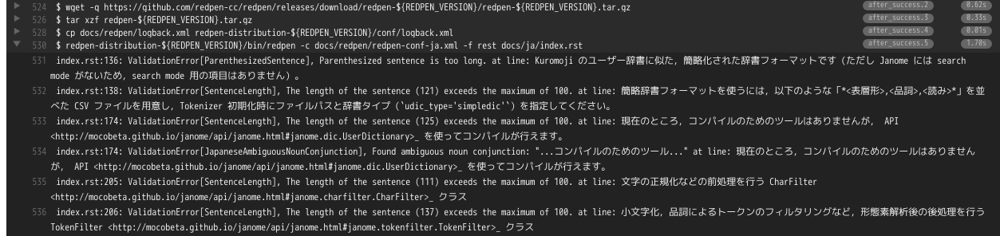

===============================================================
Travis CI + RedPen で reST ドキュメントを継続的検査する
===============================================================

:日時: 2017/08/12
:作者: moco_beta

概要
======

ドキュメント自動検査（校正）ツール `RedPen <http://redpen.cc/>`_ を使い、GitHub で管理している reST ドキュメントの自動検査を `Travis CI <https://travis-ci.org/>`_ のジョブで走らせる方法を紹介します。

RedPen バージョン 1.9.0 で reST パーサが導入されたため、RedPen 1.9.0 以上を使用してください。

リポジトリのディレクトリ構成
=========================================

ここでは、下記の Python プロジェクトを想定します。ソフトウェアのソースコードと一緒に、英語と日本語のドキュメントが同梱されているとします。

.. code-block:: bash

  .
  ├── .travis.yml       // Travis CI 設定ファイル
  ├── docs
  │   ├── en            // 英語ドキュメント
  |   |   ├── conf.py
  |   |   └── index.rst
  │   ├── ja            // 日本語ドキュメント
  |   |   ├── conf.py
  |   |   └── index.rst
  │   └── redpen        // RedPen 関連ファイル
  |       ├── logback.xml
  |       ├── redpen-conf-en.xml
  |       └── redpen-conf-ja.xml
  ├── setup.py
  └── source            // プログラムのソースコード

RedPen のルール設定ファイルを作成
=========================================

まず、RedPen のルール設定ファイルを作成します。英語用と日本語用で設定が異なるため、それぞれについて設定ファイルを用意します。reST 特有の設定などはとくにありません。

* 英語用の設定例: `redpen-conf-en.xml <https://github.com/mocobeta/janome/blob/master/docs/redpen/redpen-conf-en.xml>`_
* 日本語用の設定例: `redpen-conf-ja.xml <https://github.com/mocobeta/janome/blob/master/docs/redpen/redpen-conf-ja.xml>`_

non-Java プロジェクトの Travis ジョブに Java 8 を組み込む
===================================================================

RedPen は Java 8 で動作するため，コンテナ環境に Java 8 がインストールされている必要があります。

``language: python`` のように、 ``language`` に ``java:8`` 以外を指定しているプロジェクトでは、以下の Addon を ``.travis.yml`` に追記することで java 8 のプログラムを動かせるようになります。

.. code-block:: yaml

  addons:
    apt:
      packages:
        - oracle-java8-set-default

（参考） `Use JRE 8 on non-java project <https://github.com/travis-ci/travis-ci/issues/5161>`_

Travis ジョブから RedPen を実行する
=================================================

基本的にはこちらの記事 `RedPenを利用した文書の継続的検査への取り組み <http://gihyo.jp/lifestyle/serial/01/redpen/0002>`_ に書いてある流れと一緒です。ただし、ここではドキュメント検査のエラーでジョブは失敗させたくないので、本体のビルド成功後に実行される ``after_success`` で RedPen を走らせるようにします。

.. code-block:: yaml

  env:
    - REDPEN_VERSION=1.9.0
  after_success:
    - wget -q https://github.com/redpen-cc/redpen/releases/download/redpen-${REDPEN_VERSION}/redpen-${REDPEN_VERSION}.tar.gz
    - tar xzf redpen-${REDPEN_VERSION}.tar.gz
    - cp docs/redpen/logback.xml redpen-distribution-${REDPEN_VERSION}/conf/logback.xml
    - redpen-distribution-${REDPEN_VERSION}/bin/redpen -c docs/redpen/redpen-conf-ja.xml -f rest docs/ja.rst
    - redpen-distribution-${REDPEN_VERSION}/bin/redpen -c docs/redpen/redpen-conf-en.xml -f rest docs/en.rst

この中で、カスタマイズした logback の設定ファイルをコピーしていますが，ログレベル等を調整する必要がなければ不要です。

まとめると ``.travis.yml`` 全体は、以下のようになるでしょう。

.. code-block:: yaml

  language: python
  python:
    - "2.7"
    - "3.3"
    - "3.4"
    - "3.5"
    - "3.6"
  addons:
    apt:
      packages:
        - oracle-java8-set-default
  env:
    - REDPEN_VERSION=1.9.0
  script:
    - python setup.py test
  after_success:
    - coveralls
    - wget -q https://github.com/redpen-cc/redpen/releases/download/redpen-${REDPEN_VERSION}/redpen-${REDPEN_VERSION}.tar.gz
    - tar xzf redpen-${REDPEN_VERSION}.tar.gz
    - cp docs/redpen/logback.xml redpen-distribution-${REDPEN_VERSION}/conf/logback.xml
    - redpen-distribution-${REDPEN_VERSION}/bin/redpen -c docs/redpen/redpen-conf-ja.xml -f rest docs/ja/index.rst
    - redpen-distribution-${REDPEN_VERSION}/bin/redpen -c docs/redpen/redpen-conf-en.xml -f rest docs/en/index.rst

検査結果
========

検査結果は、ジョブのログから確認できます。以下のようなドキュメント検査結果がログが出力されるはずです。

