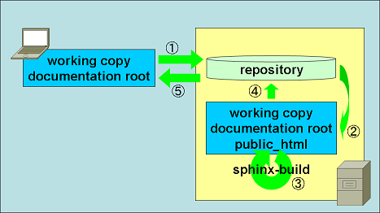

==============================================================================
Subversionのフックスクリプトを利用して手元にビルド環境がなくてもビルドする方法
==============================================================================

:日時: 2011/02/28
:作者: togakushi

はじめに
========

* これは手元のマシンにPython(Sphinx)が入ってなく、それでもSphinxでドキュメントを書きたいと思ったときに考えた手法です。
* Subversionで試してますが、他でも同じことができると思います。

前提とする環境
==============

* 手元のマシンにはPython(Sphinx)は入っていないけどSubversionのクライアントは入っている。
* SubversionのリポジトリがあるサーバにはSphinxが入っている。
* リポジトリはSphinx専用。

やりたいこと
============

* ビルド環境が手元にない状態で、どうにかしてreSTファイルをビルドし、変換後の成果物を手に入れる。
* １つのツールだけで操作を完結させたい。

仕組み
======

コミットしたらフックを利用してmake htmlを実行する。

0. 手元のreSTファイルを編集する。
#. リポジトリにコミットする。
#. フックスクリプト(post-commit)内でサーバのワーキングコピーにチェックアウトする。
#. サーバ内のワーキングコピーでビルドを実行。(make html)
#. 生成された_buildのファイルをコミット。
#. 手元のマシンでアップデートをかけると成果物が手に入る。

メリット
--------

* ビルド環境がなくてもビルドした成果物を手に入れることができる。
* Subversionクライアントだけで操作が完結している。

デメリット
----------

* _build内でよくコンフリクトを起こす。
    * 使い方の問題っぽい？
    * 回避策として_buildを一回削除してからコミット。
    * クライアントでアップデートすると、毎回_build全体がアップデートされてしまう。
    * サンプルではコメントアウトしています。

フックスクリプトのサンプル
==========================

* 使用している環境
    * リポジトリにはsvn+sshでアクセス。
    * svnserveはデーモンとして起動していない。
    * サーバ内のワーキングコピーはドキュメントの公開場所と同じ。
    * パスは/var/www/html/sphinx/docs
* 注意点
    * post-commit内でコミットをしているので、再帰的にpost-commitが呼び出される。
    * コメントを利用してループを防いでいる。

post-commit
-----------

.. code-block:: bash

    #!/bin/bash

    REPOS="$1"
    REV="$2"
    SVNCOMENT='*** commit from hook script ***'
    LOGFILE=/tmp/svn_commit_${REV}.log

    (
      echo "---------------------------------------------"
      echo "DATE : $(date)"
      echo "REPOS: ${REPOS}"
      echo "REV  : ${REV}"
      echo "---------------------------------------------"
      echo

      svnlook log ${REPOS} -r ${REV} | fgrep -q "${SVNCOMENT}"
      if [ $? -ne 0 ]
        then {
          ### _buildでコンフリクトを起こすので削除
          # cd /var/www/html/sphinx
          # rm -rf docs
          # svn checkout file://localhost/${REPOS} docs
          # cd /var/www/html/sphinx/docs
          # rm -rf _build
          # svn delete _build
          # svn commit -m "${SVNCOMENT}"

          cd /var/www/html/sphinx/docs
          svn update

          make html

          ### 新しく生成されたファイルを追加
          for file in `svn status | awk '/^\?/{print $2}'`
          do
            svn add ${file}
          done

          svn commit -m "${SVNCOMENT}"
        }
      fi
    ) > ${LOGFILE}

改善点
------

* スクリプト内のエラー通知。
* 吐き出しているログファイルの整理。

その他
======

* 手元にビルドの成果物が要らないのであれば、サーバ内でexportしてmakeだけ動かす。

