==========================================
SphinxのプロジェクトをGithubへプッシュする
==========================================

この節ではグラフィカルに操作できる *SourceTree* を使ってSphinxのプロジェクトを *Git* の *リポジトリ* にして(＝プロジェクトをGitの管理下におく)
リポジトリのホスティングサービス *Github* にプッシュ(アップロード)するところまでを説明します。

Githubのアカウントを作成する
============================
下記サイトにアクセスし *Sign up* より、 *Username* 、 *Email Address* 、 *Password* を入力し、アカウントを作成します。 ::

    https://github.com/

SourceTreeのインストール
========================
*SourceTree* はWindows版と Mac OS X版が用意されています。いずれの場合も以下のサイトからダウンロードしインストールして下さい。 ::

    https://www.sourcetreeapp.com/

インストール中に *Github* のアカウントを求められるので作成したアカウントを入力して下さい。

Sphinxのプロジェクトをリポジトリにする
======================================
テスト用のプロジェクトを作成し *Git* のリポジトリにします。例では *testproject* というディレクトリを作成し :command:`sphinx-quickstart` と :command:`make html` を実行した所から始めます。

:command:`make html` を打った直後のディレクトリ／ファイル構成は図のようになっています。 ::

    ├─testproject
        │  conf.py
        │  index.rst
        │  make.bat
        │  Makefile
        │
        ├─_build ■1. makeコマンドを打つ度に生成し直される為、Git(SourceTree)で管理しないよう設定する
        │  ├─doctrees
        │  │      environment.pickle
        │  │      index.doctree
        │  │
        │  └─html
        │      │  .buildinfo
        │      │  genindex.html
        │      │  index.html
        │      │  objects.inv
        │      │  search.html
        │      │  searchindex.js
        │      │
        │      ├─_sources
        │      │      index.txt
        │      │
        │      └─_static
        │              ajax-loader.gif
        │              .
        │              .
        │              .
        │              websupport.js
        │
        ├─_static ■2. Gitは空のディレクトリを管理できず、このディレクトリが存在しないとmakeするたびWARNINGが表示される為、ダミーファイルを置く必要がある
        └─_templates ■3. 空ディレクトリで管理する必要は無い

``_static`` ディレクトリに *custom.css* (任意の名前の空ファイル)を保存します(■2の対応)。

*SourceTree* を起動し **新規／クローンを作成する** をクリックします。

.. figure:: git_01.png
   :scale: 50 %

**リポジトリをクローン／追加／作成** というウィンドウが表示されるので **リポジトリを作成** をクリックします。
*リポジトリタイプ* に *Git* 、 *保存先のパス* にテスト用のプロジェクトのパスを入力し *作成* ボタンをクリックします。

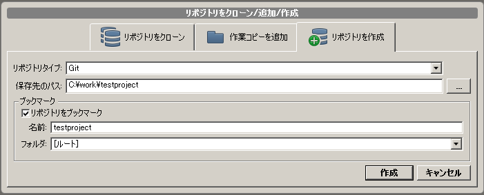

*作業ツリーのファイル* の表示で ``_build/`` が表示されている行を右クリックし *無視* をクリックします。

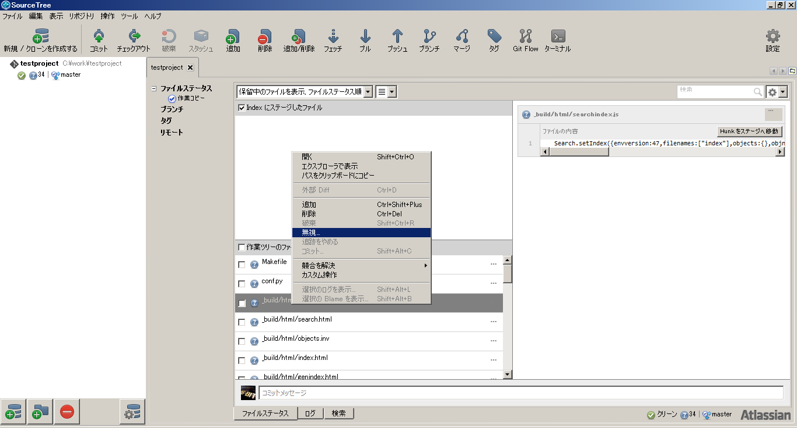

*無視* というウィンドウが表示されるので *以下にある物全てを無視* にチェックを入れ ``_build`` が選択されている事を確認し *OK* をクリック(■1の対応)

*作業ツリーのファイル* にチェックを入れます。

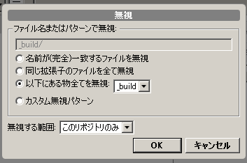

自動的に *Indexにステージしたファイル* の配下に全てのファイルが移動します。

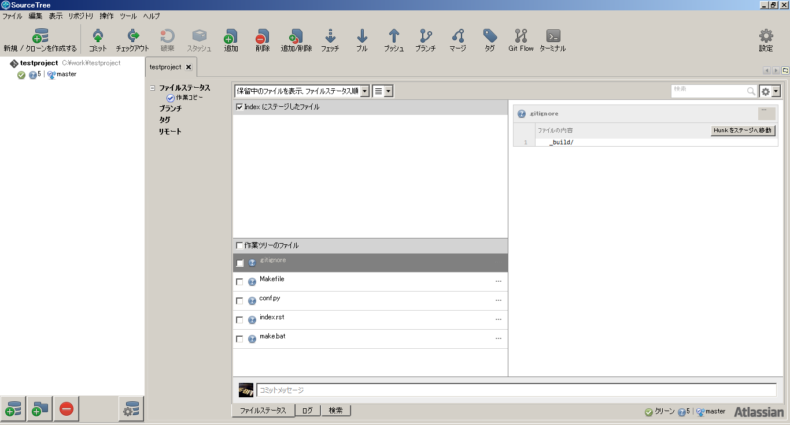

一番下の薄く *コミットメッセージ* と表示されている部分をクリックします。

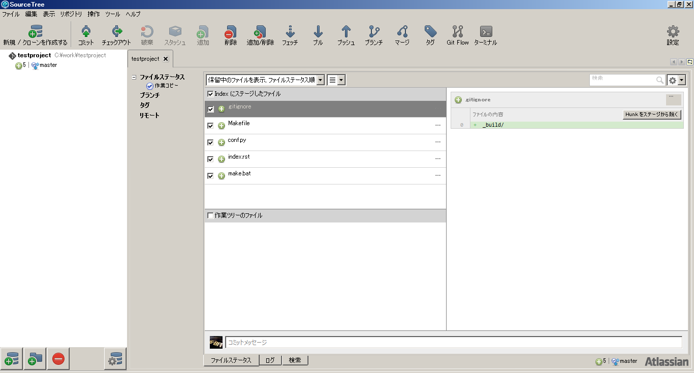

表示領域が広がるので、コミットメッセージとして *initial* と入力し *コミット* ボタンをクリックします。

.. figure:: git_08.png
   :scale: 50 %

ログタブをクリックします。コミットが成功していると図のように表示されます。

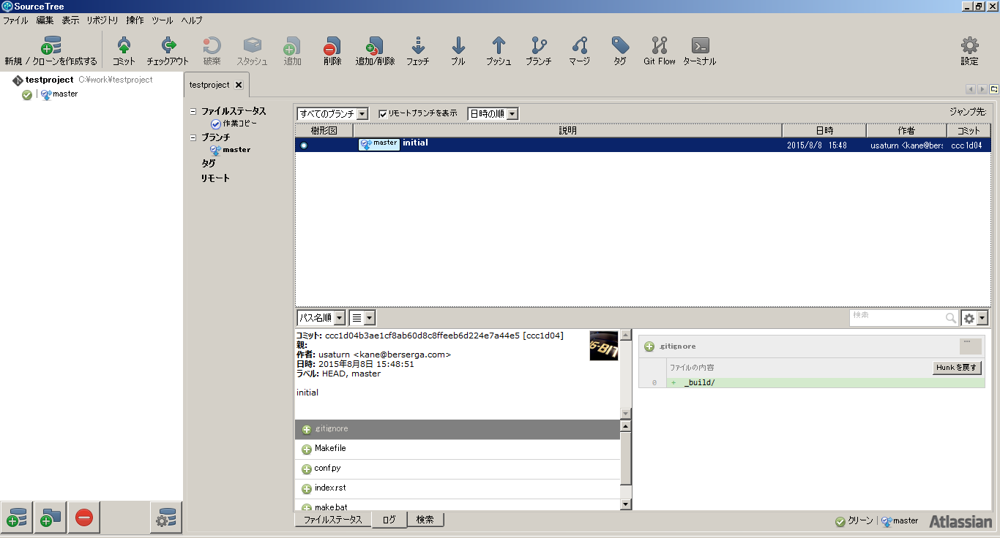

作成したリポジトリをGithubにプッシュする
========================================
*Github* にプッシュする為には先に *Github* で空のリポジトリを作成する必要があります。
*Github* にログインし *New repository* をクリックします。

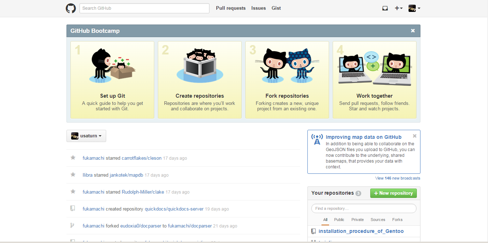

*Repository name* にリポジトリを表す簡潔な名前を入力します。元のリポジトリのディレクトリ名でなくても構いません。例ではディレクトリ名と同じ *testproject* と入力しています。
*Description* にも簡単な説明を入力します。例では *TEST* にしています。入力が終わったら *Create repository* をクリックします。

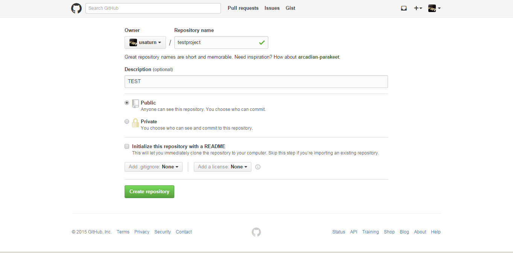

これで *Github* 上に空のリポジトリができました。プッシュする為に *HTTPS* をクリックしURLをクリップボードにコピーして下さい。

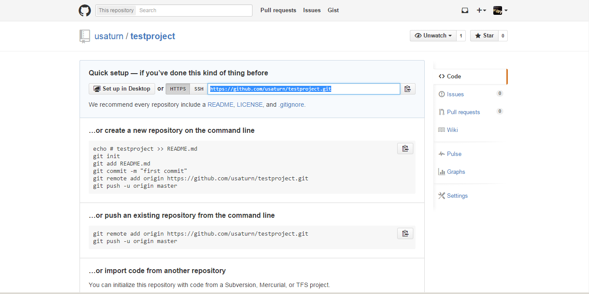

*SourceTree* に戻り *リポジトリ* ⇒ *リモートを追加* をクリックします。

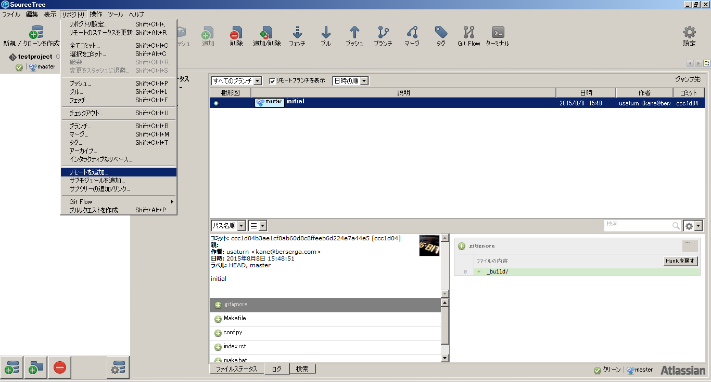

*リモートの詳細設定* ウィンドウが表示されるので *デフォルトリモート* にチェックを入れ、コピーしたURLを *URL/パス* に貼り付け、 *OK* をクリックします。

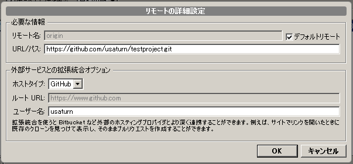

*リポジトリ設定* ウィンドウが表示されるので *リモートリポジトリのパス* が表示されている事を確認して *OK* をクリックします。

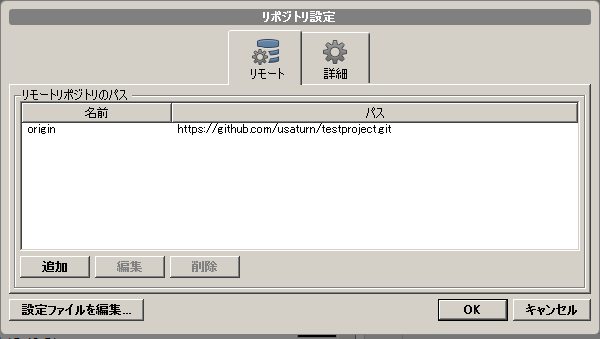

*プッシュ* をクリックします。

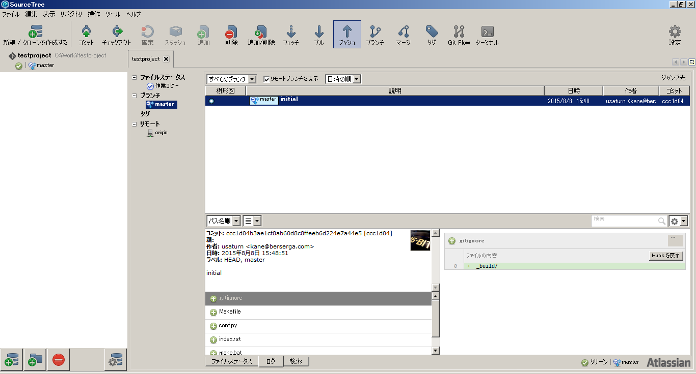

*プッシュ* ウィンドウが表示されるので *master* にチェックを入れて *OK* をクリックします。

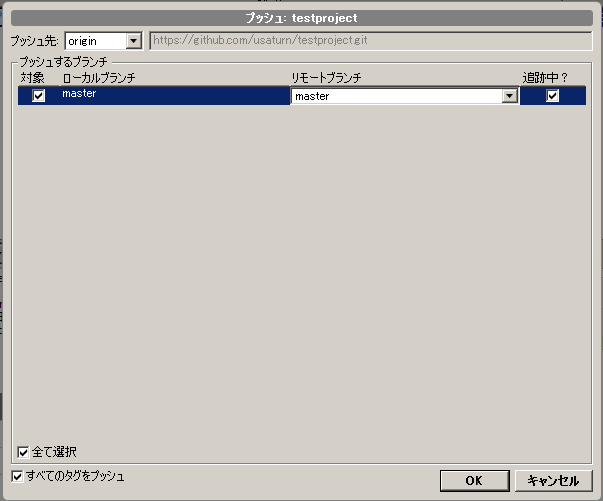

*Authenticate* ダイアログが表示されるので *Username* 、 *Password* に *Github* アカウントを入力し *Login* をクリックします。

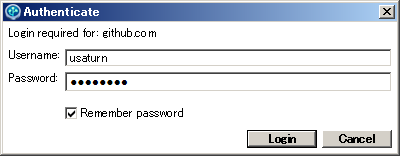

*Github* に戻り図のようにリポジトリの中身が表示されたらプッシュに成功しています。

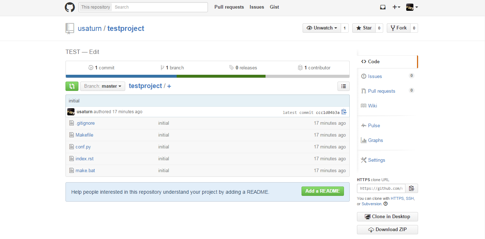

