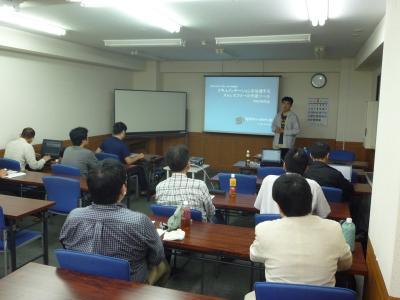
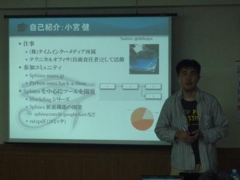
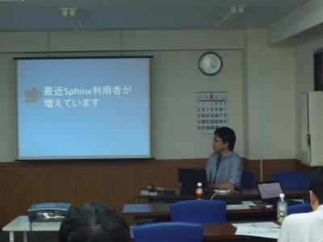

日本UNIXユーザ会 2011年6月勉強会 (2011/6/18) 大阪
==================================================

.. contents::

日本UNIXユーザ会の2011年6月の勉強会にて、以下の内容で発表させていただきます(終了しました)。

「ドキュメンテーションを加速するストレスフリーの作図ツール『blockdiag』」
--------------------------------------------------------------------------

:日時: 2011/6/18(土) 15:15～17:15 (受付開始 14:45)
:場所: `新大阪丸ビル本館 3F 303会議室`_
:講師: 小宮 健(こみや たけし)、清水川 貴之(しみずがわ　たかゆき)
:詳細: `日本UNIXユーザ会 2011年6月勉強会`_ ページをご確認下さい

内容:
~~~~~~

システム開発や保守、運用の現場においてドキュメントは必須のものです。
しかし、ドキュメントの作成・維持には多くのパワーがかかるため、
ドキュメントが存在しない、資料が古いままになっているなどといった
現状を多く耳にします。
本勉強会ではこれらのドキュメントでよく利用される「図」にフォーカスし、
みるみるうちに図を作成できる「blockdiag」をご紹介します。

「blockdiag」はシンプルなテキスト記述からブロック図、ネットワーク図
などの画像ファイルを出力可能なオープンソースの画像生成ツールです。
書きやすさ、メンテナンスしやすさを中心にデザインされており、
図を作るのに配置や並べ替えに苦労する必要はありません。

このような特徴を持つ「blockdiag」と、シンプルな記述でドキュメントを
作成するツール「Sphinx」を組み合わせることによって、スピーディな
ドキュメント作成・維持が可能となります。

本勉強会では「blockdiag」と組み合わせて利用されることの多い
ドキュメンテーションツール「Sphinx」にも触れつつ以下の構成で紹介します。

- 「blockdiag」とは何か。他のツールとの比較
- 「blockdiag」シリーズの紹介
- 「blockdiag」利用例紹介、デモ
- 「blockdiag」と連携するツール Trac, MoinMoin, Sphinx
- Sphinxとblockdiagによるドキュメント作成デモ

ドキュメント作りが楽しくなると、ソフトウェア開発や運用はきっともっと
ずっと楽しくなります。
そしてこの勉強会で、「blockdiag」と「Sphinx」の先に「Webの未来」を
きっと感じることができるでしょう。

対象とする参加者
~~~~~~~~~~~~~~~~~~

* 様々な形式に加工できる定番のドキュメンテーションツールを探している方。
* テキストベースで書いた仕様書などを納品物に使える形式に変換できるツールを探している方。
* ドキュメントをどんどん書きたくなる環境を体験したい方。

.. _`新大阪丸ビル本館 3F 303会議室`: http://www.japan-life.co.jp/jp/buil/honkan/map.html
.. _`日本UNIXユーザ会 2011年6月勉強会`: http://www.jus.or.jp/benkyokai/11-06.html

プレゼン資料
--------------

.. raw:: html

    
 <strong style="display:block;margin:12px 0 4px"><a href="http://www.slideshare.net/shimizukawa/blockdiag-jus20116" title="ドキュメンテーションを加速するストレスフリーの作図ツール『Blockdiag』 jus2011年6月勉強会">ドキュメンテーションを加速するストレスフリーの作図ツール『Blockdiag』 jus2011年6月勉強会</a></strong> <iframe src="http://www.slideshare.net/slideshow/embed_code/8348502" width="425" height="355" frameborder="0" marginwidth="0" marginheight="0" scrolling="no"></iframe> 
 View more <a href="http://www.slideshare.net/">presentations</a> from <a href="http://www.slideshare.net/shimizukawa">Takayuki Shimizukawa</a> 
 

当日の質疑応答
----------------

blockdiag編
~~~~~~~~~~~~~
* Q, dot言語とのやりとりはできますか？(木村さん)
    * A, ちょっと違っているので互換性はありません
    * blockdiagの書式はGraphvizからぱくり..インスパイアされました
    * 四角い線の方が仕事では使いやすかったので

* Q, 既存のdotファイルからのコンバータはありますか？(木村さん)
    * A, 今のところありません

* Q, バージョンアップはどのようにすれば良いでしょうか？ (さがわさん)
    * easy_install -U blockdiag です

* Q, InteractiveShellはGAEなのでリソース制限ありますよね？
    * もし使い始めたときに容量超えちゃって使えないと困るなと思って..
    * A, 紹介直後は集中するんですが、それでもまだ20倍くらい余裕があります

Q&Aは :doc:`../20110304_osc_tokyo_spring` にも掲載しています。

Sphinx編
~~~~~~~~~

* Q, PDF出せますか？
    * A, 可能です。
    * latexpdfで日本語出力する場合、sphinxにいくつかのpatchが必要です。

* Q, easy_install で入れたのですがアンインストールはどうすれば良いでしょうか？
    * A, 手動で削除しなければ行けませんが一言で伝えづらいです..

* Q, Windowsのスタンドアロンインストーラを使いたいのですが既に手動でSphinxを入れていても大丈夫ですか？
    * A, スタンドアロン版は完全に独立した環境となるのでプログラムが競合したりはしません。
    * ただしPATHが新旧両方のディレクトリに通っている場合注意が必要です。

* Q, Sphinxで保存時の文字コードがutf8以外の場合もlatexpdfで問題は無いでしょうか？
    * A, latexpdfで出力する場合、かならずutf8でなければいけません。
    * latexがutf8を認識できない環境なのですが..あきらめます.

* Q, 図表番号が無いというのは本当ですか？
    * A, 本当です。手動で図にキャプションを付ける方法で何とかしています。
    * 今後その部分についてSphinxが改修される予定はありますか？
    * A, 分かりません..

Q&Aは :doc:`../20110304_osc_tokyo_spring` にも掲載しています。

会場の様子
-----------

    15名ほどの参加者。大阪でのJUS勉強会は久しぶりの開催だとか。

    小宮「みなさんblockdiagを使いましょう」

    清水川「最近Sphinxの利用者が増えてきているようです」

