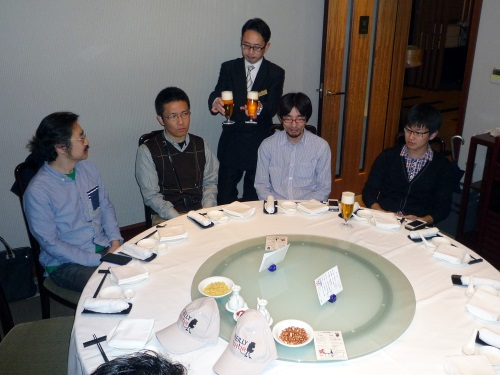
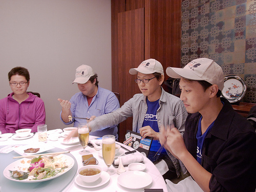
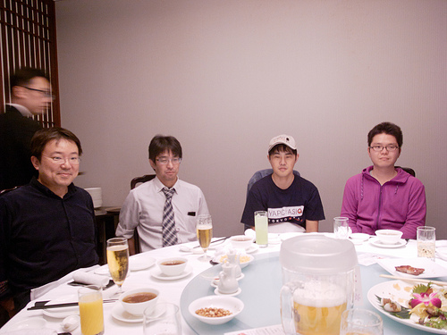
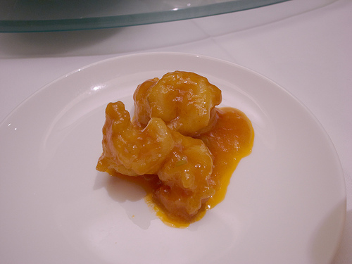
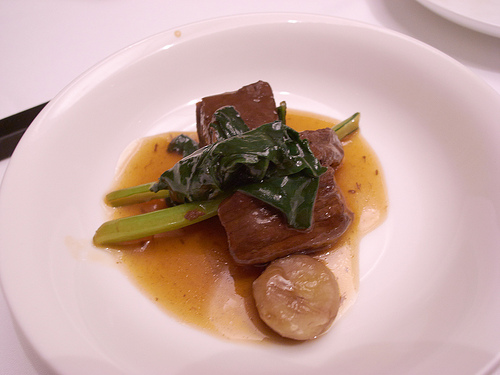
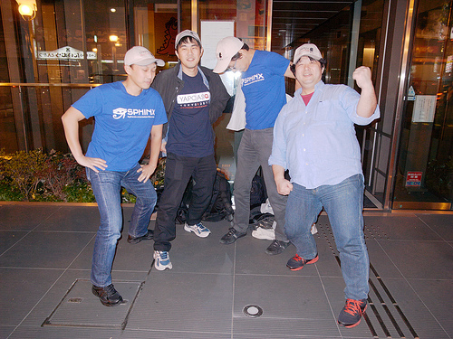

Sphinx-users.jp 2013年総会(2013/12/10)
========================================

:日時: 2013/12/10 19:30～21:30
:場所: `中国料理「桜華樓」(大久保・新大久保)`__ (関東IT健保)
:参加費: 4000円前後（運営費カンパ含む）
:持ち物: 関東IT健保の方は保険証

.. __: http://www.its-kenpo.or.jp/fuzoku/restaurant/oukarou/index.html

2013年のSphinx-Users.jp総会を行いました。

総会について詳しくは :doc:`../../regulations` を参照してください。

参加方法
---------

`sphinx-users MLにて募集を募り、11/5に締め切りました`__ 。

.. __: http://www.python.jp/pipermail/sphinx-users/2013-October/000871.html

議事進行
---------

* 開会の挨拶(カンパイ)
* 会長挨拶、活動の振り返り
* 役員の改選
* 約例の変更
* 会計報告
* 今年やったこと、来年やりたいこと

議事録
---------

会長挨拶、活動の振り返り
++++++++++++++++++++++++

Sphinx本:

* `Sphinxをはじめよう`_ がオライリーさんからEPUB形式で出版された
* 2月の :doc:`SphinxCon 2013 (OSC東京春) <../20130223_sphinxconjp/index>` でSphinx本のアンケートを実施
* 5月から、清水川貴之、小宮健、山田剛、若山史郎の4名で執筆をはじめ、9月にEPUB形式で出版
* 9月13日の夕方に出版！当日の朝まで更新していました。
* 本の執筆はSphinxで行い、編集時に ``make xml`` でXML生成し、用意しておいたxsltでReVIEW形式に変換
* `Sphinxをはじめよう`_ は、オライリーさんのEPUB売上ランキングで最初の数週間は1位2位、その後総会時点まで5位内をキープしているとのこと

.. _Sphinxをはじめよう: http://www.oreilly.co.jp/books/9784873116488/

Sphinx-1.2

* 1.2 が先ほどリリースされました！(12/10 18:00 JST頃)
* What's new の紹介:

  - Python 2.4 サポートの終了
  - Python 3.3 サポートの追加
  - 国際化機能の改善
  - ビルダーの改善: html, texinfo, latex and gettext.
  - ビルダーの追加: xml, pseudoxml
  - 拡張の追加: sphinx.ext.linkcode
  - 非ASCII文字列ディレクトリ名・ファイル名に対応
  - テーマプラグイン機構の追加
  - 10個のロケールを追加・更新
  - 並列ビルドオプション -j を実験的に追加
  - ドキュメント追加: 詳細な "Sphinxのインストール" と "Sphinx開発者のためのガイド"

役員の改選
++++++++++

* 役員立候補:

  いませんでした。

* 推薦：

  * @aodag が @usaturn（会長）を推薦。推薦理由: まじめに押したい。人柄。Sphinxはエンジニアには十分広まってる。Hacker以外に広めるには @usaturn が適任。この1年、コミッターの清水川さんはユーザー会のアドバンテージだったが、使う人の幅を広げるにはよりHackerらしくない人を選ぶべき。 @usaturn がどうドキュメントを書いているのか、書かされている人の気持ちを汲んで広めていって欲しい。どんな人にイベントに来て欲しいかリードして欲しい。

  * @tcsh が @shimizukawa（会長）を推薦。推薦理由: Sphinx自体まだ立ち上げ期間。Sphinxが運用エンジニア系にたどり着いたのが2年前。Sphinxはまだまだ手を出しにくいツールというのが現状。SphinxはPukiWikiにまだ負けている。コミュニティーとしてコミッターが引っ張っているのはよい。ユーザーからの要望を集めて、本家の開発に持っていくのに非常によい。現状ではコミッターとしての会長のほうが良いと思う。

  * @r_rudi が @tcsh（会長）を推薦。推薦理由: 推薦する背景は @tcsh さんの意見と同じで、逆にだからこそ @tcsh さんに引っ張っていって欲しい。コミュニティーを主導するのはコミッターとは別に分けた方がいいんじゃないか。 @tcsh さんはJUS(日本UNIXユーザー会)の会長としてイベント運営に2年もかかわっている。これこそコミュニティーを支えるための基盤として完璧なのではないか。

* 決定:

  :会長: @tcsh (波田野)「今年1年、やります。来年は @usaturn さんにぜひ引き継ぎたい」
  :副会長: @usaturn (山田)
  :副会長: @shimizukawa (清水川)
  :会計: @shimizukawa (清水川)

約例の変更
++++++++++

* 本部住所はできればいまのままとしてほしい(@tcsh)
* 本部住所=会長の自宅、という決まりはないので、現在の2014年度も現在の住所にしましょう(@shimizukawa)
* 住所は番地とかまでは書かなくてもいいのでは。公開は市区町村まででもいいのでは (@tcsh)
* では市区町村までで書くことにしましょう(@shimizukawa)

上記の約例変更は、賛成多数により承認されました。

.. note::

   2013/12/15に :doc:`../../regulations` に反映しました。

会計報告
++++++++

sphinx-users.jpのホスティングは昨年まで渋川さんの個人契約のさくらインターネットのレンタルサービスに相乗りしていました。2013年末の総会でSphinx-users.jpとして契約することとしていましたが、予定を変更して、4月からAWSのS3+CloudFrontでのホスティングに切り換えました。これにより、月額500円を計上していたサーバー費用は、月額100円未満で運用できています。

収入として、有志によるTシャツ作成時の寄付金が96円、夏のPyConAPACに来日したGeorgの歓迎会からの寄付金が280円ありました。また、本日の総会寄付金で3,250円の収入となります。

以下は、2013年に発生した項目を記載しています。

確定分
-------

.. list-table::
   :header-rows: 1

   - *
     * 収入
     * 支出

   - * 2012年残金
     * 6,560
     *

   - * 「sphinx-users.jp さくらサーバーレンタル日(初期1000円、年間一括5000円)」の取り消し
     * 6,000
     *

   - * 2013/2/20 有志によるTシャツ制作,売上差額寄付
     * 96
     *

   - * 2013/5/4 sphinx-users.jp AWSレンタル 2013年4月
     *
     * 130

   - * 2013/6/4 sphinx-users.jp AWSレンタル 2013年5月
     *
     * 81

   - * 2013/7/4 sphinx-users.jp AWSレンタル 2013年6月
     *
     * 78

   - * 2013/8/4 sphinx-users.jp AWSレンタル 2013年7月
     *
     * 78

   - * 2013/9/4 sphinx-users.jp AWSレンタル 2013年8月
     *
     * 78

   - * 2013/09/18 Gerog来日歓迎会の差額寄付
     * 280
     *

   - * 2013/10/4 sphinx-users.jp AWSレンタル 2013年9月
     *
     * 79

   - * 2013/11/4 sphinx-users.jp AWSレンタル 2013年10月
     *
     * 84

   - * 2013/12/4 sphinx-users.jp AWSレンタル 2013年11月
     *
     * 91

   - * 2012/12/10 sphinx-users.jp 総会 会員寄付
     * 3250
     *

   - * 2013 累計
     * 16,186
     * 699

   - * 2014年への繰り越し
     * 15,487
     *

なお、Sphinx-users.jpドメイン代は2012/1/12に渋川さんに預けており、2012年10月に支払われました。
次回支払は2014年10月の予定です。

今年やったこと、来年やりたいこと
++++++++++++++++++++++++++++++++

* @shimizukawa: メンテナとしてSphinx1.2リリースした。1年かかりった。Sphinx本書いた。来年はSphinx1.3リリースがんばる。

* @usaturn: 2月にOSC行った。Shell芸勉強会でSphinx発表した。Sphinx本書いた。来年はSphinxをいろんな勉強会で広めたい。Windowsユーザーはコマンドライン慣れしていないので、そのあたりに広めたい。

* @takuan_osho: ユーザーの一人として参加していて楽しかった。Sphinxコード読めるようになってきたのでこれから貢献できるようになりたい。

* @tk0miya: イヤイヤ本書きました（だって本当なんだもん）。次の本は @shkumagai さんと @kashew_nuts さんが書くというので、期待しています。本を出した効果でハンズオンで説明できるのがよい。最近またコード書き始めたのでドキュメントツールを何か作ろうと思っている。

* @togakushi: 今年はプライベートが忙しくてSphinxでドキュメントを書くくらいしかできなかった。いつのまにかOpenSSHの本を書くことになった。reSTは毎日書いている。来年は落ち着くと思うので、Hack-a-thonにも参加したい。

* @tcsh: 6月に会社を退職し、それ以降毎日reST書きまくっているが、日々sphinx-quickstartを10回叩いているとそろそろconf.pyを何とかしないといけないと思っている。来年はそのあたりをなんとかしたい。地方OSCも行きたい。2回に1回はhack-a-thonにも参加したい。

* はりそん: 今年はみんなのツイートをfavする仕事をしていました。来年もfavります。

* @shkumagai: 今年はあまり活動してなかった。来年はテーマネタでどのくらいかけるかわからないけど、tinkererがあるので、まとめてテーマで一冊書けるのかなと。bizstyleが本家に入るといいのかなと。

* @turky: 今年はsphinx本出せたのが一番。長年pythonに関わっているが本出せたのは初めて。これで、pythonの本を出した編集者になれました！来年はpython関連の本が色々動くので楽しみです。

* @aodag: pylonsから出張してきました。難産だったパーフェクトpythonはsphinxで書きました。来年はdjangoを殲滅したい。みんな年末年始にpython memeやろうぜ。

* @r_rudi: 今年は本書いた。sphinxのアドベントのまとめとebook化した。最近会った、本を書こうと言ってる人が「sphinxしかないよね」っていう話をしててよかった。来年はsphinxテーマの集積サイトを作りたい

会場の様子
-----------

   乾杯待ち

   歓談中。清水川(@shimizukawa)さんは議事録とりながら。

   左端は2014年会長の波田野(@tcsh)さん

   エビチリ

   牛肉

   `Sphinxをはじめよう`_ 著者4名。上着を脱ぐのが間に合わなかった清水川さん

